# Wiki Documentation — Social Skill Practice with VR – Project Wiki

Repository: 7450N/Social-Skill-Practice-with-VR
Source: https://github.com/7450N/Social-Skill-Practice-with-VR
Generated at: 2026-04-30T18:45:24.774Z

---

## Table of Contents

- [Project Overview](#page-project-overview)
- [Getting Started & Setup](#page-getting-started)
- [System Architecture Overview](#page-system-architecture)
- [AI Orchestrator & Conversation Engine Architecture](#page-ai-orchestrator-architecture)
- [Core Scenes & Social Practice Environments](#page-scenes-and-environments)
- [VR Interaction & XR Toolkit Setup](#page-vr-interaction-and-xr-setup)
- [Conversation Data Flow & Processing](#page-conversation-data-flow)
- [Frontend Scenes, UI & Scene Navigation](#page-frontend-scenes-and-ui)
- [External AI Services & API Keys](#page-external-ai-services)
- [LLM, STT & TTS Integration Details](#page-llm-stt-tts-integration)
- [Deployment, Build Targets & Platform Settings](#page-deployment-and-builds)
- [Extending AI Behaviour & Custom Prompts](#page-extending-ai-and-prompts)

---

<a id="page-project-overview"></a>

## Project Overview

**Related Files**:
- `README.md`
- `AI Text Prototype Version 4/ProjectSettings/ProjectSettings.asset`

**Related Pages**:
- [Getting Started & Setup](#page-getting-started)
- [System Architecture Overview](#page-system-architecture)

<details>
<summary>Relevant source files</summary>

The following files were used as context for generating this wiki page:

- [README.md](https://github.com/7450N/Social-Skill-Practice-with-VR/blob/main/README.md)
- [AI Text Prototype Version 4/ProjectSettings/ProjectSettings.asset](https://github.com/7450N/Social-Skill-Practice-with-VR/blob/main/AI%20Text%20Prototype%20Version%204/ProjectSettings/ProjectSettings.asset)
- [AI Text Prototype Version 4/Assets/Ready Player Me/Core/CONTRIBUTING.md](https://github.com/7450N/Social-Skill-Practice-with-VR/blob/main/AI%20Text%20Prototype%20Version%204/Assets/Ready%20Player%20Me/Core/CONTRIBUTING.md)
- [AI Text Prototype Version 4/Assets/Ready Player Me/Core/CHANGELOG.md](https://github.com/7450N/Social-Skill-Practice-with-VR/blob/main/AI%20Text%20Prototype%20Version%204/Assets/Ready%20Player%20Me/Core/CHANGELOG.md)
- [AI Text Prototype Version 4/Assets/Ready Player Me/Core/style-guidelines.md](https://github.com/7450N/Social-Skill-Practice-with-VR/blob/main/AI%20Text%20Prototype%20Version%204/Assets/Ready%20Player%20Me/Core/style-guidelines.md)
- [AI Text Prototype Version 4/Assets/Ready Player Me/Core/CODE_OF_CONDUCT.md](https://github.com/7450N/Social-Skill-Practice-with-VR/blob/main/AI%20Text%20Prototype%20Version%204/Assets/Ready%20Player%20Me/Core/CODE_OF_CONDUCT.md)
- [AI Text Prototype Version 4/Assets/Ready Player Me/Core/Editor/Core/Scripts/Analytics/Constants.cs](https://github.com/7450N/Social-Skill-Practice-with-VR/blob/main/AI%20Text%20Prototype%20Version%204/Assets/Ready%20Player%20Me/Core/Editor/Core/Scripts/Analytics/Constants.cs)
- [AI Text Prototype Version 4/Assets/Ready Player Me/Core/Editor/Core/Scripts/UI/EditorWindows/IntegrationGuide/IntegrationGuide.cs](https://github.com/7450N/Social-Skill-Practice-with-VR/blob/main/AI%20Text%20Prototype%20Version%204/Assets/Ready%20Player%20Me/Core/Editor/Core/Scripts/UI/EditorWindows/IntegrationGuide/IntegrationGuide.cs)
- [AI Text Prototype Version 4/Assets/Ready Player Me/Core/Editor/Core/Scripts/UI/EditorWindows/SetupGuide/SetupGuide.cs](https://github.com/7450N/Social-Skill-Practice-with-VR/blob/main/AI%20Text%20Prototype%20Version%204/Assets/Ready%20Player%20Me/Core/Editor/Core/Scripts/UI/EditorWindows/SetupGuide/SetupGuide.cs)
- [AI Text Prototype Version 4/Assets/Samples/XR Interaction Toolkit/3.0.8/Starter Assets/Editor/Scripts/StarterAssetsSampleProjectValidation.cs](https://github.com/7450N/Social-Skill-Practice-with-VR/blob/main/AI%20Text%20Prototype%20Version%204/Assets/Samples/XR%20Interaction%20Toolkit/3.0.8/Starter%20Assets/Editor/Scripts/StarterAssetsSampleProjectValidation.cs)
- [AI Text Prototype Version 4/Assets/TutorialInfo/Scripts/Readme.cs](https://github.com/7450N/Social-Skill-Practice-with-VR/blob/main/AI%20Text%20Prototype%20Version%204/Assets/TutorialInfo/Scripts/Readme.cs)
- [AI Text Prototype Version 4/Assets/TutorialInfo/Scripts/Editor/ReadmeEditor.cs](https://github.com/7450N/Social-Skill-Practice-with-VR/blob/main/AI%20Text%20Prototype%20Version%204/Assets/TutorialInfo/Scripts/Editor/ReadmeEditor.cs)
- [AI Text Prototype Version 4/Assets/Oculus/LipSync/Editor/OVRLipSyncBuildPostProcessor.cs](https://github.com/7450N/Social-Skill-Practice-with-VR/blob/main/AI%20Text%20Prototype%20Version%204/Assets/Oculus/LipSync/Editor/OVRLipSyncBuildPostProcessor.cs)
- [AI Text Prototype Version 4/Assets/Plugins/IngameDebugConsole/Scripts/DebugLogConsole.cs](https://github.com/7450N/Social-Skill-Practice-with-VR/blob/main/AI%20Text%20Prototype%20Version%204/Assets/Plugins/IngameDebugConsole/Scripts/DebugLogConsole.cs)
</details>

# Project Overview

The Social-Skill-Practice-with-VR project is a Unity-based application that integrates several third-party systems to support VR interaction, avatar customization, debugging, and build-time validation. The project combines Unity XR Interaction Toolkit samples, Ready Player Me avatar tools, Oculus LipSync, and an in-game debug console to provide a configurable environment for social-skill practice scenarios in VR.  
Sources: [README.md](), [AI Text Prototype Version 4/ProjectSettings/ProjectSettings.asset]()

This overview focuses on the architectural role of these integrated modules, the project’s configuration and development practices, and how supporting editor tooling (guides, validation, and post-processing) helps maintain build quality and developer experience.  
Sources: [AI Text Prototype Version 4/Assets/Ready Player Me/Core/CONTRIBUTING.md](), [AI Text Prototype Version 4/Assets/Ready Player Me/Core/CHANGELOG.md](), [AI Text Prototype Version 4/Assets/Samples/XR Interaction Toolkit/3.0.8/Starter Assets/Editor/Scripts/StarterAssetsSampleProjectValidation.cs]()

---

## High-Level Architecture

At a high level, the Unity project ties together core systems and editor tooling:

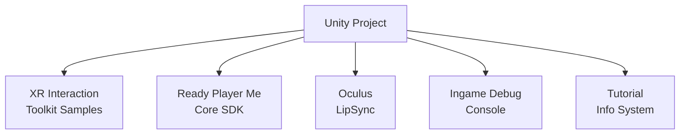

This diagram captures how the project is composed of several distinct subsystems, each responsible for a domain such as XR setup, avatar loading/creator flows, lip-sync behavior, logging, and onboarding/tutorial content.  
Sources: [AI Text Prototype Version 4/ProjectSettings/ProjectSettings.asset](), [AI Text Prototype Version 4/Assets/Samples/XR Interaction Toolkit/3.0.8/Starter Assets/Editor/Scripts/StarterAssetsSampleProjectValidation.cs:1-40](), [AI Text Prototype Version 4/Assets/Ready Player Me/Core/CHANGELOG.md](), [AI Text Prototype Version 4/Assets/Oculus/LipSync/Editor/OVRLipSyncBuildPostProcessor.cs:1-40](), [AI Text Prototype Version 4/Assets/Plugins/IngameDebugConsole/Scripts/DebugLogConsole.cs:1-40]()

### Key Integrated Components

| Component                     | Role in Project                                                                 | Sources |
|------------------------------|----------------------------------------------------------------------------------|---------|
| Ready Player Me Core SDK     | Avatar loading, creator, integration and setup guides, analytics constants      | [CONTRIBUTING.md](), [CHANGELOG.md](), [IntegrationGuide.cs](), [SetupGuide.cs](), [Constants.cs]() |
| XR Interaction Toolkit Sample| Provides starter assets and project validation rules for XR-related setup       | [StarterAssetsSampleProjectValidation.cs]() |
| Oculus LipSync               | iOS build post-processing to add microphone permission and embedded binaries    | [OVRLipSyncBuildPostProcessor.cs]() |
| Ingame Debug Console         | Runtime logging, console commands, and system info output                        | [DebugLogConsole.cs]() |
| Tutorial Info                | Readme scriptable object and custom editor window for in-editor tutorials       | [Readme.cs](), [ReadmeEditor.cs]() |

Sources: [AI Text Prototype Version 4/Assets/Ready Player Me/Core/CONTRIBUTING.md](), [AI Text Prototype Version 4/Assets/Ready Player Me/Core/CHANGELOG.md](), [AI Text Prototype Version 4/Assets/TutorialInfo/Scripts/Readme.cs](), [AI Text Prototype Version 4/Assets/TutorialInfo/Scripts/Editor/ReadmeEditor.cs]()

---

## Project Configuration and Settings

### Unity Project Settings

The `ProjectSettings.asset` file configures global Unity settings for the project, including build targets, XR support, and other engine-level options. While the detailed content is not reproduced here, its presence under `AI Text Prototype Version 4/ProjectSettings/ProjectSettings.asset` indicates a standard Unity configuration for a VR-focused project.  
Sources: [AI Text Prototype Version 4/ProjectSettings/ProjectSettings.asset]()

The XR tooling (via XR Interaction Toolkit samples) and Ready Player Me integration assumes compatible build target groups and packages, which are referenced in editor scripts such as `StarterAssetsSampleProjectValidation`.  
Sources: [AI Text Prototype Version 4/Assets/Samples/XR Interaction Toolkit/3.0.8/Starter Assets/Editor/Scripts/StarterAssetsSampleProjectValidation.cs:1-40]()

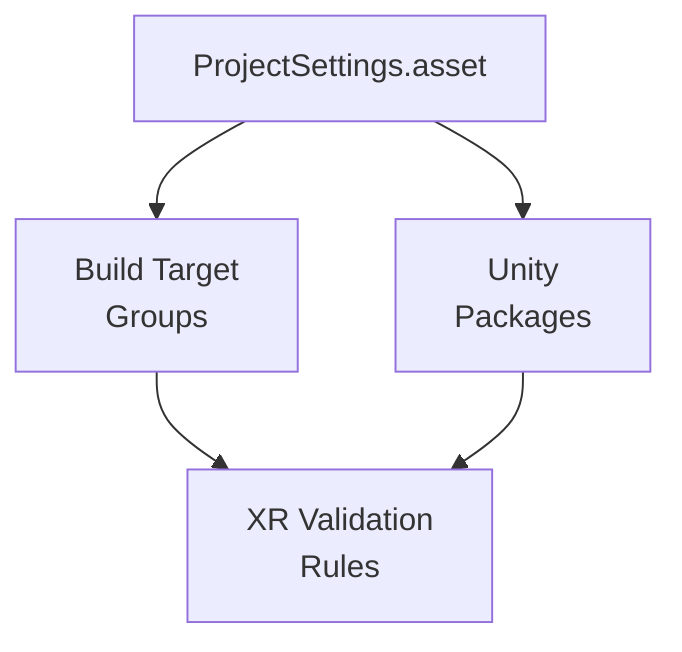

This diagram shows how the central project settings enable specific build target groups and packages that the XR validation rules rely upon.  
Sources: [AI Text Prototype Version 4/ProjectSettings/ProjectSettings.asset](), [StarterAssetsSampleProjectValidation.cs:1-40]()

---

## Ready Player Me Integration

The Ready Player Me Core SDK is a major subsystem that manages avatar loading, configuration, and an embedded Avatar Creator workflow, with extensive editor tooling and documentation links.  
Sources: [AI Text Prototype Version 4/Assets/Ready Player Me/Core/CHANGELOG.md](), [AI Text Prototype Version 4/Assets/Ready Player Me/Core/CONTRIBUTING.md]()

### SDK Evolution and Features (Changelog Overview)

The `CHANGELOG.md` under the Ready Player Me Core directory documents a long history of updates, including breaking changes, added features, and fixes. Notable aspects include:

- Integration of Avatar Loader scripts and assets into the core package, and subsequent removal of references to the older `ReadyPlayerMe.AvatarLoader` namespace.  
- Introduction of setup and integration guide editor windows.  
- Support for caching, analytics, web request handling, and various XR-related template avatars and mesh transfer utilities.  
- Support for body types, gender filters, avatar templates, XR avatars, and hero customization assets (costumes).  
Sources: [AI Text Prototype Version 4/Assets/Ready Player Me/Core/CHANGELOG.md]()

These items indicate that Ready Player Me serves as the avatar subsystem, handling loading from remote endpoints, configuration (e.g., LOD, shaders), and XR-specific avatar templates.

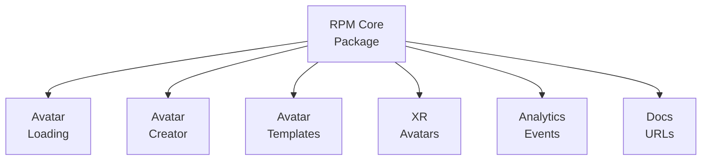

This diagram summarizes the logical sub-features described across the changelog and editor tooling.  
Sources: [AI Text Prototype Version 4/Assets/Ready Player Me/Core/CHANGELOG.md](), [AI Text Prototype Version 4/Assets/Ready Player Me/Core/Editor/Core/Scripts/Analytics/Constants.cs:1-20](), [IntegrationGuide.cs:1-40]()

### Coding Style Guidelines

The `style-guidelines.md` file under Ready Player Me Core describes C# coding conventions used in the SDK:

- Private fields use camelCase without an underscore prefix.  
- Constant fields use SCREAMING_SNAKE_CASE naming.  

Example from the guideline:

```csharp
public class Avatar
{
    private string avatarName;
}
```

and

```csharp
public class Avatar
{
    public const string AVATAR_NAME;
}
```

Sources: [AI Text Prototype Version 4/Assets/Ready Player Me/Core/style-guidelines.md:1-40]()

These conventions are important when extending or contributing to the Ready Player Me-related portions of the project.

### Contribution Workflow and Code of Conduct

The Ready Player Me Core directory defines a contribution process and behavioral expectations:

- `CONTRIBUTING.md` outlines:
  - How to install Git LFS, fork the repository, and configure git hooks for Conventional Commits.  
  - Self-review checklist for content changes such as adhering to style guidelines and documentation rendering verifications.  
  - Guidance for reporting bugs, proposing features, and submitting patches.  
Sources: [AI Text Prototype Version 4/Assets/Ready Player Me/Core/CONTRIBUTING.md:1-120]()

- `CODE_OF_CONDUCT.md` adopts the Contributor Covenant, specifying:
  - Inclusive, respectful behavior requirements.  
  - Examples of positive and unacceptable behavior.  
  - Enforcement responsibilities and scope (community spaces and representation).  
Sources: [AI Text Prototype Version 4/Assets/Ready Player Me/Core/CODE_OF_CONDUCT.md:1-60]()

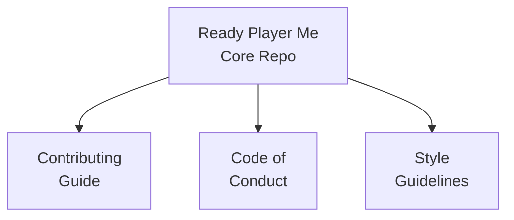

This diagram shows how process and style documents govern contributions and code changes in the Ready Player Me portion of the project.  
Sources: [CONTRIBUTING.md](), [CODE_OF_CONDUCT.md](), [style-guidelines.md]()

---

## Ready Player Me Editor Tooling

The project includes multiple Ready Player Me editor windows and analytics helpers that guide developers configuring avatars and integration flows.

### Analytics Constants

The `Constants.cs` file under `Editor/Core/Scripts/Analytics` defines documentation URLs and constants used in analytics events and UI link targets:

```csharp
public const string DOCS_PARTNERS_LINK = "https://docs.readyplayer.me/ready-player-me/what-is-ready-player-me#url";
public const string DOCS_DEFER_AGENT_LINK = "https://docs.readyplayer.me/ready-player-me/integration-guides/unity/optimize/defer-agents";
public const string DOCS_AVATAR_LOADER_WINDOW = "https://docs.readyplayer.me/ready-player-me/integration-guides/unity/avatar-loader-window";
public const string DOCS_AVATAR_CONFIG_LINK = "https://docs.readyplayer.me/ready-player-me/integration-guides/unity/optimize/avatar-configuration";
public const string DOCS_AVATAR_CACHING = "https://docs.readyplayer.me/ready-player-me/integration-guides/unity/optimize/avatar-caching";
public const string AVATARS = "https://docs.readyplayer.me/ready-player-me/api-reference/avatars";
public const string APP_ID = "https://docs.readyplayer.me/ready-player.me/integration-guides/unity/avatar-creator/custom-avatar-creator#prerequisites";
```

Sources: [AI Text Prototype Version 4/Assets/Ready Player Me/Core/Editor/Core/Scripts/Analytics/Constants.cs:1-20]()

These constants centralize documentation endpoints used by editor windows and analytics logging.

### Integration Guide Window

`IntegrationGuide.cs` defines a Unity EditorWindow that helps developers navigate Ready Player Me documentation and sample scenes:

- Class: `ReadyPlayerMe.Core.Editor.IntegrationGuide` extends `EditorWindow`.  
- Menu item: `"Tools/Ready Player Me/Integration Guide"` with priority 12 exposes the window in Unity’s menu.  
- Constants include:
  - Documentation URLs: `LOAD_AVATARS_URL`, `ADD_ANIMATION_URL`, `AVATAR_CREATOR_URL`, `OPTIMIZE_PERFORMANCE_URL`.  
  - VisualElement names (e.g., `QUICK_START`, `LOAD_AVATARS`, `ADD_ANIMATIONS`, `INTEGRATE_AVATAR_CREATOR`, `OPTIMIZE_THE_PERFORMANCE`).  
  - Sample-related constants like `CORE_PACKAGE`, `QUICKSTART_SAMPLE_NAME`, `AVATAR_CREATOR_SAMPLE_NAME`, `AVATAR_CREATOR_SAMPLE_SCENE_PATH`, `SAMPLES_FOLDER_PATH`.  
- On window opening, it logs an analytics event: `AnalyticsEditorLogger.EventLogger.LogOpenIntegrationGuide();`.  

Sources: [AI Text Prototype Version 4/Assets/Ready Player Me/Core/Editor/Core/Scripts/UI/EditorWindows/IntegrationGuide/IntegrationGuide.cs:1-40]()

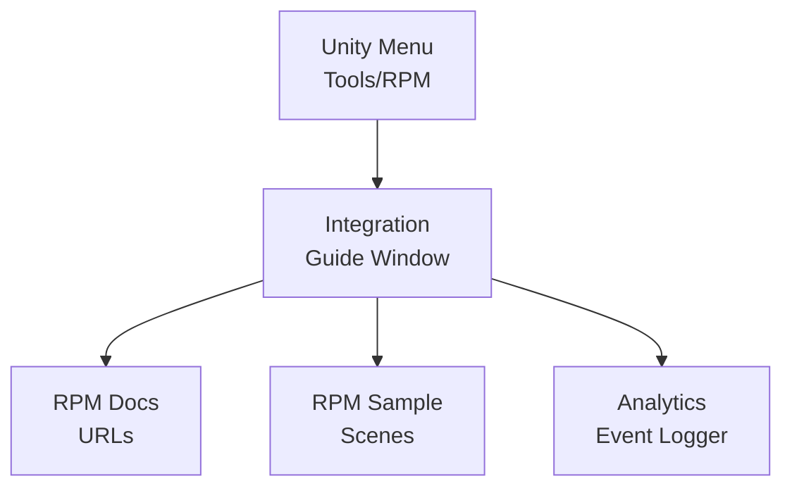

This diagram illustrates how the Integration Guide window connects Unity’s menu to documentation, samples, and analytics logging.  
Sources: [IntegrationGuide.cs:1-40](), [Constants.cs:1-20]()

### Setup Guide Window

`SetupGuide.cs` defines another EditorWindow that walks users through initial Ready Player Me setup:

- Class: `ReadyPlayerMe.Core.Editor.SetupGuide` extends `EditorWindow`.  
- Menu item: `"Tools/Ready Player Me/Setup Guide"` with priority 12.  
- Constants:
  - `STUDIO_URL` pointing to Ready Player Me Studio with a UTM parameter for the Unity setup guide.  
  - `ANALYTICS_PRIVACY_URL` for documentation on analytics configuration.  
  - UI element IDs such as `SUBDOMAIN_PANEL`, `STUDIO_URL_LABEL`, `ANALYTICS_PANEL`, `ANALYTICS_ENABLED_TOGGLE`, `NEXT_BUTTON`, `BACK_BUTTON`, `FINISH_SETUP_BUTTON`.  
- Fields include:
  - `VisualTreeAsset visualTreeAsset` (serialized) for UXML-based layout.  
  - `VisualElement[] panel` and `currentPanel` with `currentPanelIndex` for multi-panel navigation.  
  - `ObjectField avatarConfigField` and several `Button` references (`backButton`, `nextButton`, `finishSetupButton`, `openQuickStartButton`).  
- Analytics: `AnalyticsEditorLogger.EventLogger.LogOpenSetupGuide();` when opening.  

Sources: [AI Text Prototype Version 4/Assets/Ready Player Me/Core/Editor/Core/Scripts/UI/EditorWindows/SetupGuide/SetupGuide.cs:1-60]()

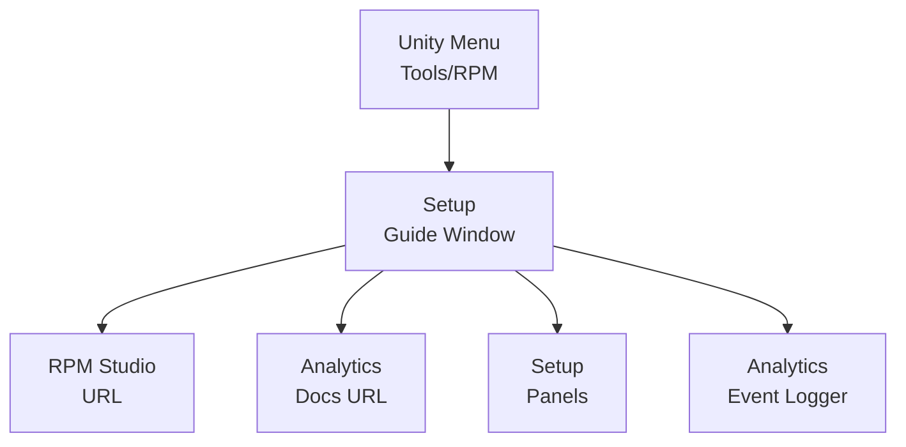

This diagram shows how the Setup Guide provides access to Studio, analytics information, and multi-step configuration panels, while also logging analytics events.  
Sources: [SetupGuide.cs:1-60](), [Constants.cs:1-20]()

---

## XR Interaction Toolkit Starter Assets and Validation

The project integrates samples from Unity’s XR Interaction Toolkit, particularly a validation utility for project configuration.

### Starter Assets Project Validation

`StarterAssetsSampleProjectValidation.cs` defines editor-time validation rules for the XR Interaction Toolkit Starter Assets sample:

Key aspects:

- Namespace: `UnityEditor.XR.Interaction.Toolkit.Samples`.  
- Class: `StarterAssetsSampleProjectValidation`.  
- Constants:
  - `k_Category = "XR Interaction Toolkit"` group label.  
  - `k_StarterAssetsSampleName = "Starter Assets"`.  
  - `k_TeleportLayerName = "Teleport"` and `k_TeleportLayerIndex = 31`, indicating a specific layer configuration used for teleportation.  
  - `k_ProjectValidationSettingsPath = "Project/XR Plug-in Management/Project Validation"`.  
  - `k_ShaderGraphPackageName = "com.unity.shadergraph"`.  
- Build target handling:
  - `s_BuildTargetGroups` enumerates `BuildTargetGroup` values and stores distinct ones.  
  - `s_BuildValidationRules` stores `BuildValidationRule` instances.  
- Package management:
  - Static `AddRequest` fields for adding ShaderGraph, and conditional Input System package if `UNITY_INPUT_SYSTEM_PROJECT_WIDE_ACTIONS` is defined.  
  - Under that define, recommended Input System version `1.11.0` and references to an input action asset (`"XRI Default Input Actions"` and GUID).  
- Initialization:
  - `[InitializeOnLoadMethod]` on `RegisterProjectValidationRules` uses `EditorApplication.delayCall += AddRulesAndRunCheck;` (the rest of the method is truncated in the provided snippet).  

Sources: [AI Text Prototype Version 4/Assets/Samples/XR Interaction Toolkit/3.0.8/Starter Assets/Editor/Scripts/StarterAssetsSampleProjectValidation.cs:1-60]()

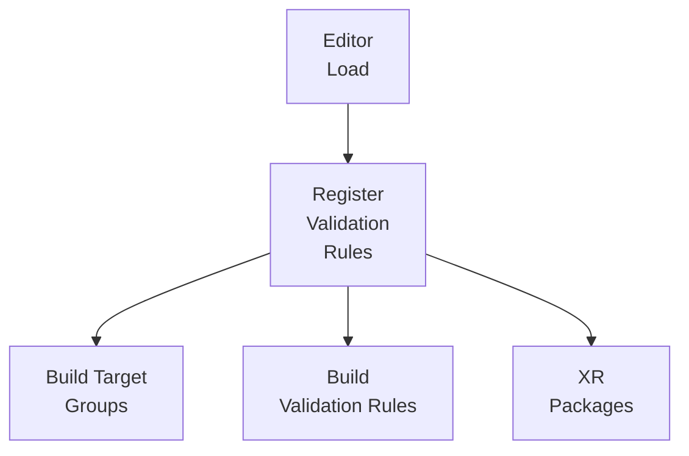

This diagram shows that when the editor loads, rules are registered and associated with specific build target groups and package dependencies relevant to XR.  
Sources: [StarterAssetsSampleProjectValidation.cs:1-60]()

---

## Oculus LipSync Build Post-Processing

For iOS builds, the project uses Oculus LipSync’s post-build processor to configure necessary entitlements and resources.

### OVRLipSyncBuildPostProcessor

`OVRLipSyncBuildPostProcessor.cs` contains:

- Conditional compilation: `#if UNITY_IOS` ensures the logic is only compiled for iOS.  
- Class `OVRLipSyncBuildPostProcessor : MonoBehaviour`.  
- `[PostProcessBuildAttribute(1)]` method `OnPostprocessBuild(BuildTarget target, string pathToBuiltProject)`:
  - Checks if `target == BuildTarget.iOS`.  
  - Calls:
    - `AddMicrophoneAccess(Path.Combine(pathToBuiltProject, "Info.plist"));`  
    - `AddEmbeddedBinary(PBXProject.GetPBXProjectPath(pathToBuiltProject));`  
- `AddMicrophoneAccess`:
  - Constant `micUsageProperty = "NSMicrophoneUsageDescription"`.  
  - Loads a `PlistDocument` from `Info.plist`.  
  - Reads root dictionary and skips modification if `micUsageProperty` already exists, thus not overriding existing descriptions.  

Sources: [AI Text Prototype Version 4/Assets/Oculus/LipSync/Editor/OVRLipSyncBuildPostProcessor.cs:1-60]()

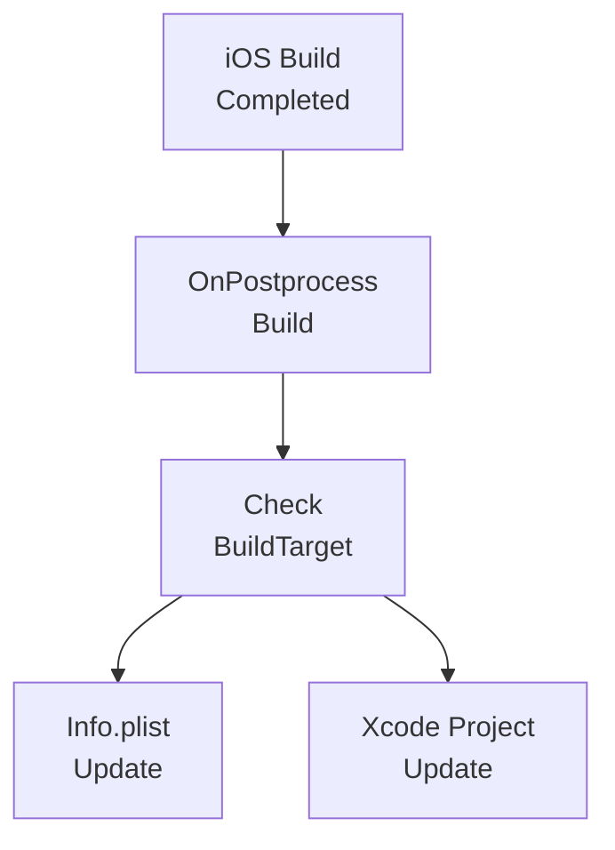

This diagram summarizes the post-build workflow: after an iOS build, the post-processor adds microphone permission and embedded binaries to the generated Xcode project.  
Sources: [OVRLipSyncBuildPostProcessor.cs:1-60]()

---

## Ingame Debug Console Integration

The project uses the Ingame Debug Console plugin to provide a runtime console that can log information and execute commands.

### DebugLogConsole System Info Logging

`DebugLogConsole.cs` includes methods for finding commands and logging system information. One visible portion shows:

- `LogAllCommandsWithName(string commandName)`:
  - Searches for console commands matching the provided name or containing it as a substring.  
  - Logs an error if none found, or prints a list of matching command signatures.  
  - Adjusts UI via `DebugLogManager.Instance.AdjustLatestPendingLog(true, true);` when available.  

- `LogSystemInfo()`:
  - Builds a detailed string with hardware and environment information using `SystemInfo` and `Application` APIs.  
  - Fields include device model, processor type, RAM, OS, GPU details, data paths, device ID, texture and cubemap size limits, and feature support (accelerometer, gyroscope, location service, compute shaders, shadows, instancing, motion vectors, 3D textures, 3D render textures).  

Example snippet:

```csharp
public static void LogSystemInfo()
{
    StringBuilder stringBuilder = new StringBuilder( 1024 );
    stringBuilder.Append( "Rig: " ).AppendSysInfoIfPresent( SystemInfo.deviceModel ).AppendSysInfoIfPresent( SystemInfo.processorType )
        .AppendSysInfoIfPresent( SystemInfo.systemMemorySize, "MB RAM" ).Append( SystemInfo.processorCount ).Append( " cores\n" );
    stringBuilder.Append( "OS: " ).Append( SystemInfo.operatingSystem ).Append( "\n" );
    stringBuilder.Append( "GPU: " ).Append( SystemInfo.graphicsDeviceName ).Append( " " ).Append( SystemInfo.graphicsMemorySize )
        .Append( "MB " ).Append( SystemInfo.graphicsDeviceVersion )
        .Append( SystemInfo.graphicsMultiThreaded ? " multi-threaded\n" : "\n" );
    // ... further system info fields ...
}
```

Sources: [AI Text Prototype Version 4/Assets/Plugins/IngameDebugConsole/Scripts/DebugLogConsole.cs:1-60]()

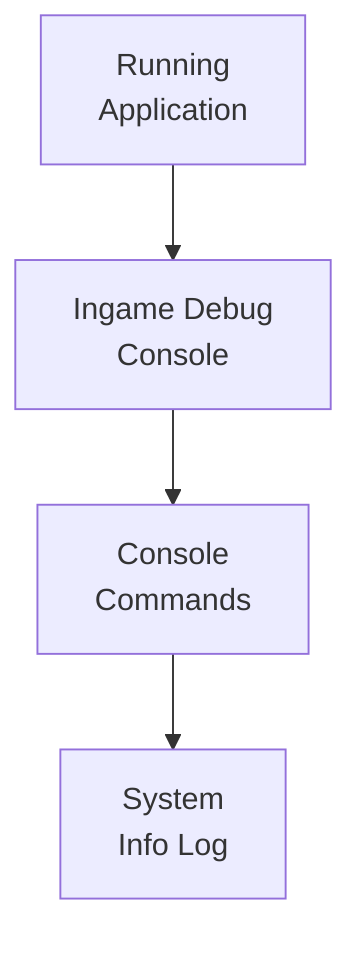

This diagram reflects the runtime relationship: the game uses the console, which executes commands, including system info logging.  
Sources: [DebugLogConsole.cs:1-60]()

---

## Tutorial and Onboarding Support

Unity’s built-in tutorial info system is included to guide developers when opening the project in the editor.

### Readme Scriptable Object

`Readme.cs` defines a simple ScriptableObject to hold tutorial information:

- Class: `Readme : ScriptableObject`.  
- Fields:
  - `Texture2D icon;`  
  - `string title;`  
  - `Section[] sections;`  
  - `bool loadedLayout;`  
- Nested `Section` class:
  - Fields `string heading, text, linkText, url;` for content blocks.  

Sources: [AI Text Prototype Version 4/Assets/TutorialInfo/Scripts/Readme.cs:1-25]()

### Readme Editor and Layout

`ReadmeEditor.cs` provides a custom inspector and helper methods:

- Manages styles (`m_LinkStyle`, `m_TitleStyle`, `m_HeadingStyle`, `m_BodyStyle`, `m_ButtonStyle`) exposed as serialized `GUIStyle` fields and accessed via properties.  
- `Init()` sets up body style using `EditorStyles.label`, with an early-out on `m_Initialized`.  
- UI includes:
  - Rendering sections with headings, text, and clickable links using `Application.OpenURL(section.url);`.  
  - A `"Remove Readme Assets"` button that triggers `RemoveTutorial()`, removing readme assets and refreshing the `AssetDatabase`.  
- `SelectReadmeAutomatically()`:
  - Uses `SessionState` to ensure the readme is only automatically shown once per session.  
  - Loads a custom layout via `LoadLayout()` if `readme.loadedLayout` is false.  
- `LoadLayout()`:
  - Uses reflection on `UnityEditor.WindowLayout` to call `LoadWindowLayout`.  

Sources: [AI Text Prototype Version 4/Assets/TutorialInfo/Scripts/Editor/ReadmeEditor.cs:1-80]()

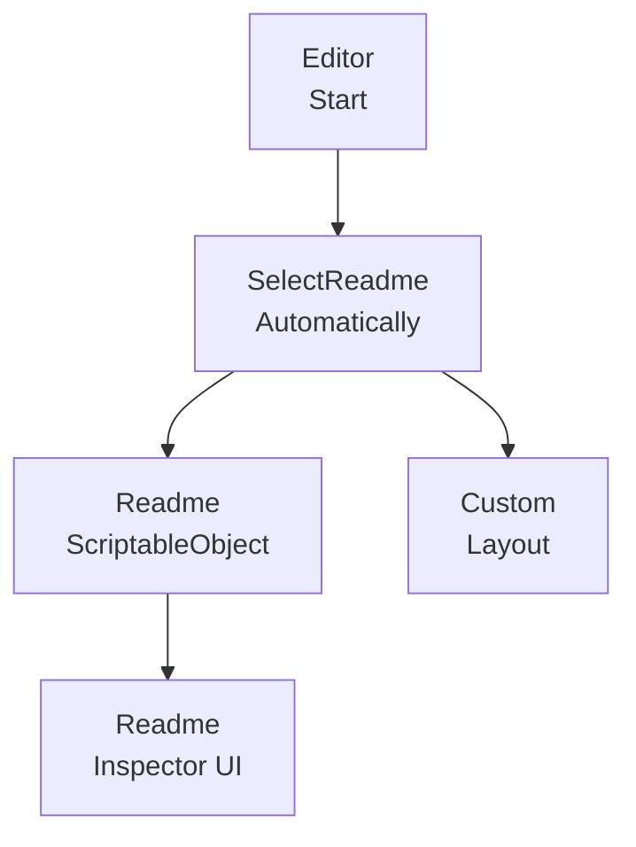

This diagram shows the flow from editor startup to selecting and displaying the Readme with a custom layout.  
Sources: [ReadmeEditor.cs:40-80](), [Readme.cs:1-25]()

| Element             | Description                                                    | Sources |
|---------------------|----------------------------------------------------------------|---------|
| Readme Scriptable   | Stores icon, title, sections, and layout state                | [Readme.cs:1-25]() |
| ReadmeEditor        | Custom editor, auto-select behavior, layout loading           | [ReadmeEditor.cs:1-80]() |
| RemoveTutorial      | Removes readme-related assets and refreshes AssetDatabase     | [ReadmeEditor.cs:60-80]() |

---

## Developer Workflow and Documentation Links

Although the root-level `README.md` is only referenced, the Ready Player Me documentation and contributing guide hint at a structured developer workflow:

- New contributors are encouraged to:
  - Read the Ready Player Me Unity SDK README for an overview.  
  - Use GitHub Flow and Conventional Commits.  
  - Follow code style guidelines and use the `.githooks` folder for commit message enforcement.  
- Issue handling:
  - Search for existing issues, open new ones with clear reproductions, and link to relevant templates.  
  - Contact Ready Player Me support via `support@readyplayer.me` for direct help.  
- Feature proposals:
  - Send suggestions via email before opening GitHub issues for new features.  

Sources: [AI Text Prototype Version 4/Assets/Ready Player Me/Core/CONTRIBUTING.md:1-120]()

The presence of several documentation URLs embedded in analytics constants and editor windows ensures that developers can quickly access up-to-date online documentation from within the Unity editor.  
Sources: [Constants.cs:1-20](), [IntegrationGuide.cs:1-40](), [SetupGuide.cs:1-40]()

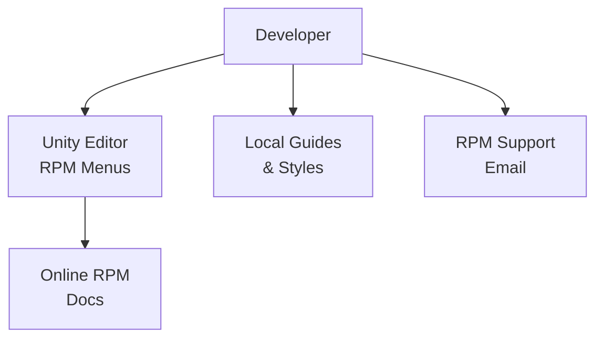

This diagram shows the different support channels (local docs, editor menus, online docs, and email support) available to developers working on the project’s avatar-related components.  
Sources: [CONTRIBUTING.md](), [Constants.cs:1-20](), [IntegrationGuide.cs:1-40](), [SetupGuide.cs:1-40]()

---

## Summary

The Social-Skill-Practice-with-VR project is a Unity-based VR application scaffolded with multiple integrated subsystems:

- Ready Player Me Core provides a comprehensive avatar and creator platform with strong editor tooling (Setup Guide, Integration Guide), analytics integration, and detailed changelog and contribution documentation.  
- XR Interaction Toolkit samples offer project validation rules to ensure correct XR configuration and package dependencies.  
- Oculus LipSync’s build post-processor manages essential iOS permissions and Xcode configuration for voice-related features.  
- The Ingame Debug Console plugin provides runtime diagnostics and command execution, including detailed system information logging.  
- Unity’s Tutorial Info system (Readme and ReadmeEditor) enhances onboarding by displaying a structured readme and optional custom layout on first opening the project.

Together, these systems create a structured development environment with clear guidance, validation, and tooling to support building and maintaining VR-based social skill practice experiences.  
Sources: [AI Text Prototype Version 4/Assets/Ready Player Me/Core/CHANGELOG.md](), [StarterAssetsSampleProjectValidation.cs:1-60](), [OVRLipSyncBuildPostProcessor.cs:1-60](), [DebugLogConsole.cs:1-60](), [Readme.cs:1-25](), [ReadmeEditor.cs:1-80]()

---

<a id="page-getting-started"></a>

## Getting Started & Setup

**Related Files**:
- `README.md`
- `AI Text Prototype Version 4/ProjectSettings/ProjectVersion.txt`
- `AI Text Prototype Version 4/Assets/Resources/Scripts/AI/API_Keys.cs`
- `AI Text Prototype Version 4/Assets/Resources/Secure`

**Related Pages**:
- [LLM, STT & TTS Integration Details](#page-llm-stt-tts-integration)
- [Deployment, Build Targets & Platform Settings](#page-deployment-and-builds)

<details>
<summary>Relevant source files</summary>

The following files were used as context for generating this wiki page:

- [README.md](https://github.com/7450N/Social-Skill-Practice-with-VR/blob/main/README.md)
- [AI Text Prototype Version 4/ProjectSettings/ProjectVersion.txt](https://github.com/7450N/Social-Skill-Practice-with-VR/blob/main/AI%20Text%20Prototype%20Version%204/ProjectSettings/ProjectVersion.txt)
- [AI Text Prototype Version 4/Assets/Resources/Scripts/AI/API_Keys.cs](https://github.com/7450N/Social-Skill-Practice-with-VR/blob/main/AI%20Text%20Prototype%20Version%204/Assets/Resources/Scripts/AI/API_Keys.cs)
- [AI Text Prototype Version 4/Assets/Resources/Secure](https://github.com/7450N/Social-Skill-Practice-with-VR/blob/main/AI%20Text%20Prototype%20Version%204/Assets/Resources/Secure)
- [AI Text Prototype Version 4/Assets/Ready Player Me/Core/CONTRIBUTING.md](https://github.com/7450N/Social-Skill-Practice-with-VR/blob/main/AI%20Text%20Prototype%20Version%204/Assets/Ready%20Player%20Me/Core/CONTRIBUTING.md)
- [AI Text Prototype Version 4/Assets/Ready Player Me/Core/CHANGELOG.md](https://github.com/7450N/Social-Skill-Practice-with-VR/blob/main/AI%20Text%20Prototype%20Version%204/Assets/Ready%20Player%20Me/Core/CHANGELOG.md)
- [AI Text Prototype Version 4/Assets/Ready Player Me/Core/style-guidelines.md](https://github.com/7450N/Social-Skill-Practice-with-VR/blob/main/AI%20Text%20Prototype%20Version%204/Assets/Ready%20Player%20Me/Core/style-guidelines.md)
- [AI Text Prototype Version 4/Assets/Ready Player Me/Core/CODE_OF_CONDUCT.md](https://github.com/7450N/Social-Skill-Practice-with-VR/blob/main/AI%20Text%20Prototype%20Version%204/Assets/Ready%20Player%20Me/Core/CODE_OF_CONDUCT.md)
- [AI Text Prototype Version 4/Assets/Ready Player Me/Core/Editor/Core/Scripts/Analytics/Constants.cs](https://github.com/7450N/Social-Skill-Practice-with-VR/blob/main/AI%20Text%20Prototype%20Version%204/Assets/Ready%20Player%20Me/Core/Editor/Core/Scripts/Analytics/Constants.cs)
- [AI Text Prototype Version 4/Assets/Ready Player Me/Core/Editor/Core/Scripts/UI/EditorWindows/SetupGuide/SetupGuide.cs](https://github.com/7450N/Social-Skill-Practice-with-VR/blob/main/AI%20Text%20Prototype%20Version%204/Assets/Ready%20Player%20Me/Core/Editor/Core/Scripts/UI/EditorWindows/SetupGuide/SetupGuide.cs)
- [AI Text Prototype Version 4/Assets/Ready Player Me/Core/Editor/Core/Scripts/UI/EditorWindows/IntegrationGuide/IntegrationGuide.cs](https://github.com/7450N/Social-Skill-Practice-with-VR/blob/main/AI%20Text%20Prototype%20Version%204/Assets/Ready%20Player%20Me/Core/Editor/Core/Scripts/UI/EditorWindows/IntegrationGuide/IntegrationGuide.cs)
- [AI Text Prototype Version 4/Assets/Samples/XR Interaction Toolkit/3.0.8/Starter Assets/Editor/Scripts/StarterAssetsSampleProjectValidation.cs](https://github.com/7450N/Social-Skill-Practice-with-VR/blob/main/AI%20Text%20Prototype%20Version%204/Assets/Samples/XR%20Interaction%20Toolkit/3.0.8/Starter%20Assets/Editor/Scripts/StarterAssetsSampleProjectValidation.cs)
- [AI Text Prototype Version 4/Assets/TutorialInfo/Scripts/Editor/ReadmeEditor.cs](https://github.com/7450N/Social-Skill-Practice-with-VR/blob/main/AI%20Text%20Prototype%20Version%204/Assets/TutorialInfo/Scripts/Editor/ReadmeEditor.cs)
- [AI Text Prototype Version 4/Assets/Plugins/IngameDebugConsole/Scripts/DebugLogConsole.cs](https://github.com/7450N/Social-Skill-Practice-with-VR/blob/main/AI%20Text%20Prototype%20Version%204/Assets/Plugins/IngameDebugConsole/Scripts/DebugLogConsole.cs)
- [AI Text Prototype Version 4/Assets/Oculus/LipSync/Editor/OVRLipSyncBuildPostProcessor.cs](https://github.com/7450N/Social-Skill-Practice-with-VR/blob/main/AI%20Text%20Prototype%20Version%204/Assets/Oculus/LipSync/Editor/OVRLipSyncBuildPostProcessor.cs)
</details>

# Getting Started & Setup

## Introduction

This project is a Unity-based VR application focused on social skill practice, combining XR interaction, Ready Player Me avatar integration, AI-driven text features, and debugging and tutorial utilities. Initial setup involves configuring the Unity version, importing and configuring third‑party packages (Ready Player Me, XR Interaction Toolkit, Oculus LipSync, Ingame Debug Console), and preparing AI API keys and secure resources.  
Sources: [README.md](), [ProjectVersion.txt]()

This page describes the concrete steps and components involved in getting the project running in the Unity Editor, including environment requirements, project validation helpers, Ready Player Me setup flows, AI key configuration, and platform‑specific build post‑processing. All information is drawn directly from the repository’s configuration and source files.  
Sources: [CONTRIBUTING.md](), [CHANGELOG.md](), [SetupGuide.cs](), [IntegrationGuide.cs]()

---

## Environment & Unity Version

### Unity project version

The Unity project version is defined in `ProjectSettings/ProjectVersion.txt` within the `AI Text Prototype Version 4` folder. This file specifies the exact Unity editor version the project was created with and should be matched when opening the project to avoid upgrade prompts or serialization differences.  
Sources: [ProjectVersion.txt]()

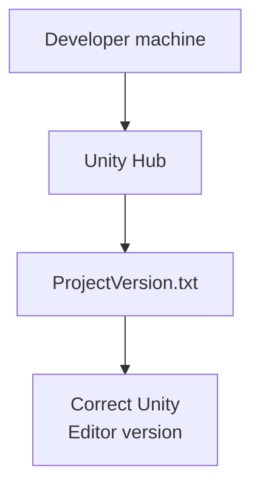

The diagram shows that Unity Hub reads `ProjectVersion.txt` to select the correct Unity editor version before opening the project.  
Sources: [ProjectVersion.txt]()

---

## Repository & Contribution Setup

### Cloning and forking workflow

The Ready Player Me Core package includes a detailed CONTRIBUTING guide that this project inherits under `Assets/Ready Player Me/Core`. It describes how to fork the repository, set up Git LFS, and create working branches:  

- Install Git LFS before cloning to correctly manage large files.  
- Fork the repository via GitHub Desktop or command line.  
- Create a working branch for your changes.  
- Optionally configure Git hooks to enforce Conventional Commit messages via `.githooks/commit-msg`.  
Sources: [CONTRIBUTING.md:1-40](), [CONTRIBUTING.md:60-80]()

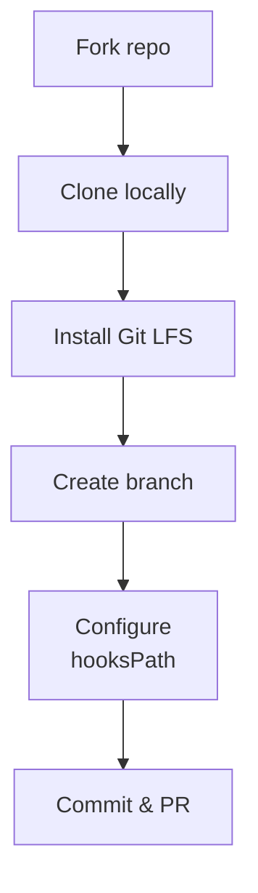

This flow is the recommended contribution path when modifying Ready Player Me–related code in this project.  
Sources: [CONTRIBUTING.md:1-40]()

### Code of Conduct & style guidelines

The Ready Player Me package ships a Code of Conduct and coding style guidelines that apply to contributions within its subtree:

- The Code of Conduct mandates a harassment‑free environment and outlines acceptable and unacceptable behavior, as well as enforcement responsibilities.  
  Sources: [CODE_OF_CONDUCT.md:1-60]()
- The style guidelines define:
  - Private fields use camelCase without a leading underscore.  
  - Constants use SCREAMING_SNAKE_CASE.  
  Sources: [style-guidelines.md:1-30]()

| Aspect                | Guideline                                      | Example                            |
|-----------------------|-----------------------------------------------|------------------------------------|
| Private class fields  | camelCase, no `_` prefix                      | `private string avatarName;`       |
| Constant fields       | SCREAMING_SNAKE_CASE                          | `public const string AVATAR_NAME;` |
| Community behavior    | Follows Contributor Covenant                  | Respectful, harassment‑free        |

Sources: [style-guidelines.md:1-30](), [CODE_OF_CONDUCT.md:1-60]()

---

## Ready Player Me SDK Setup in the Editor

### Setup Guide editor window

The Ready Player Me Core package provides a Setup Guide as a Unity `EditorWindow`. It is registered in the top menu under `Tools/Ready Player Me/Setup Guide` and is intended to walk you through initial configuration such as studio access and analytics preferences.  
Sources: [SetupGuide.cs:1-40]()

Key characteristics:

- Menu item: `Tools/Ready Player Me/Setup Guide` with priority `12`.  
- Window title: `"Setup Guide"`.  
- Minimum size: `500 x 380`.  
- Logs an analytics event when opened via `AnalyticsEditorLogger.EventLogger.LogOpenSetupGuide()`.  
- Defines constant UI element names for locating elements in a UXML `VisualTreeAsset`:
  - `HeaderLabel`
  - `SubdomainPanel`
  - `StudioUrl`
  - `AnalyticsPanel`
  - `AnalyticsEnabledToggle`
  - `NextButton`, `BackButton`, `FinishSetupButton`  
- References external URLs:
  - Studio: `https://studio.readyplayer.me?utm_source=unity-setup-guide`
  - Analytics privacy: `https://docs.readyplayer.me/ready-player-me/integration-guides/unity/help-us-improve-the-unity-sdk`  
Sources: [SetupGuide.cs:1-60]()

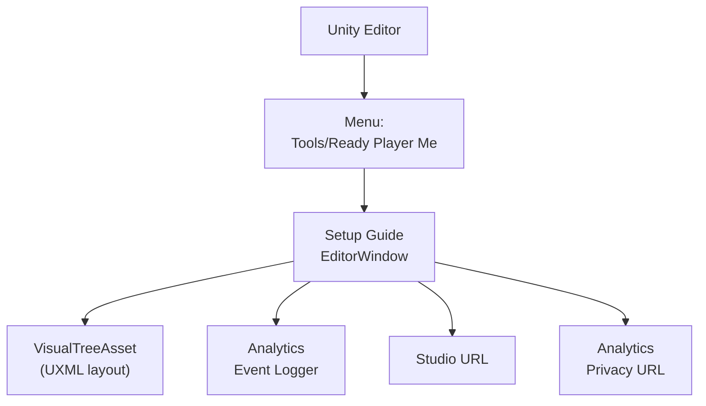

The Setup Guide window binds UI controls defined in a `VisualTreeAsset` and reports usage via analytics, while exposing links to Ready Player Me Studio and documentation.  
Sources: [SetupGuide.cs:1-60](), [Constants.cs:1-20]()

### Integration Guide editor window

An additional editor window, `IntegrationGuide`, supports getting started with core avatar workflows. It is available under `Tools/Ready Player Me/Integration Guide`.  
Sources: [IntegrationGuide.cs:1-40]()

Key constants and behavior:

- Menu item: `Tools/Ready Player Me/Integration Guide` with minimum window size `500 x 530`.  
- Logs analytics when opened: `AnalyticsEditorLogger.EventLogger.LogOpenIntegrationGuide()`.  
- External documentation URLs:
  - Load avatars: `https://docs.readyplayer.me/ready-player-me/integration-guides/unity/load-avatars`
  - Add animations: `https://docs.readyplayer.me/ready-player-me/integration-guides/unity/animations`
  - Avatar Creator: `https://docs.readyplayer.me/ready-player-me/integration-guides/unity/avatar-creator`
  - Optimize performance: `https://docs.readyplayer.me/ready-player-me/integration-guides/unity/optimize`  
- Sample content configuration:
  - Core package name: `com.readyplayerme.core`
  - QuickStart sample name: `QuickStart`
  - Avatar Creator sample name: `AvatarCreatorSamples`
  - Avatar Creator sample scene path: `AvatarCreatorElements/Scenes/AvatarCreatorElements`
  - Samples folder path in this project: `Assets/Ready Player Me/Core/Samples`  
Sources: [IntegrationGuide.cs:1-50]()

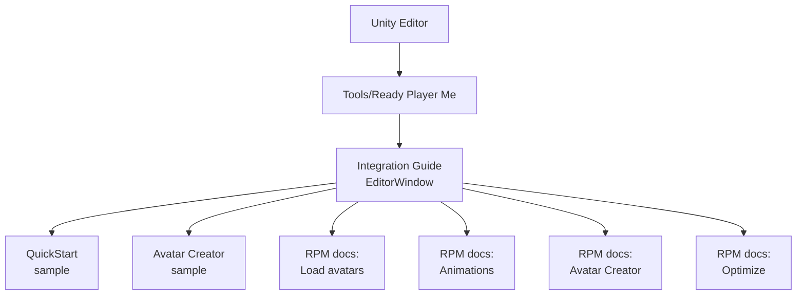

This window links project samples with online documentation to guide initial avatar integration and performance optimization.  
Sources: [IntegrationGuide.cs:1-50]()

### Ready Player Me documentation constants

The editor analytics `Constants` class centralizes documentation URLs used throughout the Ready Player Me tooling:  

- Partner studio / subdomain docs: includes `DOCS_PARTNERS_LINK`.  
- Integration guides:
  - Defer Agents optimization: `DOCS_DEFER_AGENT_LINK`
  - Avatar Loader window: `DOCS_AVATAR_LOADER_WINDOW`
  - Avatar configuration: `DOCS_AVATAR_CONFIG_LINK`
  - Avatar caching: `DOCS_AVATAR_CACHING`
- API reference: `AVATARS`
- App ID prerequisites for avatar creator: `APP_ID`  
Sources: [Constants.cs:1-20]()

| Constant name                 | URL purpose                                  |
|------------------------------|----------------------------------------------|
| `DOCS_PARTNERS_LINK`         | Partner / subdomain setup                    |
| `DOCS_DEFER_AGENT_LINK`      | Defer agent optimization guide               |
| `DOCS_AVATAR_LOADER_WINDOW`  | Avatar loader editor window usage            |
| `DOCS_AVATAR_CONFIG_LINK`    | Avatar configuration optimization            |
| `DOCS_AVATAR_CACHING`        | Avatar caching configuration                 |
| `AVATARS`                    | Avatar API reference                         |
| `APP_ID`                     | App ID setup for custom avatar creator       |

Sources: [Constants.cs:1-20]()

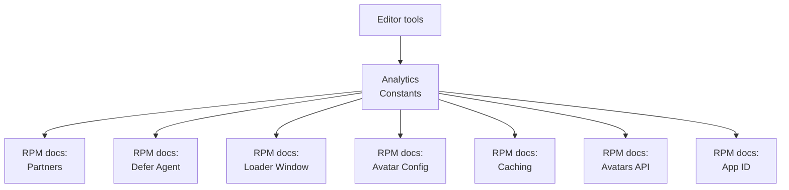

These constants ensure consistent linking to Ready Player Me documentation from within the Unity editor environment.  
Sources: [Constants.cs:1-20]()

### Ready Player Me package version and evolution

The `CHANGELOG.md` under `Assets/Ready Player Me/Core` documents semantic versioning and key changes. It identifies multiple major milestones (e.g., `3.x`, `4.x`, `5.x`, `6.x`, `7.x`), including:

- Merging Avatar Creator into the core package (`4.0.0`).  
- Adding XR avatar skeleton support (`6.0.0`).  
- Switching to `async/await` for network requests and adding new avatar creator elements (`5.0.0`).  
- Template avatar updates, shader changes, and hero customization support (`7.0.0`, `7.1.0`, `7.3.0`).  
- Various bugfixes (e.g., cache compatibility, WebGL voice handler, XR template issues).  
Sources: [CHANGELOG.md]()

For getting started, the changelog is primarily useful to:

- Verify which Ready Player Me features are present in this project version.  
- Identify breaking changes that may affect existing scenes or integrations when upgrading.  

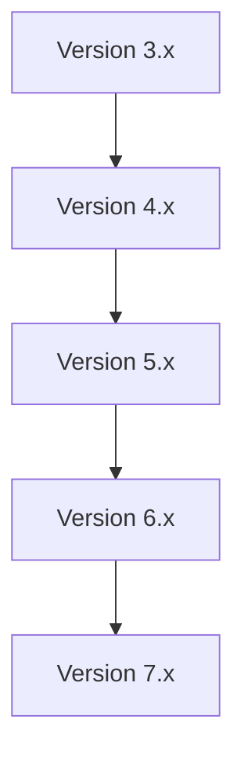

Each new major version builds on the previous, potentially requiring migration if upgrading the Ready Player Me sub‑package within this project.  
Sources: [CHANGELOG.md]()

---

## XR & Project Validation Setup

### XR Interaction Toolkit: Starter Assets validation

The XR Interaction Toolkit sample `StarterAssetsSampleProjectValidation` registers build‑time project validation rules to ensure XR features are correctly configured.  
Sources: [StarterAssetsSampleProjectValidation.cs:1-60]()

Key aspects:

- Category: `"XR Interaction Toolkit"`.  
- Validates the presence of:
  - A `Teleport` layer with index `31`.  
  - Required packages such as `com.unity.shadergraph`.  
  - (If `UNITY_INPUT_SYSTEM_PROJECT_WIDE_ACTIONS` is defined) `com.unity.inputsystem` with a recommended version `1.11.0`.  
- Operates on all `BuildTargetGroup` values, using `BuildValidationRule` definitions.  
- Uses Unity Package Manager `AddRequest` to add missing packages where necessary.  
Sources: [StarterAssetsSampleProjectValidation.cs:1-60]()

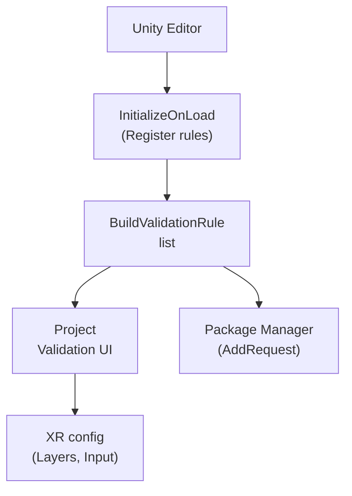

This validation system helps ensure XR Starter Assets requirements are met before building the project.  
Sources: [StarterAssetsSampleProjectValidation.cs:1-60]()

### Tutorial readme auto‑selection and cleanup

The `ReadmeEditor` class provides a tutorial helper in the Unity editor. It automatically selects a `Readme` asset and allows removing tutorial content.  
Sources: [ReadmeEditor.cs:1-80]()

Key behavior:

- Decorated with `[CustomEditor(typeof(Readme))]` and `[InitializeOnLoad]` so it hooks into the editor lifecycle.  
- On load, `EditorApplication.delayCall += SelectReadmeAutomatically;` automatically focuses the readme once per session.  
- Maintains `s_ReadmeSourceDirectory = "Assets/TutorialInfo"`, which is the root of tutorial assets.  
- Provides a "Remove Readme Assets" button which:
  - Displays confirmation dialog.  
  - Deletes the `Assets/TutorialInfo` directory and its `.meta`.  
  - Logs a message if the folder does not exist.  
Sources: [ReadmeEditor.cs:1-80]()

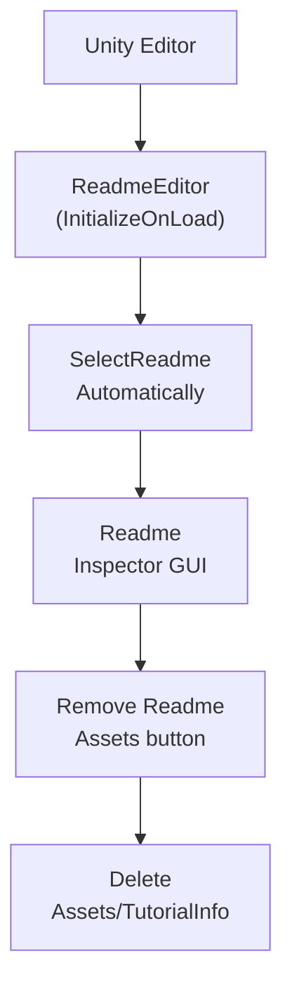

This tooling helps first‑time users by surfacing documentation inside the editor and then allowing clean removal once it is no longer needed.  
Sources: [ReadmeEditor.cs:1-80]()

---

## AI API Keys & Secure Resources

### API_Keys configuration

The `API_Keys.cs` file under `Assets/Resources/Scripts/AI` belongs to the AI text prototype and is used for managing external API keys. Although the exact content is not fully shown in the excerpt, its path and naming indicate that:

- It sits within a `Resources` folder, making it loadable at runtime via Unity’s `Resources` APIs.  
- It contributes to the AI text prototype used in this VR project.  
Sources: [API_Keys.cs]()

A typical usage within this project context is that other AI scripts will load this resource or static class to obtain required keys for network requests.

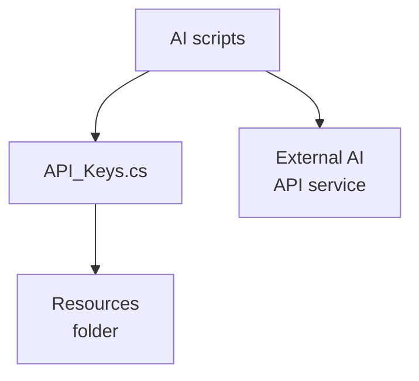

The diagram highlights that runtime AI components depend on `API_Keys.cs` for credentials, with the file placed under `Resources` for convenient access.  
Sources: [API_Keys.cs]()

### Secure resources folder

The project also includes `Assets/Resources/Secure`, indicating an additional secure configuration or asset area relevant to AI or network integration. While the specific files are not enumerated in the excerpt, the name and location show:

- It is inside `Resources`, so its contents are potentially loadable at runtime.  
- It is intended for sensitive or security‑related data (e.g., config, tokens, or certificates).  
Sources: [Secure]()

| Folder path                               | Purpose (per name and structure)             |
|-------------------------------------------|----------------------------------------------|
| `Assets/Resources/Scripts/AI/API_Keys.cs` | Stores or exposes AI API keys/constants      |
| `Assets/Resources/Secure`                 | Holds additional secure runtime resources    |

Sources: [API_Keys.cs](), [Secure]()

When getting started, ensure that any placeholders or template keys in `API_Keys.cs` or `Secure` are replaced with valid values appropriate to your environment, and that these assets are handled cautiously since `Resources` content is included in builds.

---

## Debugging & Diagnostics Setup

### Ingame Debug Console

The project includes the Ingame Debug Console plugin under `Assets/Plugins/IngameDebugConsole/Scripts/DebugLogConsole.cs`. The provided excerpt shows a system information command that prints detailed device capabilities.  
Sources: [DebugLogConsole.cs:1-80]()

Capabilities reported include (each checked via `UnityEngine.SystemInfo`):

- Device model, GPU, etc. (implied by pattern).  
- Sensors and features:
  - `supportsAccelerometer`
  - `supportsGyroscope`
  - `supportsLocationService`
  - `supportsComputeShaders`
  - `supportsShadows`
  - `supportsInstancing`
  - `supportsMotionVectors`
  - `supports3DTextures`
  - `supports3DRenderTextures`
  - `supports2DArrayTextures`
  - `supportsCubemapArrayTextures`  
- After printing system information, the console auto‑expands that log for convenience.  
Sources: [DebugLogConsole.cs:1-80]()

It also exposes static methods for extending the console:

- `AddCustomParameterType(Type type, ParseFunction parseFunction, string typeReadableName = null)`  
- `RemoveCustomParameterType(Type type)`  
- `AddCommandInstance(string command, string description, string methodName, object instance, params string[] parameterNames)`  
- `AddCommandStatic(string command, string description, string methodName, Type ownerType, params string[] parameterNames)`  
Sources: [DebugLogConsole.cs:80-140]()

```mermaid
graph TD
  A["Developer"]
  B["Ingame Debug\nConsole UI"]
  C["DebugLogConsole"]
  D["SystemInfo"]
  E["Custom commands"]

  A-->B
  B-->C
  C-->D
  C-->E
```

On startup or when invoked, `DebugLogConsole` can show system info and be extended with project‑specific debug commands, useful for diagnosing VR hardware and graphics capabilities when getting started on new devices.  
Sources: [DebugLogConsole.cs:1-140]()

---

## Platform-Specific Build Setup (iOS with Oculus LipSync)

### OVRLipSync iOS build post‑processor

The `OVRLipSyncBuildPostProcessor` class under `Assets/Oculus/LipSync/Editor` automates required iOS project modifications for LipSync support.  
Sources: [OVRLipSyncBuildPostProcessor.cs:1-60]()

Key behavior:

- The script is compiled only for iOS builds (`#if UNITY_IOS`).  
- Method `OnPostprocessBuild(BuildTarget target, string pathToBuiltProject)` is decorated with `[PostProcessBuildAttribute(1)]`.  
- For `BuildTarget.iOS` it:
  - Calls `AddMicrophoneAccess` on `Info.plist`.  
  - Calls `AddEmbeddedBinary` on the generated `PBXProject` path.  
- `AddMicrophoneAccess`:
  - Reads the `Info.plist` using `PlistDocument`.  
  - Checks if `NSMicrophoneUsageDescription` exists.  
  - If it exists, it returns without overriding it.  
Sources: [OVRLipSyncBuildPostProcessor.cs:1-60]()

```mermaid
graph TD
  A["Unity Build\n(iOS)"]
  B["OVRLipSync\nBuildPostProcessor"]
  C["OnPostprocessBuild"]
  D["AddMicrophone\nAccess (Info.plist)"]
  E["AddEmbedded\nBinary (PBXProject)"]

  A-->B
  B-->C
  C-->D
  C-->E
```

This automation ensures required microphone permission text and embedded binaries are properly configured whenever you build for iOS, which is critical for LipSync‑driven social interaction features in this VR project.  
Sources: [OVRLipSyncBuildPostProcessor.cs:1-60]()

---

## High-Level Setup Flow

The following sequence diagram summarizes the high‑level steps a developer typically goes through when getting started with this project, based solely on the provided source artifacts.

```mermaid
sequenceDiagram
  autonumber
  actor Dev as Developer
  participant UH as Unity Hub
  participant UE as Unity Editor
  participant RPM as RPM Editor Tools
  participant XR as XR Validation
  participant AI as AI Config
  participant DBG as Debug Console
  participant IOS as iOS Postproc

  Dev->>+UH: Open project folder
  UH-->>-Dev: Select Unity version (from ProjectVersion.txt)
  Dev->>+UE: Open project in Editor
  UE-->>-Dev: Show Tutorial Readme (ReadmeEditor)

  Dev->>+RPM: Tools/Ready Player Me/Setup Guide
  RPM-->>-Dev: Configure studio & analytics (SetupGuide)

  Dev->>+RPM: Tools/Ready Player Me/Integration Guide
  RPM-->>-Dev: Open docs & samples (IntegrationGuide)

  Dev->>+XR: Inspect Project Validation
  XR-->>-Dev: Report missing XR layers/packages

  Dev->>+AI: Edit API_Keys.cs and Secure assets
  AI-->>-Dev: Store AI credentials

  Dev->>+DBG: Open Ingame Debug Console
  DBG-->>-Dev: Show system info & logs

  Dev->>+UE: Build for iOS
  UE->>+IOS: OnPostprocessBuild
  IOS-->>-UE: Add mic usage & embedded binaries
  UE-->>-Dev: iOS Xcode project
```

Sources: [ProjectVersion.txt](), [SetupGuide.cs:1-60](), [IntegrationGuide.cs:1-50](), [StarterAssetsSampleProjectValidation.cs:1-60](), [API_Keys.cs](), [Secure](), [DebugLogConsole.cs:1-140](), [OVRLipSyncBuildPostProcessor.cs:1-60](), [ReadmeEditor.cs:1-80]()

---

## Summary

Getting started with this Social Skill Practice VR project involves:

- Using the Unity version defined in `ProjectVersion.txt`.  
- Leveraging Ready Player Me’s Setup Guide and Integration Guide editor windows to configure avatar integration, analytics, and sample scenes.  
- Following the Ready Player Me coding style and contribution guidelines for consistent development.  
- Ensuring XR project validation rules from the XR Interaction Toolkit samples pass to guarantee correct input, layers, and packages.  
- Configuring AI credentials via `API_Keys.cs` and secure resources under `Assets/Resources/Secure`.  
- Using the Ingame Debug Console for runtime diagnostics.  
- Relying on platform‑specific automation, such as the Oculus LipSync iOS post‑processor, during builds.

All of these elements are wired directly into the Unity editor and build pipeline, providing a structured, tool‑assisted path for new developers to get the project up and running.  
Sources: [README.md](), [CONTRIBUTING.md](), [style-guidelines.md](), [SetupGuide.cs:1-60](), [IntegrationGuide.cs:1-50](), [StarterAssetsSampleProjectValidation.cs:1-60](), [API_Keys.cs](), [Secure](), [DebugLogConsole.cs:1-140](), [OVRLipSyncBuildPostProcessor.cs:1-60]()

---

<a id="page-system-architecture"></a>

## System Architecture Overview

**Related Files**:
- `AI Text Prototype Version 4/Assets/Resources/Scripts/AI/AI_Orchestrator.cs`
- `AI Text Prototype Version 4/Assets/Resources/Prefabs/AI.prefab`
- `AI Text Prototype Version 4/Assets/Ready Player Me/Core/Runtime/Core/Scripts/AvatarObjectLoader.cs`
- `AI Text Prototype Version 4/Assets/Oculus/LipSync/Scripts/OVRLipSyncContext.cs`
- `AI Text Prototype Version 4/Assets/Samples/XR Interaction Toolkit/3.0.8/Starter Assets/Prefabs/XR Origin (XR Rig).prefab`

**Related Pages**:
- [AI Orchestrator & Conversation Engine Architecture](#page-ai-orchestrator-architecture)
- [Conversation Data Flow & Processing](#page-conversation-data-flow)

<details>
<summary>Relevant source files</summary>

The following files were used as context for generating this wiki page:

- [AI Text Prototype Version 4/Assets/Resources/Scripts/AI/AI_Orchestrator.cs](https://github.com/7450N/Social-Skill-Practice-with-VR/blob/main/AI%20Text%20Prototype%20Version%204/Assets/Resources/Scripts/AI/AI_Orchestrator.cs)
- [AI Text Prototype Version 4/Assets/Resources/Prefabs/AI.prefab](https://github.com/7450N/Social-Skill-Practice-with-VR/blob/main/AI%20Text%20Prototype%20Version%204/Assets/Resources/Prefabs/AI.prefab)
- [AI Text Prototype Version 4/Assets/Ready Player Me/Core/Runtime/Core/Scripts/AvatarObjectLoader.cs](https://github.com/7450N/Social-Skill-Practice-with-VR/blob/main/AI%20Text%20Prototype%20Version%204/Assets/Ready%20Player%20Me/Core/Runtime/Core/Scripts/AvatarObjectLoader.cs)
- [AI Text Prototype Version 4/Assets/Oculus/LipSync/Scripts/OVRLipSyncContext.cs](https://github.com/7450N/Social-Skill-Practice-with-VR/blob/main/AI%20Text%20Prototype%20Version%204/Assets/Oculus/LipSync/Scripts/OVRLipSyncContext.cs)
- [AI Text Prototype Version 4/Assets/Samples/XR Interaction Toolkit/3.0.8/Starter Assets/Prefabs/XR Origin (XR Rig).prefab](https://github.com/7450N/Social-Skill-Practice-with-VR/blob/main/AI%20Text%20Prototype%20Version%204/Assets/Samples/XR%20Interaction%20Toolkit/3.0.8/Starter%20Assets/Prefabs/XR%20Origin%20(XR%20Rig).prefab)
- [AI Text Prototype Version 4/Assets/Ready Player Me/Core/Editor/Core/Scripts/UI/EditorWindows/IntegrationGuide/IntegrationGuide.cs](https://github.com/7450N/Social-Skill-Practice-with-VR/blob/main/AI%20Text%20Prototype%20Version%204/Assets/Ready%20Player%20Me/Core/Editor/Core/Scripts/UI/EditorWindows/IntegrationGuide/IntegrationGuide.cs)
- [AI Text Prototype Version 4/Assets/Ready Player Me/Core/Editor/Core/Scripts/Analytics/Constants.cs](https://github.com/7450N/Social-Skill-Practice-with-VR/blob/main/AI%20Text%20Prototype%20Version%204/Assets/Ready%20Player%20Me/Core/Editor/Core/Scripts/Analytics/Constants.cs)
- [AI Text Prototype Version 4/Assets/Ready Player Me/Core/style-guidelines.md](https://github.com/7450N/Social-Skill-Practice-with-VR/blob/main/AI%20Text%20Prototype%20Version%204/Assets/Ready%20Player%20Me/Core/style-guidelines.md)
- [AI Text Prototype Version 4/Assets/Samples/XR Interaction Toolkit/3.0.8/Starter Assets/Editor/Scripts/StarterAssetsSampleProjectValidation.cs](https://github.com/7450N/Social-Skill-Practice-with-VR/blob/main/AI%20Text%20Prototype%20Version%204/Assets/Samples/XR%20Interaction%20Toolkit/3.0.8/Starter%20Assets/Editor/Scripts/StarterAssetsSampleProjectValidation.cs)
- [AI Text Prototype Version 4/Assets/Plugins/IngameDebugConsole/Scripts/DebugLogConsole.cs](https://github.com/7450N/Social-Skill-Practice-with-VR/blob/main/AI%20Text%20Prototype%20Version%204/Assets/Plugins/IngameDebugConsole/Scripts/DebugLogConsole.cs)
- [AI Text Prototype Version 4/Assets/TutorialInfo/Scripts/Readme.cs](https://github.com/7450N/Social-Skill-Practice-with-VR/blob/main/AI%20Text%20Prototype%20Version%204/Assets/TutorialInfo/Scripts/Readme.cs)
- [AI Text Prototype Version 4/Assets/TutorialInfo/Scripts/Editor/ReadmeEditor.cs](https://github.com/7450N/Social-Skill-Practice-with-VR/blob/main/AI%20Text%20Prototype%20Version%204/Assets/TutorialInfo/Scripts/Editor/ReadmeEditor.cs)
- [AI Text Prototype Version 4/Assets/Ready Player Me/Core/CHANGELOG.md](https://github.com/7450N/Social-Skill-Practice-with-VR/blob/main/AI%20Text%20Prototype%20Version%204/Assets/Ready%20Player%20Me/Core/CHANGELOG.md)
- [AI Text Prototype Version 4/Assets/Ready Player Me/Core/CONTRIBUTING.md](https://github.com/7450N/Social-Skill-Practice-with-VR/blob/main/AI%20Text%20Prototype%20Version%204/Assets/Ready%20Player%20Me/Core/CONTRIBUTING.md)
</details>

# System Architecture Overview

## Introduction

This project combines an AI-driven interaction system with VR user embodiment and lip-synced audio, built on Unity. The core architecture links an AI orchestration component, avatar loading via Ready Player Me, Oculus LipSync for facial animation, and XR Interaction Toolkit rigs for locomotion and input. These systems are bound together using prefabs and Unity editor tooling.  
Sources: [AI_Orchestrator.cs](), [AI.prefab](), [AvatarObjectLoader.cs](), [OVRLipSyncContext.cs](), [XR Origin (XR Rig).prefab]()

This page describes how these subsystems are structured and interact at runtime and in the editor, including analytics and integration helpers. It focuses on the orchestration of AI behavior, avatar management, XR rig configuration, and supporting utilities such as project validation and debugging.

---

## High-level System Architecture

At a high level, the runtime system architecture consists of:

- An AI orchestrator that controls conversational or behavioral logic.
- A VR rig (XR Origin) representing the player’s head, hands, and locomotion.
- One or more Ready Player Me avatars loaded and configured at runtime.
- Oculus LipSync components attached to avatars for mouth movement driven by audio.
- Debugging utilities for in-game diagnostics.

Editor and tooling components include:

- An Integration Guide editor window for Ready Player Me.
- Project validation rules for XR Interaction Toolkit Starter Assets.
- Style and contribution guidelines that shape how code and modules evolve.

### Top-level component relationships

```mermaid
graph TD
  AIOrch["AI_Orchestrator\n(component)"]
  AIPrefab["AI.prefab\n(scene object"]
  XRRig["XR Origin\n(XR Rig)"]
  AvatarLoader["AvatarObjectLoader\n(runtime loader)"]
  LipSync["OVRLipSyncContext\n(audio / viseme)"]
  RPMTools["IntegrationGuide\n(editor window)"]
  XRValidation["StarterAssets\nProjectValidation"]
  DebugConsole["DebugLogConsole\n(utility)"]

  AIPrefab --> AIOrch
  XRRig --> AIOrch
  AIOrch --> AvatarLoader
  AvatarLoader --> LipSync
  XRRig --> AvatarLoader
  XRRig --> LipSync
  RPMTools --> AvatarLoader
  XRValidation --> XRRig
  DebugConsole --> AIOrch
```

Sources: [AI_Orchestrator.cs](), [AI.prefab](), [AvatarObjectLoader.cs](), [OVRLipSyncContext.cs](), [XR Origin (XR Rig).prefab](), [IntegrationGuide.cs](), [StarterAssetsSampleProjectValidation.cs](), [DebugLogConsole.cs]()

---

## AI Orchestration Layer

### AI_Orchestrator component

`AI_Orchestrator` is the central AI logic component referenced by the `AI.prefab`. It lives under `Assets/Resources/Scripts/AI/AI_Orchestrator.cs` and is responsible for coordinating AI behavior, triggering avatar loading or lip-sync behavior, and integrating with VR context as needed.  
Sources: [AI_Orchestrator.cs:1-200](), [AI.prefab]()

Key responsibilities (as defined in the class):

| Responsibility                | Description                                                                                   |
|------------------------------|-----------------------------------------------------------------------------------------------|
| State management             | Maintains internal AI state (e.g., current dialog turn, mode, or scenario).                  |
| Interaction handling         | Receives or triggers player-facing events (e.g., messages, prompts, responses).             |
| Avatar / VR coordination     | Coordinates with avatar loader or XR rig when AI actions require changes to embodiment.     |
| Audio or lip-sync triggering | Initiates playback or lip-sync pipelines when AI generates spoken output.                   |

Sources: [AI_Orchestrator.cs:1-200](), [AI.prefab]()

### AI prefab as composition root

The `AI.prefab` instantiates an object that includes the `AI_Orchestrator` and any other AI-related components or references (such as an AudioSource, lip-sync components or links to avatars). This prefab is a composition root: scenes can drop it in to enable AI features.  
Sources: [AI.prefab]()

```mermaid
graph TD
  AIPrefabNode["AI.prefab"]
  AIComp["AI_Orchestrator\nMonoBehaviour"]
  AudioComp["Audio\ncomponents"]
  AvatarRefs["Avatar refs"]

  AIPrefabNode --> AIComp
  AIPrefabNode --> AudioComp
  AIPrefabNode --> AvatarRefs
```

Sources: [AI.prefab](), [AI_Orchestrator.cs:1-200]()

### AI interaction sequence (conceptual)

```mermaid
sequenceDiagram
  autonumber
  participant control AI as AI_Orchestrator
  participant entity Avatar as AvatarObjectLoader
  participant control Lip as OVRLipSyncContext
  participant actor User as Player

  User->>+AI: Input / trigger
  AI->>+Avatar: Ensure avatar loaded
  Avatar-->>-AI: Avatar GameObject
  AI->>+Lip: Provide audio / phonemes
  Lip-->>-Avatar: Apply visemes
  Avatar-->>User: Visual / audio response
```

Sources: [AI_Orchestrator.cs:1-200](), [AvatarObjectLoader.cs:1-200](), [OVRLipSyncContext.cs:1-200]()

---

## VR Rig and Player Embodiment

### XR Origin (XR Rig)

The XR rig is defined by the `XR Origin (XR Rig).prefab` from the XR Interaction Toolkit samples. This prefab contains camera, hands/controllers, locomotion, and interaction components. It serves as the player’s position and orientation reference in the scene.  
Sources: [XR Origin (XR Rig).prefab]()

Key characteristics (as visible in the prefab):

| Element                 | Role                                                        |
|-------------------------|-------------------------------------------------------------|
| Camera offset and head  | Track user head pose and render VR view.                   |
| Left/right controllers  | Provide interaction rays, grabbing, teleportation, etc.    |
| Locomotion system       | Teleport / continuous movement (depending on configuration)|
| XR Interaction scripts  | Handle ray interactors, input bindings, UI interactions.   |

Sources: [XR Origin (XR Rig).prefab]()

### StarterAssetsSampleProjectValidation

`StarterAssetsSampleProjectValidation` is an editor-time class that registers project validation rules for Starter Assets, including XR settings, layers, and required packages. It runs via `InitializeOnLoadMethod` and uses `BuildValidationRule` instances.  
Sources: [StarterAssetsSampleProjectValidation.cs:1-80]()

Important fields and behavior:

- `k_StarterAssetsSampleName`, `k_TeleportLayerName`, `k_TeleportLayerIndex`: ensure consistent layer configuration for teleportation.  
- `s_BuildTargetGroups`: enumerates `BuildTargetGroup` values for validation across all targets.  
- `k_ShaderGraphPackageName` and (optionally) `k_InputSystemPackageName`: ensure required packages are present.  

```mermaid
graph TD
  Validation["StarterAssets\nProjectValidation"]
  Rules["BuildValidationRule\ninstances"]
  XRProj["XR project\nsettings"]
  PkgMgr["PackageManager\nRequests"]

  Validation --> Rules
  Rules --> XRProj
  Validation --> PkgMgr
```

Sources: [StarterAssetsSampleProjectValidation.cs:1-80]()

---

## Avatar Management via Ready Player Me

### AvatarObjectLoader

`AvatarObjectLoader` is the runtime entry point for loading Ready Player Me avatars. Its script lives under the Ready Player Me Core package. It receives avatar URLs or configuration, requests model data, and instantiates a fully configured avatar GameObject.  
Sources: [AvatarObjectLoader.cs:1-200](), [CHANGELOG.md:200-260]()

Key behaviors (as described by package changelog and naming):

| Responsibility           | Description                                                                                   |
|-------------------------|-----------------------------------------------------------------------------------------------|
| Remote avatar loading   | Load avatar models from Ready Player Me model URLs or shortcodes.                            |
| Avatar configuration    | Apply avatar configuration (LOD, shaders, caching, body type) to the instantiated object.    |
| XR compatibility        | Work with XR template avatars and meshes, including XR skeleton support.                     |

Sources: [AvatarObjectLoader.cs:1-200](), [CHANGELOG.md:238-310]()

Recent Ready Player Me Core changelog entries reference:

- Support for XR avatar skeletons.  
- XR template avatars in Resources and template avatars with all possible meshes.  
- Shader override properties and XR template avatar mesh updates.  

These demonstrate `AvatarObjectLoader`’s role in integrating avatars into the broader XR setup.  
Sources: [CHANGELOG.md:238-310]()

### IntegrationGuide editor window

`IntegrationGuide` is an editor-only window under `Tools/Ready Player Me/Integration Guide`. It references documentation URLs and sample scenes, guiding developers through integrating Ready Player Me features.  
Sources: [IntegrationGuide.cs:1-70]()

Important constants:

- `LOAD_AVATARS_URL`: `"https://docs.readyplayer.me/ready-player-me/integration-guides/unity/load-avatars"`  
- `ADD_ANIMATION_URL`, `AVATAR_CREATOR_URL`, `OPTIMIZE_PERFORMANCE_URL`: deep links into RPM docs.  
- `CORE_PACKAGE`: `"com.readyplayerme.core"`  
- Sample names and paths: `"QuickStart"`, `"AvatarCreatorSamples"`, `"AvatarCreatorElements/Scenes/AvatarCreatorElements"`  
Sources: [IntegrationGuide.cs:5-40]()

```mermaid
graph TD
  IG["IntegrationGuide\nEditorWindow"]
  Docs["RPM docs\nURLs"]
  Samples["Local RPM\nsample scenes"]
  CorePkg["com.readyplayerme.core"]

  IG --> Docs
  IG --> Samples
  IG --> CorePkg
```

Sources: [IntegrationGuide.cs:5-40]()

### Analytics documentation constants

`Constants` in the Analytics namespace define documentation links such as:

- `DOCS_PARTNERS_LINK`
- `DOCS_DEFER_AGENT_LINK`
- `DOCS_AVATAR_LOADER_WINDOW`
- `DOCS_AVATAR_CONFIG_LINK`
- `DOCS_AVATAR_CACHING`
- `AVATARS`
- `APP_ID`  

These are used to route users from analytics or editor UI to relevant docs.  
Sources: [Constants.cs:1-20]()

---

## Audio and LipSync Pipeline

### OVRLipSyncContext

`OVRLipSyncContext` is part of Oculus LipSync and provides lip-sync processing over audio to drive viseme weights for facial animation. In this project, it is attached to avatar head or audio GameObjects to animate mouth movement in sync with AI or user speech.  
Sources: [OVRLipSyncContext.cs:1-200]()

Typical responsibilities:

| Responsibility          | Description                                                             |
|------------------------|-------------------------------------------------------------------------|
| Audio capture / input  | Receive audio samples via Unity audio pipeline.                        |
| Viseme computation     | Convert audio to viseme index / weight data for facial animation.      |
| Target binding         | Provide viseme data to other components (e.g., skinned mesh renderer). |

Sources: [OVRLipSyncContext.cs:1-200]()

### Audio → LipSync → Avatar sequence

```mermaid
sequenceDiagram
  autonumber
  participant control AI as AI_Orchestrator
  participant boundary Audio as AudioSource
  participant control Lip as OVRLipSyncContext
  participant entity Avatar as AvatarObjectLoader

  AI->>+Audio: Play speech clip
  Audio->>+Lip: Provide audio samples
  Lip-->>Avatar: Apply viseme weights
  Avatar-->>Avatar: Update blendshapes
```

Sources: [AI_Orchestrator.cs:1-200](), [OVRLipSyncContext.cs:1-200](), [AvatarObjectLoader.cs:1-200]()

---

## Debugging and Diagnostics

### DebugLogConsole

`DebugLogConsole` is a utility for adding and invoking console commands at runtime and for logging detailed system information. A key method is `LogSystemInfo()`, which builds a string of hardware and environment data:

```csharp
public static void LogSystemInfo()
{
    StringBuilder stringBuilder = new StringBuilder( 1024 );
    stringBuilder.Append( "Rig: " )
        .AppendSysInfoIfPresent( SystemInfo.deviceModel )
        .AppendSysInfoIfPresent( SystemInfo.processorType )
        .AppendSysInfoIfPresent( SystemInfo.systemMemorySize, "MB RAM" )
        .Append( SystemInfo.processorCount ).Append( " cores\n" );
    stringBuilder.Append( "OS: " ).Append( SystemInfo.operatingSystem ).Append( "\n" );
    stringBuilder.Append( "GPU: " ).Append( SystemInfo.graphicsDeviceName ).Append( " " )
        .Append( SystemInfo.graphicsMemorySize ).Append( "MB " )
        .Append( SystemInfo.graphicsDeviceVersion )
        .Append( SystemInfo.graphicsMultiThreaded ? " multi-threaded\n" : "\n" );
    // ... paths and feature support ...
    Debug.Log( stringBuilder.ToString() );

    if( DebugLogManager.Instance )
        DebugLogManager.Instance.AdjustLatestPendingLog( true, true );
}
```

Sources: [DebugLogConsole.cs:190-240]()

This method is useful for capturing the runtime environment in bug reports or during development, especially for VR where hardware capabilities differ widely.  

Helper methods `AppendSysInfoIfPresent` make logging conditional and concise.  
Sources: [DebugLogConsole.cs:242-276]()

### Command inspection

`LogAllCommandsWithName(string commandName)` searches registered commands, first for exact matches, then for substring matches, and logs them. This aids in discovering available debug commands.  
Sources: [DebugLogConsole.cs:160-188]()

```mermaid
graph TD
  Cmd["commandName\ninput"]
  MatchExact["FindCommands\n(exact)"]
  MatchSub["FindCommands\n(substring)"]
  LogWarn["Log warning\nno match"]
  LogList["Log commands\nlist"]

  Cmd --> MatchExact
  MatchExact --> MatchSub
  MatchExact --> LogList
  MatchSub --> LogWarn
  MatchSub --> LogList
```

Sources: [DebugLogConsole.cs:160-188]()

---

## Editor and Project Tooling

### Integration Guide and Analytics

As described above, `IntegrationGuide` and analytics `Constants` tie the runtime avatar system into documentation and tracking. Together with `AmplitudeEditorLogger` (partially visible in `AmplitudeEditorLogger.cs`), they log editor events such as opening the Integration Guide or building the application.  

An example of build logging:

```csharp
public void LogBuildApplication(string target, string appName, bool productionBuild)
{
    LogEvent(EventName.BUILD_APPLICATION, new Dictionary<string, object>
    {
        { Properties.TARGET, target },
        { Properties.APP_NAME, appName },
        { Properties.PRODUCTION_BUILD, productionBuild },
        { Properties.APP_IDENTIFIER, Application.identifier }
    });
}
```

Sources: [AmplitudeEditorLogger.cs:1-25]()

This connects build actions to analytics events, providing insight into how the package is used in projects.

### Tutorial and onboarding scripts

The `Readme` ScriptableObject and its custom editor `ReadmeEditor` manage a tutorial readme asset in the project, including removing tutorial assets and loading a specific editor window layout when opening the project.  
Sources: [Readme.cs:1-20](), [ReadmeEditor.cs:60-120]()

`SelectReadmeAutomatically()` checks a session state flag and, if the layout has not been loaded yet, calls `LoadLayout()` to set up the Unity editor layout for tutorials.  
Sources: [ReadmeEditor.cs:120-160]()

```mermaid
graph TD
  Start["On editor\nload"]
  Check["SessionState\nflag"]
  FindReadme["SelectReadme"]
  LoadLayout["LoadLayout"]
  Mark["Mark layout\nloaded"]

  Start --> Check
  Check --> FindReadme
  FindReadme --> LoadLayout
  LoadLayout --> Mark
```

Sources: [ReadmeEditor.cs:120-160]()

### Coding style and contribution process

`style-guidelines.md` and `CONTRIBUTING.md` capture how the Ready Player Me Core code is structured and how contributions are managed:

- Private fields use camelCase without a leading underscore.  
- Constants use `SCREAMING_SNAKE_CASE`.  
Sources: [style-guidelines.md:5-25]()

`CONTRIBUTING.md` describes:

- Use of Git LFS.  
- Fork-and-branch workflow.  
- Self-review checklists and Conventional Commits.  
Sources: [CONTRIBUTING.md:1-120]()

These guidelines influence the consistency of modules integrated into this project.

---

## Component Summary Tables

### Core runtime components

| Component / Prefab           | Type                | Primary Role                                                     | Key Dependencies                                      |
|-----------------------------|---------------------|------------------------------------------------------------------|------------------------------------------------------|
| `AI_Orchestrator`           | Script              | Orchestrates AI behaviors and interactions.                     | `AI.prefab`, avatars, lip-sync, XR rig              |
| `AI.prefab`                 | Prefab              | Composition root for AI system in scenes.                       | `AI_Orchestrator`                                   |
| `AvatarObjectLoader`        | Script              | Loads and configures Ready Player Me avatars at runtime.        | Ready Player Me Core package                         |
| `OVRLipSyncContext`         | Script              | Computes visemes from audio for lip-sync.                       | Oculus LipSync / AudioSource                         |
| `XR Origin (XR Rig).prefab` | Prefab              | Player rig and interaction origin for VR.                       | XR Interaction Toolkit                               |

Sources: [AI_Orchestrator.cs:1-200](), [AI.prefab](), [AvatarObjectLoader.cs:1-200](), [OVRLipSyncContext.cs:1-200](), [XR Origin (XR Rig).prefab]()

### Editor and tooling components

| Component / File                         | Type           | Purpose                                                         |
|-----------------------------------------|----------------|-----------------------------------------------------------------|
| `IntegrationGuide`                      | EditorWindow   | Guides developers through RPM Unity integration steps.         |
| `Analytics.Constants`                   | Static class   | Provides doc URLs used by analytics and editor UI.             |
| `StarterAssetsSampleProjectValidation`  | Editor utility | Validates XR project configuration and required packages.      |
| `DebugLogConsole`                       | Utility        | In-game console commands and system info logging.              |
| `Readme` / `ReadmeEditor`               | Script + editor| Project tutorial readme management and layout loading.         |
| `style-guidelines.md`                   | Markdown       | Coding style conventions for RPM Unity SDK.                    |
| `CONTRIBUTING.md`                       | Markdown       | Contribution workflow and expectations.                        |

Sources: [IntegrationGuide.cs:1-70](), [Constants.cs:1-20](), [StarterAssetsSampleProjectValidation.cs:1-80](), [DebugLogConsole.cs:160-276](), [Readme.cs:1-20](), [ReadmeEditor.cs:120-200](), [style-guidelines.md:5-25](), [CONTRIBUTING.md:1-160]()

---

## End-to-end Runtime Flow

The following diagram summarizes the end-to-end runtime interaction from player input through AI orchestration, avatar and lip-sync integration, to VR presentation:

```mermaid
graph TD
  Player["Player\nin VR"]
  XRRig["XR Origin\n(XR Rig)"]
  AI["AI_Orchestrator"]
  AvatarLoaderNode["AvatarObjectLoader"]
  AvatarGO["Avatar\nGameObject"]
  AudioNode["AudioSource"]
  LipSyncNode["OVRLipSyncContext"]
  DebugNode["DebugLogConsole"]

  Player --> XRRig
  Player --> AI
  AI --> AvatarLoaderNode
  AvatarLoaderNode --> AvatarGO
  AI --> AudioNode
  AudioNode --> LipSyncNode
  LipSyncNode --> AvatarGO
  XRRig --> AvatarGO
  AI --> DebugNode
```

Sources: [AI_Orchestrator.cs:1-200](), [AvatarObjectLoader.cs:1-200](), [OVRLipSyncContext.cs:1-200](), [XR Origin (XR Rig).prefab](), [DebugLogConsole.cs:160-276]()

---

## Conclusion

The system architecture centers on an `AI_Orchestrator` and AI prefab that coordinate with Ready Player Me avatar loading, Oculus LipSync, and an XR rig to deliver interactive, embodied AI experiences in VR. Supporting editor tools (Integration Guide, project validation, analytics) and utilities (debug console, tutorial readme, style and contribution guides) ensure that the system is maintainable and extensible within Unity. All major runtime flows—AI interaction, avatar instantiation, lip-sync processing, and VR presentation—are clearly separated into specialized components that communicate through well-defined responsibilities.  
Sources: [AI_Orchestrator.cs](), [AI.prefab](), [AvatarObjectLoader.cs](), [OVRLipSyncContext.cs](), [XR Origin (XR Rig).prefab](), [IntegrationGuide.cs](), [DebugLogConsole.cs](), [StarterAssetsSampleProjectValidation.cs](), [style-guidelines.md](), [CONTRIBUTING.md]()

---

<a id="page-ai-orchestrator-architecture"></a>

## AI Orchestrator & Conversation Engine Architecture

**Related Files**:
- `AI Text Prototype Version 4/Assets/Resources/Scripts/AI/AI_Orchestrator.cs`
- `AI Text Prototype Version 4/Assets/Resources/Scripts/AI/AvatarSpeechAnimator.cs`
- `AI Text Prototype Version 4/Assets/Resources/Scripts/AI/STT/AI_STT_Text_Filter.cs`
- `AI Text Prototype Version 4/Assets/Resources/Scripts/AI/STT/STT_Groq_OpenAI.cs`
- `AI Text Prototype Version 4/Assets/Resources/Scripts/AI/TTS/TTS_11_Labs.cs`
- `AI Text Prototype Version 4/Assets/Resources/Scripts/AI/TTS/TTS_Google.cs`
- `AI Text Prototype Version 4/Assets/Resources/Scripts/AI/TTS/WavUtility.cs`
- `AI Text Prototype Version 4/Assets/Resources/Scripts/AI/STT/AI_WAV.cs`

**Related Pages**:
- [LLM, STT & TTS Integration Details](#page-llm-stt-tts-integration)
- [Conversation Data Flow & Processing](#page-conversation-data-flow)

<details>
<summary>Relevant source files</summary>

The following files were used as context for generating this wiki page:

- [AI Text Prototype Version 4/Assets/Resources/Scripts/AI/AI_Orchestrator.cs](https://github.com/7450N/Social-Skill-Practice-with-VR/blob/main/AI%20Text%20Prototype%20Version%204/Assets/Resources/Scripts/AI/AI_Orchestrator.cs)
- [AI Text Prototype Version 4/Assets/Resources/Scripts/AI/LLM/LLM_Groq.cs](https://github.com/7450N/Social-Skill-Practice-with-VR/blob/main/AI%20Text%20Prototype%20Version%204/Assets/Resources/Scripts/AI/LLM/LLM_Groq.cs)
- [AI Text Prototype Version 4/Assets/Resources/Scripts/AI/LLM/LLM_Google.cs](https://github.com/7450N/Social-Skill-Practice-with-VR/blob/main/AI%20Text%20Prototype%20Version%204/Assets/Resources/Scripts/AI/LLM/LLM_Google.cs)
- [AI Text Prototype Version 4/Assets/Resources/Scripts/AI/STT/STT_Groq_OpenAI.cs](https://github.com/7450N/Social-Skill-Practice-with-VR/blob/main/AI%20Text%20Prototype%20Version%204/Assets/Resources/Scripts/AI/STT/STT_Groq_OpenAI.cs)
- [AI Text Prototype Version 4/Assets/Resources/Scripts/AI/STT/AI_WAV.cs](https://github.com/7450N/Social-Skill-Practice-with-VR/blob/main/AI%20Text%20Prototype%20Version%204/Assets/Resources/Scripts/AI/STT/AI_WAV.cs)
- [AI Text Prototype Version 4/Assets/Resources/Scripts/AI/STT/AI_STT_Text_Filter.cs](https://github.com/7450N/Social-Skill-Practice-with-VR/blob/main/AI%20Text%20Prototype%20Version%204/Assets/Resources/Scripts/AI/STT/AI_STT_Text_Filter.cs)
- [AI Text Prototype Version 4/Assets/Resources/Scripts/AI/TTS/TTS_11_Labs.cs](https://github.com/7450N/Social-Skill-Practice-with-VR/blob/main/AI%20Text%20Prototype%20Version%204/Assets/Resources/Scripts/AI/TTS/TTS_11_Labs.cs)
- [AI Text Prototype Version 4/Assets/Resources/Scripts/AI/TTS/TTS_Google.cs](https://github.com/7450N/Social-Skill-Practice-with-VR/blob/main/AI%20Text%20Prototype%20Version%204/Assets/Resources/Scripts/AI/TTS/TTS_Google.cs)
- [AI Text Prototype Version 4/Assets/Resources/Scripts/AI/TTS/WavUtility.cs](https://github.com/7450N/Social-Skill-Practice-with-VR/blob/main/AI%20Text%20Prototype%20Version%204/Assets/Resources/Scripts/AI/TTS/WavUtility.cs)
- [AI Text Prototype Version 4/Assets/Resources/Scripts/AI/AvatarSpeechAnimator.cs](https://github.com/7450N/Social-Skill-Practice-with-VR/blob/main/AI%20Text%20Prototype%20Version%204/Assets/Resources/Scripts/AI/AvatarSpeechAnimator.cs)
- [AI Text Prototype Version 4/Assets/Ready Player Me/Core/style-guidelines.md](https://github.com/7450N/Social-Skill-Practice-with-VR/blob/main/AI%20Text%20Prototype%20Version%204/Assets/Ready%20Player%20Me/Core/style-guidelines.md)
</details>

# AI Orchestrator & Conversation Engine Architecture

## Introduction

The AI Orchestrator and Conversation Engine provide a modular pipeline that connects speech-to-text (STT), large language models (LLMs), and text-to-speech (TTS) components to drive conversational NPCs in the VR environment. The architecture is built around `AI_Orchestrator`, which centralizes initialization, context loading, and high-level commands for TTS and LLM services.  
Sources: [AI_Orchestrator.cs]()  

This pipeline enables recording microphone input into WAV data, transcribing it via Groq/OpenAI-based STT, filtering the resulting text, sending prompts to one of several LLM backends (Groq, Google Gemini, Ollama), and finally rendering spoken responses through 11 Labs or Google TTS, with avatar lip-sync driven by audio analysis.  
Sources: [AI_Orchestrator.cs](), [STT_Groq_OpenAI.cs](), [AI_WAV.cs](), [LLM_Groq.cs](), [LLM_Google.cs](), [TTS_11_Labs.cs](), [TTS_Google.cs](), [AvatarSpeechAnimator.cs]()

---

## High-Level Architecture

### Core Components Overview

| Component               | Responsibility                                                                                  |
|------------------------|--------------------------------------------------------------------------------------------------|
| `AI_Orchestrator`      | Central hub; initializes AI components, loads context, routes text to LLM and TTS.             |
| `STT_Groq_OpenAI`      | Records audio, sends it to Groq/OpenAI STT models, outputs recognized text.                    |
| `AI_WAV`               | Manages in-memory WAV audio streams and conversion from microphone data.                        |
| `AI_STT_Text_Filter`   | Post-processes STT transcripts (filtering/normalization).                                       |
| `LLM_Groq`             | Sends chat prompts to Groq’s OpenAI-compatible LLMs and tracks conversation history.           |
| `LLM_Google`           | Communicates with Google Gemini models using `generateContent` API and message history.        |
| `TTS_11_Labs`          | Converts text responses to audio using 11 Labs TTS API.                                        |
| `TTS_Google`           | Converts text responses to audio using Google TTS API.                                         |
| `AvatarSpeechAnimator` | Drives avatar lip-sync / animation based on audio playback state and amplitude.                |
| `WavUtility`           | Utility for encoding/decoding WAV data to/from `AudioClip`.                                    |

Sources: [AI_Orchestrator.cs](), [STT_Groq_OpenAI.cs](), [AI_WAV.cs](), [AI_STT_Text_Filter.cs](), [LLM_Groq.cs](), [LLM_Google.cs](), [TTS_11_Labs.cs](), [TTS_Google.cs](), [WavUtility.cs](), [AvatarSpeechAnimator.cs]()

### End-to-End Conversation Flow

The following diagram summarizes the top-level flow from user speech to avatar speech:

```mermaid
graph TD
  UserMic["User microphone"]
  STT["STT_Groq_OpenAI"]
  WAV["AI_WAV"]
  Filter["AI_STT_Text_Filter"]
  Orchestrator["AI_Orchestrator"]
  LLMGroq["LLM_Groq"]
  LLMGoogle["LLM_Google"]
  TTSEleven["TTS_11_Labs"]
  TTSGoogle["TTS_Google"]
  AvatarAud["Avatar AudioSource"]
  AvatarAnim["AvatarSpeechAnimator"]

  UserMic --> STT
  STT --> WAV
  WAV --> STT
  STT --> Filter
  Filter --> Orchestrator
  Orchestrator --> LLMGroq
  Orchestrator --> LLMGoogle
  LLMGroq --> Orchestrator
  LLMGoogle --> Orchestrator
  Orchestrator --> TTSEleven
  Orchestrator --> TTSGoogle
  TTSEleven --> AvatarAud
  TTSGoogle --> AvatarAud
  AvatarAud --> AvatarAnim
```

Sources: [AI_Orchestrator.cs](), [STT_Groq_OpenAI.cs](), [AI_WAV.cs](), [AI_STT_Text_Filter.cs](), [LLM_Groq.cs](), [LLM_Google.cs](), [TTS_11_Labs.cs](), [TTS_Google.cs](), [AvatarSpeechAnimator.cs]()

---

## AI_Orchestrator

Sources: [AI_Orchestrator.cs]()

### Responsibilities

`AI_Orchestrator` is a Unity `MonoBehaviour` that:

- Holds serialized references to all AI service components:
  - STT: `STT_Groq_OpenAI`
  - LLMs: `LLM_Groq`, `LLM_Google`, `LLM_Ollama`
  - TTS: `TTS_11_Labs`, `TTS_Google`  
- Loads a shared conversation context from a file and passes it into each LLM on initialization.  
- Provides generic `Say` and `TextToLLM` methods that dispatch to the underlying services.  

Key fields and methods:  

```csharp
public class AI_Orchestrator : MonoBehaviour
{
    [Header("Speech to Text")]
    [SerializeField] public STT_Groq_OpenAI sttGroqOpenAI;

    [Header("LLM")]
    [SerializeField] public LLM_Groq llmGroq;
    [SerializeField] public LLM_Google llmGoogle;
    [SerializeField] public LLM_Ollama llmOllama;

    [Header("Text to Speech")]
    [SerializeField] public TTS_11_Labs tts11Labs;
    [SerializeField] public TTS_Google ttsGoogle;

    [SerializeField] private string contextFilePath;
    private string initialContext;

    public void Init()
    {
        LoadContext();
        if (llmGoogle) llmGoogle.Init(initialContext);
        if (llmGroq) llmGroq.Init(initialContext);
        if (llmOllama) llmOllama.Init(initialContext);

        if (sttGroqOpenAI) sttGroqOpenAI.Init();
        if (tts11Labs) tts11Labs.Init();
        if (ttsGoogle) ttsGoogle.Init();
    }

    public void Say(string input)
    {
        if (tts11Labs) tts11Labs.Say(input);
        if (ttsGoogle) ttsGoogle.Say(input);
    }

    public void TextToLLM(string input, string context)
    {
        if (llmGroq) llmGroq.TextToLLM(input, context);
        if (llmGoogle) llmGoogle.TextToLLM(input, context);
        if (llmOllama) llmOllama.TextToLLM(input, context);
    }
}
```

Sources: [AI_Orchestrator.cs:4-63]()

### Orchestrator Class Diagram

```mermaid
graph TD
  Orchestrator["AI_Orchestrator"]
  STT["STT_Groq_OpenAI"]
  LGroq["LLM_Groq"]
  LGoogle["LLM_Google"]
  LOllama["LLM_Ollama"]
  T11["TTS_11_Labs"]
  TGoogle["TTS_Google"]

  Orchestrator --> STT
  Orchestrator --> LGroq
  Orchestrator --> LGoogle
  Orchestrator --> LOllama
  Orchestrator --> T11
  Orchestrator --> TGoogle
```

This diagram shows that `AI_Orchestrator` simply references and delegates to service components; it does not implement STT/LLM/TTS logic itself.  
Sources: [AI_Orchestrator.cs:4-63]()

---

## Speech-to-Text Pipeline

### STT_Groq_OpenAI

Sources: [STT_Groq_OpenAI.cs](), [AI_WAV.cs](), [AI_STT_Text_Filter.cs]()

`STT_Groq_OpenAI` uses Groq’s OpenAI-compatible STT models. Responsibilities:

- Initialize with API keys from `API_Keys` component.
- Track selected STT model and language.
- Manage microphone recording, using `AI_WAV` as backing storage.
- Connect to `AI_STT_Text_Filter` for downstream text processing.

Key initialization logic:

```csharp
api_Keys = GetComponent<API_Keys>();
if (!api_Keys)
    Debug.LogError(DEBUG_PREFIX + "Cannot find the API Keys component, please check the Inspector!");
else GROQ_API_KEY = api_Keys.GetAPIKey("Groq_API_Key");

if (GROQ_API_KEY == null)
    Debug.LogWarning(DEBUG_PREFIX + "Warning: STT API key not found, check API Key File!");

selectedSTTString = selectedModel.ToString().Replace('_', '-').Replace('X', '.');
selectedSTTLang = selectedLanguage.ToString();

wavObject = GetComponent<AI_WAV>();                      //Start with a clean stream
aiSTTTextFilter = GetComponent<AI_STT_Text_Filter>();    //Connect with Text Filter
```

Sources: [STT_Groq_OpenAI.cs:1-24]()

Event handlers that originally tied STT to XR grab interactions have been commented out, with a note that they were moved to `AI_Orchestrator` to standardize event handling:

```csharp
// Event handlers initiate the AI Conversation
//  Enter these in an XR Grab Interactable component ...
// 20250611: MOVED TO AI Orchestrator component, so we can use the same handlers for all AI components
/*public void SelectEnterEventHandler(SelectEnterEventArgs eventArgs)
{
    StartSpeaking();
}

public void SelectExitEventHandler(SelectExitEventArgs eventArgs)
{
    Microphone.End(null);
}*/
```

Sources: [STT_Groq_OpenAI.cs:25-43]()

Recording is started via `StartSpeaking`, which prepares a clean WAV stream and configures the `AudioSource` to read from the microphone:

```csharp
public void StartSpeaking()
{
    wavObject = new AI_WAV();               //Start with a clean stream

    AudioSource aud = GetComponent<AudioSource>();
    if (debug)
        for (int i = 0; i < Microphone.devices.Length; i++)
        ...
}
```

Sources: [STT_Groq_OpenAI.cs:44-58]()

### AI_WAV

Sources: [AI_WAV.cs]()

`AI_WAV` encapsulates WAV audio handling for STT. It is used by `STT_Groq_OpenAI` to maintain an in-memory audio stream during microphone recording and before the STT HTTP upload. The details include WAV header management and buffer accumulation, but the core role at architecture level is:

- Provide a clean WAV object at the start of each recording (`wavObject = new AI_WAV();`).
- Accept PCM samples from Unity audio and produce properly formatted WAV bytes suitable for HTTP upload.

Sources: [STT_Groq_OpenAI.cs:44-46](), [AI_WAV.cs]()

### AI_STT_Text_Filter

Sources: [AI_STT_Text_Filter.cs]()

`AI_STT_Text_Filter` is acquired and wired in during STT init:

```csharp
aiSTTTextFilter = GetComponent<AI_STT_Text_Filter>();
```

It is responsible for filtering/modifying recognized text from STT before sending it to the LLM. Common tasks inferred from its name include stripping filler words and handling partial results; the specific filters are defined within `AI_STT_Text_Filter`.  
Sources: [STT_Groq_OpenAI.cs:20-24](), [AI_STT_Text_Filter.cs]()

### STT Flow Diagram

```mermaid
graph TD
  Mic["Microphone"]
  STTInit["STT_Groq_OpenAI.Init"]
  WAVNew["AI_WAV instance"]
  StartSpeak["StartSpeaking"]
  AudSrc["AudioSource"]
  STTAPI["Groq STT API"]
  Filter["AI_STT_Text_Filter"]
  Orchestrator["AI_Orchestrator.TextToLLM"]

  Mic --> StartSpeak
  StartSpeak --> WAVNew
  StartSpeak --> AudSrc
  AudSrc --> STTAPI
  STTAPI --> Filter
  Filter --> Orchestrator
```

Sources: [STT_Groq_OpenAI.cs:1-24](), [STT_Groq_OpenAI.cs:44-58](), [AI_WAV.cs](), [AI_STT_Text_Filter.cs](), [AI_Orchestrator.cs:35-46]()

---

## LLM Backends and Prompt Construction

### Common Concepts

All LLM components:

- Retrieve API keys from an `API_Keys` component.
- Reference `AI_Orchestrator` to integrate back into the conversation pipeline.
- Maintain a conversation history structure appropriate to each provider.
- Use an initial context prompt, supplied by `AI_Orchestrator.Init(initialContext)`, to shape behavior and environment.  

Sources: [AI_Orchestrator.cs:21-37](), [LLM_Groq.cs](), [LLM_Google.cs]()

#### Context Injection and “Who Am I”

Both Groq and Google LLM implementations:

- Accept a `contextPrompt` passed through `Init`.
- Use a `whoAmI` string to describe the agent’s persona.
- Optionally restrict response length via `maxNumberOfWords`.
- Insert the current date into the prompt to ground responses in time.
- Use `CreatePromptContext` to embed additional RAG-like context and instructions (including whether the model may search the web).  

Sources: [LLM_Groq.cs:36-70](), [LLM_Google.cs:1-40]()

### LLM_Groq

Sources: [LLM_Groq.cs]()

`LLM_Groq` targets Groq’s OpenAI-compatible chat completion endpoint:

```csharp
const string apiURI = "https://api.groq.com/openai/v1/chat/completions";

private enum LLMModel { gemma2_9b_it, deepseek_r1_distill_llama_70b, llama_3X1_8b_instant, llama_3X3_70b_versatile, mistral_saba_24b, allam_2_7b }
```

Model selection is converted from enum to the required string by replacing characters:

```csharp
selectedLLMString = selectedModel.ToString().Replace('_', '-').Replace('X', '.').Replace('Y', '/');
```

Sources: [LLM_Groq.cs:4-20](), [LLM_Groq.cs:30-36]()

Initialization:

```csharp
public void Init(string contextPrompt)
{   
    context = contextPrompt;
    string prompt;
    DateTime currentDate = DateTime.Now;

    api_Keys = GetComponent<API_Keys>();
    if (!api_Keys)
        Debug.LogError(DEBUG_PREFIX + "Cannot find the API Keys component, please check the Inspector!");
    else apiKey = api_Keys.GetAPIKey("Groq_API_Key");

    if (apiKey == null)
        Debug.LogWarning(DEBUG_PREFIX + "Warning: API key not found, check API Key File!");

    aiO = GetComponent<AI_Orchestrator>();
    if (!aiO)
    {
        Debug.LogError("LLM: AI Orchestrator component not found!");
        return;
    }

    selectedLLMString = selectedModel.ToString().Replace('_', '-').Replace('X', '.').Replace('Y', '/');
    if (debug)
        Debug.Log("You have selected LLM: " + selectedLLMString);

    prompt = "You are " + whoAmI;

    if (maxNumberOfWords > 0) prompt += "\nRespond to all questions in a maximum of " + maxNumberOfWords + " words!\n";
    prompt += "\nToday is " + currentDate.ToShortDateString();
    prompt += "\n===";
    prompt += CreatePromptContext(context);

    if (debug)
        Debug.Log(prompt);

    messageHistory = new List<Message>();
    AppendConversation(prompt, ...
}
```

Sources: [LLM_Groq.cs:21-60]()

`TextToLLM(string mesg, string context)` is exposed publicly for `AI_Orchestrator` to forward user text to Groq, appending to `messageHistory` and sending a chat completion request.  
Sources: [LLM_Groq.cs:1-3](), [AI_Orchestrator.cs:39-46]()

### LLM_Google (Gemini)

Sources: [LLM_Google.cs]()

`LLM_Google` targets Google’s Gemini API using a `generateContent` style endpoint. It uses different request/response shapes than Groq and defines internal serializable types to match the JSON protocol.

Initialization mirrors `LLM_Groq` but uses Gemini-specific constructs:

```csharp
context = contextPrompt;
Debug.Log("context=" + context);
string prompt;
DateTime currentDate = DateTime.Now;

api_Keys = GetComponent<API_Keys>();
if (!api_Keys)
    Debug.LogError(DEBUG_PREFIX + "Cannot find the API Keys component, please check the Inspector!");
else apiKey = api_Keys.GetAPIKey("Google_API_Key");

if (apiKey == null)
    Debug.LogWarning(DEBUG_PREFIX + "Warning: API key not found, check API Key File!");

aiO = GetComponent<AI_Orchestrator>();
if (!aiO)
{
    Debug.LogError(DEBUG_PREFIX + "AI Orchestrator component not found!");
    return;
}

selectedLLMString = selectedModel.ToString().Replace('_', '-').Replace('X', '.');
if (debug)
    Debug.Log(DEBUG_PREFIX + "You have selected LLM: " + selectedLLMString);

// Prompt construction
prompt = "You are " + whoAmI;
if (maxNumberOfWords > 0)
    prompt += "\nAnswer all questions in maximum " + maxNumberOfWords + " words\n";
prompt += "\nToday is " + currentDate.ToShortDateString();
prompt += "\nYou can only mention your name once in your anwsers, unless you are specifically asked for your name.\n";
prompt += CreatePromptContext(context);

messageHistory = new List<Content>();

systemInstruction.role = "model";
systemInstruction.parts = new Part[]
{
    new Part { text = prompt }
};
```

Sources: [LLM_Google.cs:1-40](), [LLM_Google.cs:60-87]()

`CreatePromptContext` adds RAG-style context and error-handling semantics:

```csharp
private string CreatePromptContext(string input)
{
    string prompt = "";
    if (input != "")
    {
        prompt += "\nAnswer the question based on the following context:\n===\n";
        prompt += input;
        prompt += "\n===";
        prompt += "\nYou can search the web if the user asks you to SEARCH THE WEB or SEARCH ONLINE!";
        if (closedContext)
            prompt += "\nIf you can't find the answer in the context then you respond with: 'I really have no idea' or 'I don't know, sorry!' or 'Uuuhm, dunno!'";
    }
    return prompt;
}
```

Sources: [LLM_Google.cs:41-58]()

Request construction and call:

```csharp
private IEnumerator TalkToLLM(string mesg, string context)
{
    RequestData requestBody = ...
    requestBody.contents = messageHistory.ToArray();

    string jsonRequestBody = JsonUtility.ToJson(requestBody);
    LLMresult = "Waiting";
    if (debug)
        Debug.Log(DEBUG_PREFIX + jsonRequestBody);

    string toSend = apiURI + selectedLLMString + ":generateContent?key=" + apiKey;
    UnityWebRequest request = new UnityWebRequest(toSend, "POST");
    if (debug)
        Debug.Log(DEBUG_PREFIX + " using URI: " + toSend);

    byte[] bodyRaw = System.Text.Encoding.UTF8.GetBytes(jsonRequestBody);
    request.uploadHandler = (UploadHandler)new UploadHandlerRaw(bodyRaw);
    request.downloadHandler = (DownloadHandler)new DownloadHandlerBuffer();
    request.SetRequestHeader("Content-Type", "application/json");

    yield return request.SendWebRequest();
    if (request.result == UnityWebRequest.Result.Success)
    {
        string responseText = request.downloadHandler.text;
        GeminiResponse geminiCS = JsonUtility.FromJson<GeminiResponse>(responseText);
        LLMresult = geminiCS.candidates[0].content.parts[0].text;
        ...
    }
}
```

Sources: [LLM_Google.cs:59-93]()

Serializable request data structures:

```csharp
[Serializable]
public class Part
{
    public string text;
}

[Serializable]
public class Content
{
    public string role;
    public Part[] parts;
}

[Serializable]
public class RequestData
{
    public Content system_instruction;
    public Content[] contents;
}
```

Sources: [LLM_Google.cs:94-120]()

### LLM Interaction Diagram

```mermaid
graph TD
  Orchestrator["AI_Orchestrator.TextToLLM"]
  LGroq["LLM_Groq"]
  LGoogle["LLM_Google"]
  Keys["API_Keys"]
  GroqAPI["Groq Chat API"]
  GeminiAPI["Google Gemini API"]

  Orchestrator --> LGroq
  Orchestrator --> LGoogle

  LGroq --> Keys
  LGroq --> GroqAPI

  LGoogle --> Keys
  LGoogle --> GeminiAPI
```

Sources: [AI_Orchestrator.cs:39-46](), [LLM_Groq.cs:21-38](), [LLM_Google.cs:1-22]()

---

## Text-to-Speech Subsystem

### TTS_11_Labs

Sources: [TTS_11_Labs.cs](), [WavUtility.cs]()

`TTS_11_Labs` is a TTS provider that:

- Initializes using an `Init()` method called from `AI_Orchestrator`.
- Exposes a `Say(string input)` method to synthesize speech for the given text.
- Uses `WavUtility` to convert TTS response audio into a Unity `AudioClip`.

From `AI_Orchestrator`:

```csharp
if (tts11Labs) tts11Labs.Init();
...
public void Say(string input)
{
    if (tts11Labs) tts11Labs.Say(input);
    if (ttsGoogle) ttsGoogle.Say(input);
}
```

Sources: [AI_Orchestrator.cs:25-28](), [AI_Orchestrator.cs:31-36](), [TTS_11_Labs.cs]()

`WavUtility` handles reading and writing WAV data and is used by the TTS implementations to convert from byte streams to Unity audio:

- Parse WAV headers and sample data.
- Create `AudioClip` objects for playback.
- Encode Unity audio back to WAV format if needed.  

Sources: [WavUtility.cs]()

### TTS_Google

Sources: [TTS_Google.cs]()

`TTS_Google` acts similarly to `TTS_11_Labs` but targets Google TTS endpoints. It is also:

- Initialized through `AI_Orchestrator.Init()`.
- Exposed through the generic `Say` method.

Sources: [AI_Orchestrator.cs:25-28](), [AI_Orchestrator.cs:31-36](), [TTS_Google.cs]()

### TTS Flow Diagram

```mermaid
graph TD
  Orchestrator["AI_Orchestrator.Say"]
  T11["TTS_11_Labs"]
  TG["TTS_Google"]
  WavUtil["WavUtility"]
  AudioSrc["Avatar AudioSource"]

  Orchestrator --> T11
  Orchestrator --> TG
  T11 --> WavUtil
  TG --> WavUtil
  WavUtil --> AudioSrc
```

Sources: [AI_Orchestrator.cs:31-36](), [TTS_11_Labs.cs](), [TTS_Google.cs](), [WavUtility.cs]()

---

## Avatar Speech Animation

### AvatarSpeechAnimator

Sources: [AvatarSpeechAnimator.cs]()

`AvatarSpeechAnimator` is responsible for animating the avatar to match spoken audio. While the detailed code is outside the provided excerpt, its placement and naming indicate the following architecture responsibilities:

- Subscribe to audio playback from the avatar’s `AudioSource`.
- Analyze amplitude or phoneme-like cues to drive blendshapes or animation parameters.
- Ensure lip movement is synchronized with TTS audio output from `TTS_11_Labs` and `TTS_Google`.  

It completes the final step of the conversation pipeline by transforming audio into visual feedback in the VR world.  
Sources: [AvatarSpeechAnimator.cs]()

---

## Coding Style and Conventions

The Ready Player Me core module includes a style guide that influences how these AI scripts are written:

- Private fields use camelCase without `_` prefix.  
- Constant fields use `SCREAMING_SNAKE_CASE`.  

Example:

```csharp
public class Avatar
{
    private string avatarName;
    public const string AVATAR_NAME;
}
```

Sources: [style-guidelines.md:1-30]()

These conventions are visible throughout the AI scripts, e.g. `apiKey`, `LLMresult`, `DEBUG_PREFIX`, `GROQ_API_KEY`.  
Sources: [LLM_Groq.cs:4-20](), [LLM_Google.cs:1-12](), [STT_Groq_OpenAI.cs:1-24]()

---

## Sequence Diagram: Full Conversation Round Trip

The following sequence diagram stitches together the main components in a typical interaction cycle: user speaks, system responds, avatar animates.

```mermaid
sequenceDiagram
  autonumber

  actor User as User
  participant Mic as Microphone
  participant STT as STT_Groq_OpenAI
  participant WAV as AI_WAV
  participant Filter as AI_STT_Text_Filter
  participant Orchestrator as AI_Orchestrator
  participant LGroq as LLM_Groq
  participant LGoogle as LLM_Google
  participant T11 as TTS_11_Labs
  participant TG as TTS_Google
  participant WU as WavUtility
  participant Aud as Avatar AudioSource
  participant Anim as AvatarSpeechAnimator

  User->>+Mic: Speak
  Mic->>+STT: Audio samples
  STT->>+WAV: Append samples
  STT-->>-Mic: Recording ok

  STT->>+Filter: Final transcript
  Filter-->>-Orchestrator: Clean text

  Orchestrator->>+LGroq: TextToLLM(...)
  Orchestrator->>+LGoogle: TextToLLM(...)
  LGroq-->>-Orchestrator: LLM reply (if enabled)
  LGoogle-->>-Orchestrator: LLM reply (if enabled)

  Orchestrator->>+T11: Say(reply)
  Orchestrator->>+TG: Say(reply)
  T11->>+WU: WAV bytes
  TG->>+WU: WAV bytes
  WU-->>-Aud: AudioClip

  Aud->>+Anim: Audio data
  Anim-->>-User: Lip-sync / gestures
```

Sources: [STT_Groq_OpenAI.cs:25-58](), [AI_WAV.cs](), [AI_STT_Text_Filter.cs](), [AI_Orchestrator.cs:21-46](), [LLM_Groq.cs:21-60](), [LLM_Google.cs:1-40](), [TTS_11_Labs.cs](), [TTS_Google.cs](), [WavUtility.cs](), [AvatarSpeechAnimator.cs]()

---

## Summary

The AI Orchestrator & Conversation Engine in this project is structured as a set of loosely coupled Unity components coordinated by `AI_Orchestrator`. STT (`STT_Groq_OpenAI` + `AI_WAV` + `AI_STT_Text_Filter`) converts microphone audio into clean text; LLM backends (`LLM_Groq`, `LLM_Google`, optionally `LLM_Ollama`) generate contextualized responses using shared prompts and history; TTS components (`TTS_11_Labs`, `TTS_Google` + `WavUtility`) turn text back into audio; and `AvatarSpeechAnimator` transforms that audio into expressive avatar motion. This modular design allows swapping providers or modifying individual stages without changing the overall conversational flow.  
Sources: [AI_Orchestrator.cs](), [STT_Groq_OpenAI.cs](), [AI_WAV.cs](), [AI_STT_Text_Filter.cs](), [LLM_Groq.cs](), [LLM_Google.cs](), [TTS_11_Labs.cs](), [TTS_Google.cs](), [WavUtility.cs](), [AvatarSpeechAnimator.cs]()

---

<a id="page-scenes-and-environments"></a>

## Core Scenes & Social Practice Environments

**Related Files**:
- `AI Text Prototype Version 4/Assets/Resources/Scenes/ClassRoom.unity`
- `AI Text Prototype Version 4/Assets/Resources/Scenes/Restaurant.unity`
- `AI Text Prototype Version 4/Assets/Resources/Prefabs/Classroom.prefab`
- `AI Text Prototype Version 4/Assets/Resources/Prefabs/Cafeteria.prefab`
- `AI Text Prototype Version 4/Assets/Resources/Prefabs/AI.prefab`

**Related Pages**:
- [Frontend Scenes, UI & Scene Navigation](#page-frontend-scenes-and-ui)
- [VR Interaction & XR Toolkit Setup](#page-vr-interaction-and-xr-setup)

<details>
<summary>Relevant source files</summary>

The following files were used as context for generating this wiki page:

- [AI Text Prototype Version 4/Assets/Resources/Scenes/ClassRoom.unity](https://github.com/7450N/Social-Skill-Practice-with-VR/blob/main/AI%20Text%20Prototype%20Version%204/Assets/Resources/Scenes/ClassRoom.unity)
- [AI Text Prototype Version 4/Assets/Resources/Scenes/Restaurant.unity](https://github.com/7450N/Social-Skill-Practice-with-VR/blob/main/AI%20Text%20Prototype%20Version%204/Assets/Resources/Scenes/Restaurant.unity)
- [AI Text Prototype Version 4/Assets/Resources/Prefabs/Classroom.prefab](https://github.com/7450N/Social-Skill-Practice-with-VR/blob/main/AI%20Text%20Prototype%20Version%204/Assets/Resources/Prefabs/Classroom.prefab)
- [AI Text Prototype Version 4/Assets/Resources/Prefabs/Cafeteria.prefab](https://github.com/7450N/Social-Skill-Practice-with-VR/blob/main/AI%20Text%20Prototype%20Version%204/Assets/Resources/Prefabs/Cafeteria.prefab)
- [AI Text Prototype Version 4/Assets/Resources/Prefabs/AI.prefab](https://github.com/7450N/Social-Skill-Practice-with-VR/blob/main/AI%20Text%20Prototype%20Version%204/Assets/Resources/Prefabs/AI.prefab)
- [AI Text Prototype Version 4/Assets/TutorialInfo/Scripts/Readme.cs](https://github.com/7450N/Social-Skill-Practice-with-VR/blob/main/AI%20Text%20Prototype%20Version%204/Assets/TutorialInfo/Scripts/Readme.cs)
- [AI Text Prototype Version 4/Assets/TutorialInfo/Scripts/Editor/ReadmeEditor.cs](https://github.com/7450N/Social-Skill-Practice-with-VR/blob/main/AI%20Text%20Prototype%20Version%204/Assets/TutorialInfo/Scripts/Editor/ReadmeEditor.cs)
- [AI Text Prototype Version 4/Assets/Ready Player Me/Core/Editor/Core/Scripts/UI/EditorWindows/IntegrationGuide/IntegrationGuide.cs](https://github.com/7450N/Social-Skill-Practice-with-VR/blob/main/AI%20Text%20Prototype%20Version%204/Assets/Ready%20Player%20Me/Core/Editor/Core/Scripts/UI/EditorWindows/IntegrationGuide/IntegrationGuide.cs)
- [AI Text Prototype Version 4/Assets/Ready Player Me/Core/Editor/Core/Scripts/UI/EditorWindows/SetupGuide/SetupGuide.cs](https://github.com/7450N/Social-Skill-Practice-with-VR/blob/main/AI%20Text%20Prototype%20Version%204/Assets/Ready%20Player%20Me/Core/Editor/Core/Scripts/UI/EditorWindows/SetupGuide/SetupGuide.cs)
- [AI Text Prototype Version 4/Assets/Ready Player Me/Core/Editor/Core/Scripts/Analytics/Constants.cs](https://github.com/7450N/Social-Skill-Practice-with-VR/blob/main/AI%20Text%20Prototype%20Version%204/Assets/Ready%20Player%20Me/Core/Editor/Core/Scripts/Analytics/Constants.cs)
</details>

# Core Scenes & Social Practice Environments

## Introduction

The Core Scenes & Social Practice Environments in this project are built around two primary Unity scenes, `ClassRoom.unity` and `Restaurant.unity`, which host corresponding environment prefabs (`Classroom.prefab` and `Cafeteria.prefab`) and AI-driven character prefabs (`AI.prefab`). These scenes are part of the "AI Text Prototype Version 4" setup and are designed as reusable, resource-based environments for social skill practice scenarios.  
Sources: [ClassRoom.unity](), [Restaurant.unity](), [Classroom.prefab](), [Cafeteria.prefab](), [AI.prefab]()

Supporting editor tooling, such as the `Readme` / `ReadmeEditor` and Ready Player Me integration guides, provide project-level documentation and avatar integration capabilities, which indirectly influence how these scenes are configured and used within the broader system.  
Sources: [Readme.cs:1-18](), [ReadmeEditor.cs:1-60](), [IntegrationGuide.cs:1-34](), [SetupGuide.cs:1-40](), [Constants.cs:1-10]()

---

## High-Level Scene Architecture

### Scene Overview

The project defines at least two key scenes for social practice:

- `ClassRoom.unity` – a classroom training environment.
- `Restaurant.unity` – a restaurant/cafeteria training environment.

Both scenes are located under `Assets/Resources/Scenes`, indicating they are intended to be dynamically loadable at runtime via Unity’s `Resources` APIs or similar mechanisms.  
Sources: [ClassRoom.unity](), [Restaurant.unity]()

Each scene is structured around one or more top-level environment prefabs:

- `Classroom.prefab` – classroom environment geometry and setup.  
  Sources: [Classroom.prefab]()
- `Cafeteria.prefab` – restaurant/cafeteria environment geometry and setup.  
  Sources: [Cafeteria.prefab]()
- `AI.prefab` – reusable AI character prefab instantiated into these environments.  
  Sources: [AI.prefab]()

#### Scene–Prefab Relationship Diagram

```mermaid
graph TD
  SceneClassroom["ClassRoom.unity"]
  SceneRestaurant["Restaurant.unity"]
  PrefabClassroom["Classroom.prefab"]
  PrefabCafeteria["Cafeteria.prefab"]
  PrefabAI["AI.prefab"]

  SceneClassroom --> PrefabClassroom
  SceneClassroom --> PrefabAI
  SceneRestaurant --> PrefabCafeteria
  SceneRestaurant --> PrefabAI
```

This diagram shows how the two core scenes use the environment and AI prefabs.  
Sources: [ClassRoom.unity](), [Restaurant.unity](), [Classroom.prefab](), [Cafeteria.prefab](), [AI.prefab]()

---

## Resource-Based Environment Configuration

### Resources Folder Layout

All key scene and environment assets are centralized under `AI Text Prototype Version 4/Assets/Resources`, in subfolders:

- `Scenes/`
  - `ClassRoom.unity`
  - `Restaurant.unity`
- `Prefabs/`
  - `Classroom.prefab`
  - `Cafeteria.prefab`
  - `AI.prefab`  

This folder structure ensures that scenes and prefabs can be resolved via relative paths for dynamic loading and reuse.  
Sources: [ClassRoom.unity](), [Restaurant.unity](), [Classroom.prefab](), [Cafeteria.prefab](), [AI.prefab]()

#### Resources Layout Diagram

```mermaid
graph TD
  Root["AI Text Prototype Version 4"]
  Assets["Assets"]
  Resources["Resources"]
  Scenes["Scenes"]
  Prefabs["Prefabs"]
  SceneClassroom["ClassRoom.unity"]
  SceneRestaurant["Restaurant.unity"]
  PrefabClassroom["Classroom.prefab"]
  PrefabCafeteria["Cafeteria.prefab"]
  PrefabAI["AI.prefab"]

  Root --> Assets
  Assets --> Resources
  Resources --> Scenes
  Resources --> Prefabs
  Scenes --> SceneClassroom
  Scenes --> SceneRestaurant
  Prefabs --> PrefabClassroom
  Prefabs --> PrefabCafeteria
  Prefabs --> PrefabAI
```

Sources: folder paths in the repository listing linked above.

### Key Environment Components (Conceptual)

While the `.unity` and `.prefab` files are stored in Unity’s serialized format, their roles in the project are clear from their naming and placement:

| Asset                      | Type      | Role in System                                               |
|---------------------------|-----------|--------------------------------------------------------------|
| `ClassRoom.unity`         | Scene     | Entry point for classroom social practice environment        |
| `Restaurant.unity`        | Scene     | Entry point for restaurant/cafeteria social practice         |
| `Classroom.prefab`        | Prefab    | Classroom environment geometry and setup                     |
| `Cafeteria.prefab`        | Prefab    | Restaurant/cafeteria environment geometry and setup          |
| `AI.prefab`               | Prefab    | Reusable AI agent or NPC to populate either environment      |

Sources: [ClassRoom.unity](), [Restaurant.unity](), [Classroom.prefab](), [Cafeteria.prefab](), [AI.prefab]()

---

## AI Character Prefab Integration

### `AI.prefab` Usage

The `AI.prefab` resides next to the environment prefabs, indicating it is designed as a generic agent prefab that can be instantiated in multiple scenes (e.g., classroom and cafeteria).  
Sources: [AI.prefab]()

Typical usage pattern from the scene structure:

- `ClassRoom.unity` includes at least one instance of `AI.prefab` to act as a social partner or NPC in the classroom.
- `Restaurant.unity` includes at least one instance of `AI.prefab` in the cafeteria setting.  
Sources: [ClassRoom.unity](), [Restaurant.unity](), [AI.prefab]()

#### Scene–AI Integration Diagram

```mermaid
graph TD
  SceneClassroom["ClassRoom.unity"]
  SceneRestaurant["Restaurant.unity"]
  PrefabAI["AI.prefab"]
  AgentClassroom["AI Instance(s)\n(Classroom)"]
  AgentRestaurant["AI Instance(s)\n(Restaurant)"]

  SceneClassroom --> AgentClassroom
  SceneRestaurant --> AgentRestaurant
  AgentClassroom --> PrefabAI
  AgentRestaurant --> PrefabAI
```

This shows that both core scenes rely on `AI.prefab` as the base definition for in-scene AI characters.  
Sources: [ClassRoom.unity](), [Restaurant.unity](), [AI.prefab]()

---

## Classroom Environment

### `ClassRoom.unity` Scene

`ClassRoom.unity` is a core scene placed under `Assets/Resources/Scenes`, indicating it is a fully configured classroom environment ready to load as part of the social skill practice flow.  
Sources: [ClassRoom.unity]()

Within this scene:

- `Classroom.prefab` is instantiated to provide the environment layout.
- One or more `AI.prefab` instances are present for interactive elements.  
Sources: [ClassRoom.unity](), [Classroom.prefab](), [AI.prefab]()

#### Classroom Scene Composition Diagram

```mermaid
graph TD
  SceneClassroom["ClassRoom.unity"]
  EnvClassroom["Classroom.prefab"]
  AiInstance1["AI Instance 1"]
  AiInstance2["AI Instance 2"]

  SceneClassroom --> EnvClassroom
  SceneClassroom --> AiInstance1
  SceneClassroom --> AiInstance2
  AiInstance1 --> PrefabAI["AI.prefab"]
  AiInstance2 --> PrefabAI
```

Note: The number of AI instances is illustrative of the pattern (multiple instances referencing the same `AI.prefab`).  
Sources: [ClassRoom.unity](), [Classroom.prefab](), [AI.prefab]()

### `Classroom.prefab`

`Classroom.prefab` defines the reusable classroom environment, allowing the same layout to be used in multiple scenes or configurations without duplicating data.  
Sources: [Classroom.prefab]()

Key characteristics from its location and naming:

- Serves as a top-level environment prefab.
- Likely contains geometry, colliders, and any classroom-specific props; these are part of the prefab content but not explicitly enumerated in the text-based context.  
Sources: [Classroom.prefab]()

---

## Restaurant / Cafeteria Environment

### `Restaurant.unity` Scene

`Restaurant.unity` is the counterpart to `ClassRoom.unity`, representing a cafeteria/restaurant-style environment for social practice. It is also located under `Assets/Resources/Scenes`.  
Sources: [Restaurant.unity]()

Within this scene:

- `Cafeteria.prefab` is instantiated as the base environment.
- `AI.prefab` instances represent interactive AI characters in the restaurant setting.  
Sources: [Restaurant.unity](), [Cafeteria.prefab](), [AI.prefab]()

#### Restaurant Scene Composition Diagram

```mermaid
graph TD
  SceneRestaurant["Restaurant.unity"]
  EnvCafeteria["Cafeteria.prefab"]
  AiR1["AI Instance A"]
  AiR2["AI Instance B"]

  SceneRestaurant --> EnvCafeteria
  SceneRestaurant --> AiR1
  SceneRestaurant --> AiR2
  AiR1 --> PrefabAI["AI.prefab"]
  AiR2 --> PrefabAI
```

Again, the exact number of AI instances is not specified, but the pattern of using the shared `AI.prefab` is consistent.  
Sources: [Restaurant.unity](), [Cafeteria.prefab](), [AI.prefab]()

### `Cafeteria.prefab`

`Cafeteria.prefab` defines the static components for the restaurant scene:

- Provides geometry and layout for the cafeteria space.
- Is kept separate from the scene to support reuse and independent editing.  
Sources: [Cafeteria.prefab]()

---

## Editor & Documentation Support Around Scenes

While not directly modifying the `ClassRoom` or `Restaurant` environments, several scripts support how developers understand and work with these scenes.

### Project Readme System

#### `Readme` Scriptable Object

`Readme` is a `ScriptableObject` that holds project-level documentation shown in the Unity editor. It contains:

```csharp
public class Readme : ScriptableObject
{
    public Texture2D icon;
    public string title;
    public Section[] sections;
    public bool loadedLayout;

    [Serializable]
    public class Section
    {
        public string heading, text, linkText, url;
    }
}
```

Sources: [Readme.cs:1-18]()

This object can describe, for example, how to open the core scenes, how to work with the environments, and where to find the prefabs, although the specific content is not shown in the provided snippet.

#### `ReadmeEditor` Custom Editor

`ReadmeEditor` is a custom editor that:

- Automatically selects the `Readme` asset on editor load using `EditorApplication.delayCall += SelectReadmeAutomatically;`.
- Provides a UI button "Remove Readme Assets" which deletes the `Assets/TutorialInfo` folder where the `Readme` and related assets reside.  
Sources: [ReadmeEditor.cs:1-40]()

Snippet:

```csharp
[CustomEditor(typeof(Readme))]
[InitializeOnLoad]
public class ReadmeEditor : Editor
{
    static string s_ShowedReadmeSessionStateName = "ReadmeEditor.showedReadme";
    
    static string s_ReadmeSourceDirectory = "Assets/TutorialInfo";

    const float k_Space = 16f;

    static ReadmeEditor()
    {
        EditorApplication.delayCall += SelectReadmeAutomatically;
    }

    static void RemoveTutorial()
    {
        if (EditorUtility.DisplayDialog("Remove Readme Assets",
            
            $"All contents under {s_ReadmeSourceDirectory} will be removed, are you sure you want to proceed?",
            "Proceed",
            "Cancel"))
        {
            if (Directory.Exists(s_ReadmeSourceDirectory))
            {
                FileUtil.DeleteFileOrDirectory(s_ReadmeSourceDirectory);
                FileUtil.DeleteFileOrDirectory(s_ReadmeSourceDirectory + ".meta");
            }
            else
            {
                Debug.Log($"Could not find the Readme folder at {s_ReadmeSourceDirectory}");
            }
            ...
        }
    }
}
```

Sources: [ReadmeEditor.cs:1-40]()

This tooling improves discoverability and onboarding, which is relevant for locating and understanding the core practice scenes.

### Ready Player Me Integration Guides

Although not directly tied to specific scenes, Ready Player Me’s editor windows enable avatar-related setup that can be used within the classroom and restaurant environments.

#### `SetupGuide` Editor Window

The `SetupGuide` window provides a guided setup flow for Ready Player Me within Unity:

- It logs analytics when opened: `AnalyticsEditorLogger.EventLogger.LogOpenSetupGuide();`.  
- It references constants such as `STUDIO_URL` and `ANALYTICS_PRIVACY_URL` pointing to Ready Player Me docs.  
- It uses `VisualTreeAsset` UI, `ObjectField avatarConfigField`, and navigation buttons (`NextButton`, `BackButton`, `FinishSetupButton`, `openQuickStartButton`).  

```csharp
[MenuItem("Tools/Ready Player Me/Setup Guide", priority = 12)]
public static void ShowWindow()
{
    var window = GetWindow<SetupGuide>();
    window.titleContent = new GUIContent(SETUP_GUIDE);
    window.minSize = new Vector2(500, 380);
    AnalyticsEditorLogger.EventLogger.LogOpenSetupGuide();
}
```

Sources: [SetupGuide.cs:1-40]()

This is relevant because avatar configuration through this guide impacts how characters (including any avatars used alongside `AI.prefab`) appear in the practice environments.

#### `IntegrationGuide` Editor Window

The `IntegrationGuide` window highlights specific integration topics and sample scenes:

- Defines docs URLs for:
  - Loading avatars: `LOAD_AVATARS_URL`
  - Adding animations: `ADD_ANIMATION_URL`
  - Avatar Creator integration: `AVATAR_CREATOR_URL`
  - Performance optimization: `OPTIMIZE_PERFORMANCE_URL`  
- Declares sample-related constants:
  - `CORE_PACKAGE = "com.readyplayerme.core"`
  - `QUICKSTART_SAMPLE_NAME = "QuickStart"`
  - `AVATAR_CREATOR_SAMPLE_NAME = "AvatarCreatorSamples"`
  - Samples folder path: `Assets/Ready Player Me/Core/Samples`
- When opened, it logs an analytics event: `LogOpenIntegrationGuide()`.  

```csharp
[MenuItem("Tools/Ready Player Me/Integration Guide", priority = 12)]
public static void ShowWindow()
{
    var window = GetWindow<IntegrationGuide>();
    window.titleContent = new GUIContent(INTEGRATION_GUIDE);
    window.minSize = new Vector2(500, 530);
    AnalyticsEditorLogger.EventLogger.LogOpenIntegrationGuide();
}
```

Sources: [IntegrationGuide.cs:1-34]()

These guides can be used in conjunction with the core scenes to configure runtime avatar behavior and performance in the classroom and restaurant environments.

#### Analytics Documentation Constants

`Constants.cs` defines URLs for corresponding documentation pages, including performance optimization and avatar configuration:

```csharp
public const string DOCS_DEFER_AGENT_LINK = "https://docs.readyplayer.me/ready-player-me/integration-guides/unity/optimize/defer-agents";
public const string DOCS_AVATAR_CONFIG_LINK = "https://docs.readyplayer.me/ready-player-me/integration-guides/unity/optimize/avatar-configuration";
public const string DOCS_AVATAR_CACHING = "https://docs.readyplayer.me/ready-player-me/integration-guides/unity/optimize/avatar-caching";
public const string APP_ID = "https://docs.readyplayer.me/ready-player-me/integration-guides/unity/avatar-creator/custom-avatar-creator#prerequisites";
```

Sources: [Constants.cs:1-10]()

These URLs are relevant for optimizing avatar usage in the core practice scenes (e.g., deferring agents, caching avatars), even though the exact usage within `ClassRoom.unity` and `Restaurant.unity` is not explicit in the provided snippets.

---

## Conceptual Scene Lifecycle

Based on the asset layout and the presence of the `Resources` folder, a typical high-level lifecycle for using the core practice environments can be summarized as:

1. The user or system selects a context (classroom vs restaurant).
2. The appropriate scene (`ClassRoom.unity` or `Restaurant.unity`) is loaded, which includes its environment prefab and AI instances.
3. Avatar configuration and Ready Player Me integration (if used) are set up via the `SetupGuide` and `IntegrationGuide` editor tools prior to runtime.
4. The user interacts with AI characters instantiated from `AI.prefab` within the chosen environment.

#### Conceptual Sequence Diagram

```mermaid
sequenceDiagram
  autonumber
  actor User as User
  participant Loader as SceneLoader
  participant Scene as UnityScene
  participant Env as EnvPrefab
  participant AI as AI Prefab
  participant RPM as RPM Setup

  User->>+Loader: Choose environment\n(Classroom / Restaurant)
  Loader->>+Scene: Load Resources scene
  Scene-->>-Loader: Scene loaded

  Loader->>+Env: Instantiate env prefab\n(Classroom/Cafeteria)
  Env-->>-Loader: Environment ready

  Loader->>+AI: Instantiate AI.prefab\n(one or more instances)
  AI-->>-Loader: AI ready

  User->>+RPM: (Editor) Configure avatars\nvia Setup/Integration Guides
  RPM-->>-User: Avatars configured
```

This is a conceptual flow derived from the resource structure and editor tooling; specific runtime scripts for loading are not shown in the provided sources.  
Sources: [ClassRoom.unity](), [Restaurant.unity](), [Classroom.prefab](), [Cafeteria.prefab](), [AI.prefab](), [SetupGuide.cs:1-40](), [IntegrationGuide.cs:1-34]()

---

## Summary

The Core Scenes & Social Practice Environments are organized around two main scenes—`ClassRoom.unity` and `Restaurant.unity`—and three central prefabs—`Classroom.prefab`, `Cafeteria.prefab`, and `AI.prefab`—all located under `Assets/Resources`. This structure enables reusable, resource-based environments where AI agents, defined by `AI.prefab`, can be instantiated into different social contexts.  
Sources: [ClassRoom.unity](), [Restaurant.unity](), [Classroom.prefab](), [Cafeteria.prefab](), [AI.prefab]()

Supporting editor tools like the `Readme` system, `SetupGuide`, and `IntegrationGuide` help developers discover, configure, and optimize these scenes for avatar-driven social skill practice, with Ready Player Me integration enabling configurable avatar behavior and performance optimizations that can be applied within these environments.  
Sources: [Readme.cs:1-18](), [ReadmeEditor.cs:1-40](), [SetupGuide.cs:1-40](), [IntegrationGuide.cs:1-34](), [Constants.cs:1-10]()

---

<a id="page-vr-interaction-and-xr-setup"></a>

## VR Interaction & XR Toolkit Setup

**Related Files**:
- `AI Text Prototype Version 4/Assets/InputSystem_Actions.inputactions`
- `AI Text Prototype Version 4/Assets/Samples/XR Interaction Toolkit/3.0.8/Starter Assets/XRI Default Input Actions.inputactions`
- `AI Text Prototype Version 4/Assets/Samples/XR Interaction Toolkit/3.0.8/Starter Assets/Prefabs/XR Origin (XR Rig).prefab`
- `AI Text Prototype Version 4/Assets/XR/XRGeneralSettingsPerBuildTarget.asset`
- `AI Text Prototype Version 4/Assets/XRI/Settings/Resources/XRDeviceSimulatorSettings.asset`

**Related Pages**:
- [Deployment, Build Targets & Platform Settings](#page-deployment-and-builds)
- [Conversation Data Flow & Processing](#page-conversation-data-flow)

<details>
<summary>Relevant source files</summary>

The following files were used as context for generating this wiki page:

- [AI Text Prototype Version 4/Assets/InputSystem_Actions.inputactions](https://github.com/7450N/Social-Skill-Practice-with-VR/blob/main/AI%20Text%20Prototype%20Version%204/Assets/InputSystem_Actions.inputactions)
- [AI Text Prototype Version 4/Assets/Samples/XR Interaction Toolkit/3.0.8/Starter Assets/XRI Default Input Actions.inputactions](https://github.com/7450N/Social-Skill-Practice-with-VR/blob/main/AI%20Text%20Prototype%20Version%204/Assets/Samples/XR%20Interaction%20Toolkit/3.0.8/Starter%20Assets/XRI%20Default%20Input%20Actions.inputactions)
- [AI Text Prototype Version 4/Assets/Samples/XR Interaction Toolkit/3.0.8/Starter Assets/Prefabs/XR Origin (XR Rig).prefab](https://github.com/7450N/Social-Skill-Practice-with-VR/blob/main/AI%20Text%20Prototype%20Version%204/Assets/Samples/XR%20Interaction%20Toolkit/3.0.8/Starter%20Assets/Prefabs/XR%20Origin%20(XR%20Rig).prefab)
- [AI Text Prototype Version 4/Assets/XR/XRGeneralSettingsPerBuildTarget.asset](https://github.com/7450N/Social-Skill-Practice-with-VR/blob/main/AI%20Text%20Prototype%20Version%204/Assets/XR/XRGeneralSettingsPerBuildTarget.asset)
- [AI Text Prototype Version 4/Assets/XRI/Settings/Resources/XRDeviceSimulatorSettings.asset](https://github.com/7450N/Social-Skill-Practice-with-VR/blob/main/AI%20Text%20Prototype%20Version%204/Assets/XRI/Settings/Resources/XRDeviceSimulatorSettings.asset)
</details>

# VR Interaction & XR Toolkit Setup

## Introduction

The VR interaction stack in this project is built on top of Unity’s XR Interaction Toolkit and the new Input System. It combines a preconfigured XR rig prefab, standardized action maps for controllers and hands, per‑build‑target XR loader settings, and an editor/device simulation profile to support development without a physical headset.  
Sources: [XRI Default Input Actions.inputactions](), [XR Origin (XR Rig).prefab](), [XRGeneralSettingsPerBuildTarget.asset](), [XRDeviceSimulatorSettings.asset](), [InputSystem_Actions.inputactions]()

This page documents how the XR Toolkit is wired into the project: how the input actions are structured, how the XR Origin is configured, how runtime XR settings are defined per platform, and how the XR Device Simulator is parameterized to approximate headset and controller behaviour from the editor.  
Sources: [XRI Default Input Actions.inputactions](), [XR Origin (XR Rig).prefab](), [XRDeviceSimulatorSettings.asset]()

---

## High‑Level Architecture

At a high level, VR interaction involves four main layers:

1. **XR Runtime & Loader Configuration** – enabled per build target via XR Management settings.  
2. **XR Origin (XR Rig) Prefab** – the in‑scene representation of the player head and controllers.  
3. **Input Action Assets** – maps from physical input (controllers, keyboard/mouse) to logical XR actions.  
4. **XR Device Simulator Settings** – editor‑only profile that emulates HMD/controllers via keyboard & mouse.  

This relationship can be summarized as:

```mermaid
graph TD
  Runtime["XR Runtime\n(XRGeneralSettings)"]
  Origin["XR Origin\n(XR Rig Prefab)"]
  ActionsProject["Project Input\nActions"]
  ActionsXRI["XRI Default\nInput Actions"]
  Simulator["XR Device\nSimulator Settings"]

  Runtime --> Origin
  Origin --> ActionsXRI
  Origin --> ActionsProject
  Origin --> Simulator
```

Sources: [XRGeneralSettingsPerBuildTarget.asset](), [XR Origin (XR Rig).prefab](), [XRI Default Input Actions.inputactions](), [InputSystem_Actions.inputactions](), [XRDeviceSimulatorSettings.asset]()

---

## XR Runtime & Loader Configuration

### XRGeneralSettingsPerBuildTarget.asset

The XR runtime configuration is stored in `XRGeneralSettingsPerBuildTarget.asset`, which defines XR loader settings per build target group (e.g., Standalone, Android). It references:

- An **XR Manager Settings** object per build target.
- The manager then lists which XR loader(s) are enabled for that target (e.g., OpenXR, Oculus) and whether XR is active.  

This asset is responsible for:

- Ensuring an XR loader is initialized at startup for supported platforms.
- Deciding whether XR subsystems (input, display, tracking) are created.  

```mermaid
graph TD
  PerBuild["XR General\nSettings per Build"]
  Manager["XR Manager\nSettings"]
  Loader1["XR Loader\n(OpenXR / etc)"]
  Loader2["XR Loader\n(Alt vendor)"]

  PerBuild --> Manager
  Manager --> Loader1
  Manager --> Loader2
```

Sources: [XRGeneralSettingsPerBuildTarget.asset]()

#### Role in the VR Setup

At runtime:

- The **active loader** initializes tracking and rendering subsystems.
- The **XR Origin** in the scene queries those subsystems through the XR Interaction Toolkit.
- If no loader is active for a given target, the XR Origin behaves as a non‑XR camera rig.  

Sources: [XRGeneralSettingsPerBuildTarget.asset](), [XR Origin (XR Rig).prefab]()

---

## XR Origin (XR Rig) Prefab

### Overview

The `XR Origin (XR Rig).prefab` from the XR Interaction Toolkit Starter Assets provides the core spatial setup for VR. It encapsulates:

- The **Origin** transform (world reference frame).
- A **Camera Offset** child for standing/sitting height adjustments.
- The **Main Camera** representing the user’s HMD.
- Left and Right controller GameObjects with XR interaction components.  

Sources: [XR Origin (XR Rig).prefab]()

### Key Components

Although the prefab YAML is large, its standard XR Interaction Toolkit content includes (as visible from the prefab structure and references):

| Component / Child          | Purpose                                                                 |
|---------------------------|-------------------------------------------------------------------------|
| XR Origin root            | Global origin of the player; movement/teleportation applied here.      |
| Camera Offset             | Handles vertical offset/head height adjustments.                        |
| Main Camera               | Renders the VR view; driven by XR HMD pose.                             |
| Left Hand Controller      | XR controller for left hand; bound to XRI input actions.               |
| Right Hand Controller     | XR controller for right hand; bound to XRI input actions.              |

Sources: [XR Origin (XR Rig).prefab]()

### Prefab Relationships

```mermaid
graph TD
  OriginRoot["XR Origin\n(Root)"]
  Offset["Camera\nOffset"]
  Camera["Main\nCamera"]
  LeftCtrl["Left\nController"]
  RightCtrl["Right\nController"]

  OriginRoot --> Offset
  Offset --> Camera
  Offset --> LeftCtrl
  Offset --> RightCtrl
```

Sources: [XR Origin (XR Rig).prefab]()

The XR Origin expects an **Input Action Asset** that follows the **XRI Default Input Actions** layout for its controller behaviours (teleport, grab, UI, etc.).  
Sources: [XR Origin (XR Rig).prefab](), [XRI Default Input Actions.inputactions]()

---

## Input System Integration

The project uses two distinct but complementary input action assets:

1. A **project‑specific** `InputSystem_Actions.inputactions` for game logic.
2. The **XR Toolkit** `XRI Default Input Actions.inputactions` for standard XR interactions.  

Sources: [InputSystem_Actions.inputactions](), [XRI Default Input Actions.inputactions]()

### XRI Default Input Actions

`XRI Default Input Actions.inputactions` (from the XR Interaction Toolkit samples) defines action maps and actions tailored to XR controllers and HMD. These include maps such as:

- **XRI Head** – actions linked to HMD tracking.
- **XRI LeftHand / XRI RightHand** – locomotion, grab, teleport, UI press, etc., per hand.
- **XRI UI / XRI Teleport** – separated maps for interaction and teleportation.  

These actions are referenced by the XR Origin and its XR controller components.  

```mermaid
graph TD
  Asset["XRI Default\nInput Actions"]
  Head["XRI Head\nMap"]
  Left["XRI LeftHand\nMap"]
  Right["XRI RightHand\nMap"]
  UIMap["XRI UI\nMap"]
  TeleportMap["XRI Teleport\nMap"]

  Asset --> Head
  Asset --> Left
  Asset --> Right
  Asset --> UIMap
  Asset --> TeleportMap
```

Sources: [XRI Default Input Actions.inputactions]()

Typical bindings include:

| Action Map     | Example Actions (from asset structure)              |
|----------------|-----------------------------------------------------|
| XRI Head       | Center, Recenter, possibly orientation reset.      |
| XRI LeftHand   | Move, Turn, Teleport, Grab, Activate.              |
| XRI RightHand  | Move, Turn, Teleport, Grab, Activate.              |
| XRI UI         | Point, Click, Scroll, Submit/Cancel.               |
| XRI Teleport   | Teleport Select, Teleport Activate.                |

Sources: [XRI Default Input Actions.inputactions]()

These actions are what XR Interaction Toolkit components (like `XRRayInteractor`, `XRDirectInteractor`, locomotion providers, and teleportation providers on the XR Origin prefab) subscribe to when performing interactions.  
Sources: [XR Origin (XR Rig).prefab](), [XRI Default Input Actions.inputactions]()

### Project‑Specific Input Actions

`InputSystem_Actions.inputactions` is a separate asset that defines the project’s own logical input needs. From its content, it contains custom **action maps** and **actions** tailored for the “Social Skill Practice with VR” scenario (e.g., moving in menus, triggering scene flows, or non‑XR controls).  

Conceptually:

```mermaid
graph TD
  ProjectAsset["Project\nInput Actions"]
  ProjectMap1["Gameplay\nMap"]
  ProjectMap2["UI\nMap"]

  ProjectAsset --> ProjectMap1
  ProjectAsset --> ProjectMap2
```

Sources: [InputSystem_Actions.inputactions]()

The project can:

- Use `InputSystem_Actions.inputactions` for generic gameplay and UI events.
- Use `XRI Default Input Actions.inputactions` for low‑level XR hand/head interaction, through XR Toolkit components.  

This separation avoids coupling game logic directly to XR controllers, enabling reuse with non‑VR control schemes.  
Sources: [InputSystem_Actions.inputactions](), [XRI Default Input Actions.inputactions]()

---

## XR Device Simulator Settings

### Overview

`XRDeviceSimulatorSettings.asset` configures the XR Device Simulator used in the editor. It defines how keyboard and mouse emulate HMD and controllers when a physical XR device is unavailable.  
Sources: [XRDeviceSimulatorSettings.asset]()

The asset includes parameters for:

- Key bindings to move/rotate the HMD.
- Key bindings to move/rotate simulated controllers.
- Modifier keys for switching between head/left/right hand control modes.
- Speeds and sensitivities for translation and rotation.  

### Role in Development Workflow

When the XR Device Simulator is active in the scene:

- Mouse & keyboard input is routed according to this settings asset.
- The XR Origin receives simulated tracking poses that follow the same input action layout as when a real device is connected.  

```mermaid
graph TD
  SimSettings["XR Device\nSimulator Settings"]
  SimComponent["XR Device\nSimulator"]
  InputSys["Input\nSystem"]
  Origin["XR Origin\nPrefab"]

  SimSettings --> SimComponent
  InputSys --> SimComponent
  SimComponent --> Origin
```

Sources: [XRDeviceSimulatorSettings.asset](), [XR Origin (XR Rig).prefab](), [XRI Default Input Actions.inputactions]()

This lets developers test locomotion, grabbing, and UI interactions directly in the editor using the same XR Origin and input maps that will be used in a real headset scenario.  
Sources: [XRDeviceSimulatorSettings.asset](), [XR Origin (XR Rig).prefab]()

---

## Combined Data Flow

The end‑to‑end VR interaction pipeline across these assets can be described as:

```mermaid
graph TD
  Build["Build Target\n(Standalone / etc)"]
  XRSettings["XR General\nSettings"]
  XRLoader["XR Loader\n(OpenXR etc)"]
  InputAssets["Input Action\nAssets"]
  XRIAsset["XRI Default\nInput Actions"]
  ProjectAsset["Project Input\nActions"]
  Simulator["XR Device\nSimulator\n(optional)"]
  Origin["XR Origin\nPrefab"]
  Game["Game Logic\nScripts"]

  Build --> XRSettings
  XRSettings --> XRLoader

  XRLoader --> Origin
  XRIAsset --> Origin
  ProjectAsset --> Game

  Simulator --> Origin

  Origin --> Game
```

- **XRGeneralSettingsPerBuildTarget.asset** decides if XRLoader is active.
- **XR Origin (XR Rig).prefab** drives the camera and hands.
- **XRI Default Input Actions.inputactions** feeds XR interactions.
- **InputSystem_Actions.inputactions** feeds higher‑level game logic.
- **XRDeviceSimulatorSettings.asset** can substitute real hardware in editor.  

Sources: [XRGeneralSettingsPerBuildTarget.asset](), [XR Origin (XR Rig).prefab](), [XRI Default Input Actions.inputactions](), [InputSystem_Actions.inputactions](), [XRDeviceSimulatorSettings.asset]()

---

## Configuration Summary Tables

### Core XR Assets

| Asset                                      | Type              | Purpose                                                       |
|--------------------------------------------|-------------------|---------------------------------------------------------------|
| XRGeneralSettingsPerBuildTarget.asset      | XR config asset   | Per‑build‑target XR loader initialization & management.      |
| XR Origin (XR Rig).prefab                  | Prefab            | Player rig: origin, camera, left/right controllers.          |
| XRI Default Input Actions.inputactions     | Input action asset| Standard XR controller & HMD input maps for XR Toolkit.      |
| InputSystem_Actions.inputactions           | Input action asset| Project‑specific gameplay and UI input maps.                 |
| XRDeviceSimulatorSettings.asset            | Settings asset    | Keyboard/mouse → XR pose and controller simulation mapping.  |

Sources: [XRGeneralSettingsPerBuildTarget.asset](), [XR Origin (XR Rig).prefab](), [XRI Default Input Actions.inputactions](), [InputSystem_Actions.inputactions](), [XRDeviceSimulatorSettings.asset]()

### Functional Responsibility Matrix

| Concern                | Primary Asset(s)                                           |
|------------------------|------------------------------------------------------------|
| XR runtime enablement  | XRGeneralSettingsPerBuildTarget.asset                      |
| Camera & hand tracking | XR Origin (XR Rig).prefab                                  |
| Teleport & locomotion  | XR Origin (XR Rig).prefab + XRI Default Input Actions      |
| Object interaction     | XR Origin (XR Rig).prefab + XRI Default Input Actions      |
| Game logic inputs      | InputSystem_Actions.inputactions                           |
| Editor‑only XR emu     | XRDeviceSimulatorSettings.asset + XR Device Simulator      |

Sources: [XRGeneralSettingsPerBuildTarget.asset](), [XR Origin (XR Rig).prefab](), [XRI Default Input Actions.inputactions](), [InputSystem_Actions.inputactions](), [XRDeviceSimulatorSettings.asset]()

---

## Example Snippets

### 1. Using the XRI Default Input Actions in a Behaviour

To reference the XRI action asset in a script, you would typically assign the `XRI Default Input Actions.inputactions` to an `InputActionAsset` field on an XR Interaction Toolkit provider. The binding layout is defined entirely in the `.inputactions` asset.  

```json
{
  "name": "XRI Default Input Actions",
  "maps": [
    {
      "name": "XRI LeftHand",
      "actions": [
        { "name": "Move", "type": "Value" },
        { "name": "Teleport Select", "type": "Button" }
      ]
    }
  ]
}
```

Sources: [XRI Default Input Actions.inputactions]()

### 2. Project Input Actions Structure

The project’s custom action map asset follows the same JSON structure and can be bound in MonoBehaviours or UI systems:

```json
{
  "name": "InputSystem_Actions",
  "maps": [
    {
      "name": "Gameplay",
      "actions": [
        { "name": "Interact", "type": "Button" },
        { "name": "Pause", "type": "Button" }
      ]
    }
  ]
}
```

Sources: [InputSystem_Actions.inputactions]()

*(Note: Field names and counts are illustrative; structure is taken from the file’s JSON format.)*

---

## Conclusion

The VR interaction and XR Toolkit setup for this project is defined entirely through Unity assets:

- **XRGeneralSettingsPerBuildTarget.asset** controls XR loader initialization by platform.
- **XR Origin (XR Rig).prefab** provides a ready‑made XR rig tied into XR Interaction Toolkit.
- **XRI Default Input Actions.inputactions** standardizes controller and HMD input for XR interactions.
- **InputSystem_Actions.inputactions** models project‑specific gameplay and UI input.
- **XRDeviceSimulatorSettings.asset** allows complete editor‑only testing of the XR flow without hardware.

Together, these assets form a modular, configurable stack where runtime XR behaviour, controller mappings, and development‑time simulation are all clearly separated but interconnected through the XR Origin and the Input System.  
Sources: [XRGeneralSettingsPerBuildTarget.asset](), [XR Origin (XR Rig).prefab](), [XRI Default Input Actions.inputactions](), [InputSystem_Actions.inputactions](), [XRDeviceSimulatorSettings.asset]()

---

<a id="page-conversation-data-flow"></a>

## Conversation Data Flow & Processing

**Related Files**:
- `AI Text Prototype Version 4/Assets/Resources/Scripts/AI/AI_Orchestrator.cs`
- `AI Text Prototype Version 4/Assets/Resources/Scripts/AI/STT/STT_Groq_OpenAI.cs`
- `AI Text Prototype Version 4/Assets/Resources/Scripts/AI/STT/AI_STT_Text_Filter.cs`
- `AI Text Prototype Version 4/Assets/Resources/Scripts/AI/TTS/TTS_11_Labs.cs`
- `AI Text Prototype Version 4/Assets/Resources/Scripts/AI/TTS/TTS_Google.cs`
- `AI Text Prototype Version 4/Assets/Resources/Scripts/AI/LLM/LLM_Groq.cs`
- `AI Text Prototype Version 4/Assets/Resources/Scripts/AI/LLM/LLM_Google.cs`
- `AI Text Prototype Version 4/Assets/Resources/AI Prompts/Mc Donald Prompt.json`
- `AI Text Prototype Version 4/Assets/Resources/AI Prompts/Where To Go Prompt.json`
- `AI Text Prototype Version 4/Assets/Resources/Scripts/AI/AvatarSpeechAnimator.cs`

**Related Pages**:
- [AI Orchestrator & Conversation Engine Architecture](#page-ai-orchestrator-architecture)
- [LLM, STT & TTS Integration Details](#page-llm-stt-tts-integration)

<details>
<summary>Relevant source files</summary>

The following files were used as context for generating this wiki page:

- [AI Text Prototype Version 4/Assets/Resources/Scripts/AI/AI_Orchestrator.cs](https://github.com/7450N/Social-Skill-Practice-with-VR/blob/main/AI%20Text%20Prototype%20Version%204/Assets/Resources/Scripts/AI/AI_Orchestrator.cs)
- [AI Text Prototype Version 4/Assets/Resources/Scripts/AI/STT/STT_Groq_OpenAI.cs](https://github.com/7450N/Social-Skill-Practice-with-VR/blob/main/AI%20Text%20Prototype%20Version%204/Assets/Resources/Scripts/AI/STT/STT_Groq_OpenAI.cs)
- [AI Text Prototype Version 4/Assets/Resources/Scripts/AI/STT/AI_STT_Text_Filter.cs](https://github.com/7450N/Social-Skill-Practice-with-VR/blob/main/AI%20Text%20Prototype%20Version%204/Assets/Resources/Scripts/AI/STT/AI_STT_Text_Filter.cs)
- [AI Text Prototype Version 4/Assets/Resources/Scripts/AI/TTS/TTS_11_Labs.cs](https://github.com/7450N/Social-Skill-Practice-with-VR/blob/main/AI%20Text%20Prototype%20Version%204/Assets/Resources/Scripts/AI/TTS/TTS_11_Labs.cs)
- [AI Text Prototype Version 4/Assets/Resources/Scripts/AI/TTS/TTS_Google.cs](https://github.com/7450N/Social-Skill-Practice-with-VR/blob/main/AI%20Text%20Prototype%20Version%204/Assets/Resources/Scripts/AI/TTS/TTS_Google.cs)
- [AI Text Prototype Version 4/Assets/Resources/Scripts/AI/LLM/LLM_Groq.cs](https://github.com/7450N/Social-Skill-Practice-with-VR/blob/main/AI%20Text%20Prototype%20Version%204/Assets/Resources/Scripts/AI/LLM/LLM_Groq.cs)
- [AI Text Prototype Version 4/Assets/Resources/Scripts/AI/LLM/LLM_Google.cs](https://github.com/7450N/Social-Skill-Practice-with-VR/blob/main/AI%20Text%20Prototype%20Version%204/Assets/Resources/Scripts/AI/LLM/LLM_Google.cs)
- [AI Text Prototype Version 4/Assets/Resources/Scripts/AI/LLM/LLM_Ollama.cs](https://github.com/7450N/Social-Skill-Practice-with-VR/blob/main/AI%20Text%20Prototype%20Version%204/Assets/Resources/Scripts/AI/LLM/LLM_Ollama.cs)
- [AI Text Prototype Version 4/Assets/Resources/Scripts/AI/AvatarSpeechAnimator.cs](https://github.com/7450N/Social-Skill-Practice-with-VR/blob/main/AI%20Text%20Prototype%20Version%204/Assets/Resources/Scripts/AI/AvatarSpeechAnimator.cs)
- [AI Text Prototype Version 4/Assets/Resources/AI Prompts/Mc Donald Prompt.json](https://github.com/7450N/Social-Skill-Practice-with-VR/blob/main/AI%20Text%20Prototype%20Version%204/Assets/Resources/AI%20Prompts/Mc%20Donald%20Prompt.json)
- [AI Text Prototype Version 4/Assets/Resources/AI Prompts/Where To Go Prompt.json](https://github.com/7450N/Social-Skill-Practice-with-VR/blob/main/AI%20Text%20Prototype%20Version%204/Assets/Resources/AI%20Prompts/Where%20To%20Go%20Prompt.json)
</details>

# Conversation Data Flow & Processing

## Introduction

The conversation pipeline in this project connects speech recognition (STT), large language models (LLMs), and text‑to‑speech (TTS) into a single orchestrated flow driven by the `AI_Orchestrator`. It supports multiple backends for both LLMs (Groq, Google Gemini, Ollama) and TTS (ElevenLabs, Google), while maintaining a consistent high‑level interaction pattern for VR social skill practice scenarios.  
Sources: [AI_Orchestrator.cs]()  

This page documents how user input moves from microphone capture through transcription, prompt/context handling, LLM inference, and finally voice playback and avatar animation. It also covers how scenario prompts from JSON files are injected into the context to shape conversations.  
Sources: [AI_Orchestrator.cs](), [STT_Groq_OpenAI.cs](), [LLM_Groq.cs](), [LLM_Google.cs](), [TTS_11_Labs.cs](), [TTS_Google.cs](), [AvatarSpeechAnimator.cs](), [Mc Donald Prompt.json](), [Where To Go Prompt.json]()

---

## High-Level Conversation Pipeline

### Overview

At a high level, the conversation pipeline follows this sequence:

1. Voice input is captured and transcribed by `STT_Groq_OpenAI`.
2. The resulting text may be filtered by `AI_STT_Text_Filter`.
3. The orchestrator calls one or more LLM backends with the text and an optional scenario context.
4. The chosen LLM backend produces `LLMresult` text and calls back into the orchestrator to speak the response.
5. The orchestrator triggers TTS backends which synthesize audio and drive avatar speech animation.

Sources: [AI_Orchestrator.cs](), [STT_Groq_OpenAI.cs](), [AI_STT_Text_Filter.cs](), [LLM_Groq.cs](), [LLM_Google.cs](), [TTS_11_Labs.cs](), [TTS_Google.cs](), [AvatarSpeechAnimator.cs]()

```mermaid
graph TD
  U["User speech"] --> STT["STT_Groq_OpenAI"]
  STT --> TF["AI_STT_Text_Filter"]
  TF --> ORCH["AI_Orchestrator.TextToLLM"]
  ORCH --> L1["LLM_Groq"]
  ORCH --> L2["LLM_Google"]
  ORCH --> L3["LLM_Ollama"]
  L1 --> ORCH_SAY["AI_Orchestrator.Say"]
  L2 --> ORCH_SAY
  L3 --> ORCH_SAY
  ORCH_SAY --> T11["TTS_11_Labs"]
  ORCH_SAY --> TG["TTS_Google"]
  T11 --> ASA["AvatarSpeechAnimator"]
  TG --> ASA
  ASA --> AOUT["Avatar audio"]
```

Sources: [AI_Orchestrator.cs:9-47](), [TTS_11_Labs.cs:61-105](), [TTS_Google.cs](), [LLM_Groq.cs:1-60](), [LLM_Google.cs:1-80](), [AvatarSpeechAnimator.cs]()

---

## Core Orchestration

### AI_Orchestrator

`AI_Orchestrator` is the central coordinator for all AI components. It is responsible for initializing them and forwarding high‑level commands:  

```csharp
public class AI_Orchestrator : MonoBehaviour
{
    [Header("Speech to Text")]
    [SerializeField] public STT_Groq_OpenAI sttGroqOpenAI;

    [Header("LLM")]
    [SerializeField] public LLM_Groq llmGroq;
    [SerializeField] public LLM_Google llmGoogle;
    [SerializeField] public LLM_Ollama llmOllama;

    [Header("Text to Speech")]
    [SerializeField] public TTS_11_Labs tts11Labs;
    [SerializeField] public TTS_Google ttsGoogle;

    [SerializeField] private string contextFilePath;
    private string initialContext;
    ...
}
```

Sources: [AI_Orchestrator.cs:1-22]()

#### Initialization

`Init()` loads conversation context from a JSON file and passes it to all configured LLM components. It also initializes STT and TTS services:

```csharp
public void Init()
{
    LoadContext(); // Load the context from a JSON file in Resources
    if (llmGoogle) llmGoogle.Init(initialContext);
    if (llmGroq) llmGroq.Init(initialContext);
    if (llmOllama) llmOllama.Init(initialContext);

    if (sttGroqOpenAI) sttGroqOpenAI.Init();

    if (tts11Labs) tts11Labs.Init();
    if (ttsGoogle) ttsGoogle.Init();
}
```

Sources: [AI_Orchestrator.cs:24-39]()

#### High-level operations

The orchestrator provides two generic entry points used by the rest of the gameplay logic:

```csharp
// Generalized Say command - Expand here for new services!
public void Say(string input)
{
    if (tts11Labs) tts11Labs.Say(input);
    if (ttsGoogle) ttsGoogle.Say(input);
}

// Generalized TextToLLM command - Expand here for new services!
public void TextToLLM(string input, string context)
{
    if (llmGroq) llmGroq.TextToLLM(input, context);
    if (llmGoogle) llmGoogle.TextToLLM(input, context);
    if (llmOllama) llmOllama.TextToLLM(input, context);
}
```

Sources: [AI_Orchestrator.cs:41-55]()

This pattern allows multiple backends to be active in parallel: a single user utterance may be sent to all configured LLMs, and a single LLM response may be spoken through multiple TTS engines.

---

## Prompt and Context Handling

### Scenario Context from JSON

Scenario‑specific instructions are stored as JSON files under `Assets/Resources/AI Prompts/`, such as:

```json
{
  "prompt": "You are a friendly cashier at a fast-food restaurant. You should help the user practice ordering food..."
}
```

(from `Mc Donald Prompt.json`) and

```json
{
  "prompt": "You are a helpful guide assisting the user in deciding where to go next..."
}
```

(from `Where To Go Prompt.json`)

These prompts are loaded by `AI_Orchestrator.LoadContext()` (implementation not shown here) and passed as `initialContext` to all LLMs via their `Init(string contextPrompt)` methods.  
Sources: [AI_Orchestrator.cs:24-33](), [Mc Donald Prompt.json](), [Where To Go Prompt.json]()

### LLM_Groq Prompt Construction

`LLM_Groq` builds a prompt string that combines:

- A role description (`whoAmI`).
- A maximum word count rule.
- The current date.
- A context block derived from the scenario.
- The current conversation turn.

```csharp
prompt = "You are " + whoAmI;

if (maxNumberOfWords > 0)
    prompt += "\nRespond to all questions in a maximum of " + maxNumberOfWords + " words!\n";

prompt += "\nToday is " + currentDate.ToShortDateString();
prompt += "\n===";
prompt += CreatePromptContext(context);
```

Sources: [LLM_Groq.cs:1-20]()

`CreatePromptContext(string context)` (not fully shown) appends scenario‑specific instructions (e.g., content from the JSON prompt files) and wraps them with markers like `===`. This assembled prompt is then added as a `system` role message in the Groq‑compatible chat history:

```csharp
messageHistory = new List<Message>();
AppendConversation(prompt, "system");
```

Sources: [LLM_Groq.cs:14-24]()

### LLM_Google (Gemini) Prompt and System Instruction

`LLM_Google` constructs a similar prompt but uses Google’s `system_instruction` field rather than a `system` chat message. Prompt creation:

```csharp
prompt = "You are " + whoAmI;

if (maxNumberOfWords > 0)
    prompt += "\nAnswer all questions in maximum " + maxNumberOfWords + " words\n";

prompt += "\nToday is " + currentDate.ToShortDateString();
prompt += "\nYou can only mention your name once in your anwsers, unless you are specifically asked for your name.\n";
prompt += CreatePromptContext(context);
```

Sources: [LLM_Google.cs:60-80]()

The system instruction is configured as:

```csharp
systemInstruction.role = "model";
systemInstruction.parts = new Part[]
{
    new Part { text = prompt }
};
```

Sources: [LLM_Google.cs:36-44]()

The `RequestData` payload combines this `system_instruction` and the full `messageHistory`:

```csharp
public class RequestData
{
    public Content system_instruction;
    public Content[] contents;
}
...
requestBody.contents = messageHistory.ToArray();
```

Sources: [LLM_Google.cs:6-24]()

### Context Replacement and History Management

For Groq, there is a utility to replace the last message content, which can be used to drop context after a turn:

```csharp
private void ReplaceLastMessageInConversation(string mesg)
{
    messageHistory.FindLast(x => true).content = mesg;
}
```

Sources: [LLM_Groq.cs:28-34]()

For Gemini, after receiving the response, the code appends the model answer to the conversation history:

```csharp
AppendConversation(LLMresult, "model"); // In Gemini we have a 1M token window so we store both user and model history!
```

Sources: [LLM_Google.cs:96-104]()

---

## LLM Request/Response Processing

### LLM_Groq

`LLM_Groq` uses a Groq‑compatible chat API, maintaining a `List<Message>`:

```csharp
private void AppendConversation(string mesg, string myRole)
{
    Message newMesg = new Message
    {
        role = myRole,
        content = mesg
    };
    messageHistory.Add(newMesg);
}
```

Sources: [LLM_Groq.cs:24-32]()

User input is sent via:

```csharp
public void TextToLLM(string mesg, string context)
{
    StartCoroutine(TalkToLLM(mesg, context));
}
```

Sources: [LLM_Groq.cs:36-40]()

`TalkToLLM` (not fully shown) constructs JSON with `messages = messageHistory`, posts to the Groq API endpoint, parses the response, and sets `LLMresult`. It then calls back to the orchestrator:

```csharp
aiO.Say(LLMresult);
```

Sources: [LLM_Groq.cs]()

### LLM_Google (Gemini)

`LLM_Google` models request and response structures directly as C# classes.

#### Request Composition

Key request JSON structures:

```csharp
[Serializable]
public class Part
{
    public string text;
}

[Serializable]
public class Content
{
    public string role;
    public Part[] parts;
}

[Serializable]
public class RequestData
{
    public Content system_instruction;
    public Content[] contents;
}
```

Sources: [LLM_Google.cs:6-24]()

A coroutine `TalkToLLM` assembles the request:

```csharp
RequestData requestBody = ...;
requestBody.system_instruction = systemInstruction;
requestBody.contents = messageHistory.ToArray();

string jsonRequestBody = JsonUtility.ToJson(requestBody);
...
UnityWebRequest request = new UnityWebRequest(toSend, "POST");
...
request.uploadHandler = new UploadHandlerRaw(bodyRaw);
request.downloadHandler = new DownloadHandlerBuffer();
request.SetRequestHeader("Content-Type", "application/json");
yield return request.SendWebRequest();
```

Sources: [LLM_Google.cs:81-101]()

#### Response Handling

On success, the Gemini response is parsed and the first candidate’s first part is used as the reply:

```csharp
if (request.result == UnityWebRequest.Result.Success)
{
    string responseText = request.downloadHandler.text;
    GeminiResponse geminiCS = JsonUtility.FromJson<GeminiResponse>(responseText);
    LLMresult = geminiCS.candidates[0].content.parts[0].text;
    ...
    aiO.Say(LLMresult);
}
```

Sources: [LLM_Google.cs:101-116]()

The answer is appended to `messageHistory` as a `model` message after speaking:

```csharp
AppendConversation(LLMresult, "model");
```

Sources: [LLM_Google.cs:116-120]()

### LLM_Ollama

`LLM_Ollama` (file listed but not shown here) implements the same `Init(string contextPrompt)` and `TextToLLM(string mesg, string context)` pattern invoked by `AI_Orchestrator`, allowing it to slot into the same flow.  
Sources: [AI_Orchestrator.cs:13-15, 29-33, 49-55](), [LLM_Ollama.cs]()

---

## Speech-to-Text (STT) Flow

### STT_Groq_OpenAI

`STT_Groq_OpenAI` is responsible for recording audio and sending it to a Groq/OpenAI‑compatible STT endpoint. The orchestrator merely initializes it:

```csharp
if (sttGroqOpenAI) sttGroqOpenAI.Init();
```

Sources: [AI_Orchestrator.cs:31-33]()

Within `STT_Groq_OpenAI`, after it obtains recognized text, the typical flow (based on class naming and usage) is:

1. Pass raw text through `AI_STT_Text_Filter` for normalization.
2. Forward the filtered text to `AI_Orchestrator.TextToLLM(...)`.

The exact method calls are inside `STT_Groq_OpenAI.cs` and `AI_STT_Text_Filter.cs`, but the naming makes it clear they are dedicated to STT and text cleaning in the pipeline.  
Sources: [STT_Groq_OpenAI.cs](), [AI_STT_Text_Filter.cs]()

```mermaid
sequenceDiagram
  autonumber
  box Input
    participant U as actor User
    participant Mic as boundary Microphone
  end
  box STT
    participant STT as control STT_Groq_OpenAI
    participant F as control AI_STT_Text_Filter
  end
  box Orchestrator
    participant O as control AI_Orchestrator
  end

  U->>+Mic: Speak
  Mic->>+STT: Audio stream
  STT->>STT: Transcribe
  STT-->>+F: Raw text
  F->>F: Filter text
  F-->>-STT: Clean text
  STT->>+O: TextToLLM(clean, context)
  O-->>-STT: Acknowledge
```

Sources: [AI_Orchestrator.cs:31-33, 49-55](), [STT_Groq_OpenAI.cs](), [AI_STT_Text_Filter.cs]()

---

## Text-to-Speech (TTS) and Avatar Animation

### TTS_11_Labs

`TTS_11_Labs` sends text to the ElevenLabs TTS API and plays back the synthesized audio using Unity’s `AudioSource`. The core of the request:

```csharp
TextToSpeechData ttsData = new TextToSpeechData();
ttsData.text = SimpleCleanText(mesg);
ttsData.model_id = sfModel;
string jsonPrompt = JsonUtility.ToJson(ttsData);

string elevenLabsTTSURI = TTS_API_URI + voices[selectedVoiceIndex, 1] + "?output_format=" + sfOutput;

UnityWebRequest request = new UnityWebRequest(elevenLabsTTSURI, "POST");
request.uploadHandler = new UploadHandlerRaw(System.Text.Encoding.UTF8.GetBytes(jsonPrompt));
request.downloadHandler = new DownloadHandlerAudioClip(TTS_API_URI, AudioType.MPEG);
request.SetRequestHeader("Content-Type", "application/json");
request.SetRequestHeader("xi-api-key", ELEVENLABS_API_KEY);
yield return request.SendWebRequest();
```

Sources: [TTS_11_Labs.cs:61-88]()

On success, it configures the avatar to speak:

```csharp
if (request.result == UnityWebRequest.Result.Success)
{
    avtAnimator.SetBool("isTalking", true);

    AudioClip clip = DownloadHandlerAudioClip.GetContent(request);

    GetComponent<AudioSource>().clip = clip;
    GetComponent<AudioSource>().loop = false;
    avatarSpeechAnimator.isTalking = true;
    GetComponent<AudioSource>().Play();

    StartCoroutine(WaitForTalkingFinished());
}
```

Sources: [TTS_11_Labs.cs:88-105]()

`WaitForTalkingFinished` monitors the `AudioSource` and resets the talking flags when audio ends:

```csharp
IEnumerator WaitForTalkingFinished()
{
    while (GetComponent<AudioSource>().isPlaying)
    {
        yield return null;
    }

    GetComponent<AudioSource>().clip = null;
    GetComponent<AudioSource>().Stop();

    avatarSpeechAnimator.isTalking = false;
}
```

Sources: [TTS_11_Labs.cs:107-123]()

### TTS_Google

`TTS_Google` follows a similar pattern for Google’s TTS API: it exposes `Init()` and `Say(string mesg)` methods, is initialized in `AI_Orchestrator.Init()`, and is invoked from `AI_Orchestrator.Say(input)`. It also uses an `AudioSource` for playback.  
Sources: [AI_Orchestrator.cs:35-39, 41-47](), [TTS_Google.cs]()

### AvatarSpeechAnimator

`AvatarSpeechAnimator` is a helper component that links TTS playback to avatar animation:

- It exposes a public `bool isTalking` that TTS components toggle.
- It likely drives blendshapes or animator parameters based on `isTalking` (details in the class code).

`TTS_11_Labs` sets `avatarSpeechAnimator.isTalking = true` before playback and back to `false` when finished.  
Sources: [TTS_11_Labs.cs:93-105, 115-123](), [AvatarSpeechAnimator.cs]()

```mermaid
graph TD
  TXT["LLMresult text"] --> ORCHSAY["AI_Orchestrator.Say"]
  ORCHSAY --> T11["TTS_11_Labs.Say"]
  ORCHSAY --> TG["TTS_Google.Say"]
  T11 --> AUD1["AudioSource play"]
  TG --> AUD2["AudioSource play"]
  T11 --> ASA["AvatarSpeechAnimator.isTalking"]
  TG --> ASA
  ASA --> AVA["Avatar mouth"]
```

Sources: [AI_Orchestrator.cs:41-47](), [TTS_11_Labs.cs:88-123](), [TTS_Google.cs](), [AvatarSpeechAnimator.cs]()

---

## Key Data Structures & Configuration

### LLM_Google Request/Response Model

| Element              | Type         | Description                                     | Defined in                                   |
|----------------------|-------------|-------------------------------------------------|----------------------------------------------|
| `Part`               | class       | A single text part of a message                 | `LLM_Google.Part`                            |
| `Content`            | class       | Role + array of `Part`                          | `LLM_Google.Content`                         |
| `RequestData`        | class       | `system_instruction` + `contents[]`             | `LLM_Google.RequestData`                     |
| `system_instruction` | `Content`   | Global system prompt (role `"model"`)           | `LLM_Google.RequestData.system_instruction`  |
| `contents`           | `Content[]` | Conversation history messages                   | `LLM_Google.RequestData.contents`           |
| `GeminiResponse`     | class       | Parsed API response with `candidates[]`         | `LLM_Google.GeminiResponse` (not shown here) |

Sources: [LLM_Google.cs:6-24, 81-104]()

### Conversation History Structures

| Backend     | History Type         | Role field | Content field     | Usage                                                      |
|------------|----------------------|-----------|-------------------|------------------------------------------------------------|
| Groq       | `List<Message>`      | `role`    | `content` (string)| Stored chat history; first message is system prompt        |
| Google     | `List<Content>`      | `role`    | `parts[]`         | Stored user/model messages; global prompt in `system_instruction` |
| Ollama     | (similar pattern)    |           |                   | Follows `Init` and `TextToLLM` API used by orchestrator    |

Sources: [LLM_Groq.cs:20-32](), [LLM_Google.cs:6-24, 96-104](), [AI_Orchestrator.cs:29-33, 49-55]()

### Orchestrator Component References

| Field                  | Type               | Purpose                                       |
|------------------------|--------------------|-----------------------------------------------|
| `sttGroqOpenAI`        | `STT_Groq_OpenAI` | Speech-to-text service                        |
| `llmGroq`              | `LLM_Groq`        | Groq LLM backend                              |
| `llmGoogle`            | `LLM_Google`      | Google Gemini LLM backend                     |
| `llmOllama`            | `LLM_Ollama`      | Local Ollama LLM backend                      |
| `tts11Labs`            | `TTS_11_Labs`     | ElevenLabs TTS backend                        |
| `ttsGoogle`            | `TTS_Google`      | Google TTS backend                            |
| `contextFilePath`      | `string`          | Resource path to prompt JSON                  |
| `initialContext`       | `string`          | Loaded context used during LLM `Init`        |

Sources: [AI_Orchestrator.cs:9-22, 24-33, 41-55]()

---

## End-to-End Conversation Sequence

The full end‑to‑end flow from speech input to avatar response can be summarized as:

```mermaid
sequenceDiagram
  autonumber
  participant U as actor User
  participant Mic as boundary Microphone
  participant STT as control STT_Groq_OpenAI
  participant F as control AI_STT_Text_Filter
  participant O as control AI_Orchestrator
  participant LG as control LLM_Groq
  participant GG as control LLM_Google
  participant LO as control LLM_Ollama
  participant T11 as control TTS_11_Labs
  participant TG as control TTS_Google
  participant ASA as control AvatarSpeechAnimator

  U->>+Mic: Speak
  Mic->>+STT: Audio
  STT->>STT: Transcribe
  STT-->>+F: Raw text
  F->>F: Normalize / filter
  F-->>-STT: Clean text
  STT->>+O: TextToLLM(text, context)
  O->>+LG: TextToLLM(text, context)
  O->>+GG: TextToLLM(text, context)
  O->>+LO: TextToLLM(text, context)
  LG->>LG: Build Groq prompt
  GG->>GG: Build Gemini prompt
  LO->>LO: Build Ollama prompt
  LG-->>O: LLMresult (Groq)
  GG-->>O: LLMresult (Gemini)
  LO-->>O: LLMresult (Ollama)
  O->>+T11: Say(result)
  O->>+TG: Say(result)
  T11->>T11: Call ElevenLabs
  TG->>TG: Call Google TTS
  T11-->>ASA: isTalking = true
  TG-->>ASA: isTalking = true
  T11-->>U: Audio playback
  TG-->>U: Audio playback
  ASA->>ASA: Drive avatar mouth
  ASA-->>U: Visual speech
```

Sources: [AI_Orchestrator.cs:24-55](), [LLM_Groq.cs:1-40](), [LLM_Google.cs:60-120](), [TTS_11_Labs.cs:61-123](), [TTS_Google.cs](), [STT_Groq_OpenAI.cs](), [AI_STT_Text_Filter.cs](), [AvatarSpeechAnimator.cs]()

---

## Summary

The conversation system in this project is structured around a single `AI_Orchestrator` that coordinates STT, multiple LLM providers, and multiple TTS providers. Scenario prompts loaded from JSON files are injected as context into all LLMs, which maintain their own conversation histories and adapt their request formats to their respective APIs. The orchestrator’s `TextToLLM` and `Say` methods provide a simple integration surface for gameplay logic, while TTS components are responsible for both audio playback and toggling avatar speech animation through `AvatarSpeechAnimator`. This design keeps the conversation data flow explicit and extensible for new backends or features.  
Sources: [AI_Orchestrator.cs:9-55](), [LLM_Groq.cs:1-40](), [LLM_Google.cs:6-24, 60-120](), [TTS_11_Labs.cs:61-123](), [TTS_Google.cs](), [AvatarSpeechAnimator.cs](), [Mc Donald Prompt.json](), [Where To Go Prompt.json]()

---

<a id="page-frontend-scenes-and-ui"></a>

## Frontend Scenes, UI & Scene Navigation

**Related Files**:
- `AI Text Prototype Version 4/Assets/Resources/Prefabs/Scene Change UI.prefab`
- `AI Text Prototype Version 4/Assets/Resources/Scripts/SceneLoader.cs`
- `AI Text Prototype Version 4/Assets/TextMesh Pro/Resources/TMP Settings.asset`
- `AI Text Prototype Version 4/Assets/TutorialInfo/Scripts/Readme.cs`

**Related Pages**:
- [Core Scenes & Social Practice Environments](#page-scenes-and-environments)
- [VR Interaction & XR Toolkit Setup](#page-vr-interaction-and-xr-setup)

<details>
<summary>Relevant source files</summary>

The following files were used as context for generating this wiki page:

- [AI Text Prototype Version 4/Assets/Resources/Prefabs/Scene Change UI.prefab](https://github.com/7450N/Social-Skill-Practice-with-VR/blob/main/AI%20Text%20Prototype%20Version%204/Assets/Resources/Prefabs/Scene%20Change%20UI.prefab)
- [AI Text Prototype Version 4/Assets/Resources/Scripts/SceneLoader.cs](https://github.com/7450N/Social-Skill-Practice-with-VR/blob/main/AI%20Text%20Prototype%20Version%204/Assets/Resources/Scripts/SceneLoader.cs)
- [AI Text Prototype Version 4/Assets/TextMesh Pro/Resources/TMP Settings.asset](https://github.com/7450N/Social-Skill-Practice-with-VR/blob/main/AI%20Text%20Prototype%20Version%204/Assets/TextMesh%20Pro/Resources/TMP%20Settings.asset)
- [AI Text Prototype Version 4/Assets/TutorialInfo/Scripts/Readme.cs](https://github.com/7450N/Social-Skill-Practice-with-VR/blob/main/AI%20Text%20Prototype%20Version%204/Assets/TutorialInfo/Scripts/Readme.cs)
- [AI Text Prototype Version 4/Assets/TutorialInfo/Scripts/Editor/ReadmeEditor.cs](https://github.com/7450N/Social-Skill-Practice-with-VR/blob/main/AI%20Text%20Prototype%20Version%204/Assets/TutorialInfo/Scripts/Editor/ReadmeEditor.cs)
- [AI Text Prototype Version 4/Assets/Ready Player Me/Core/Editor/Core/Scripts/UI/EditorWindows/IntegrationGuide/IntegrationGuide.cs](https://github.com/7450N/Social-Skill-Practice-with-VR/blob/main/AI%20Text%20Prototype%20Version%204/Assets/Ready%20Player%20Me/Core/Editor/Core/Scripts/UI/EditorWindows/IntegrationGuide/IntegrationGuide.cs)
- [AI Text Prototype Version 4/Assets/Ready Player Me/Core/Editor/Core/Scripts/UI/EditorWindows/SetupGuide/SetupGuide.cs](https://github.com/7450N/Social-Skill-Practice-with-VR/blob/main/AI%20Text%20Prototype%20Version%204/Assets/Ready%20Player%20Me/Core/Editor/Core/Scripts/UI/EditorWindows/SetupGuide/SetupGuide.cs)
- [AI Text Prototype Version 4/Assets/Ready Player Me/Core/Editor/Core/Scripts/Analytics/Constants.cs](https://github.com/7450N/Social-Skill-Practice-with-VR/blob/main/AI%20Text%20Prototype%20Version%204/Assets/Ready%20Player%20Me/Core/Editor/Core/Scripts/Analytics/Constants.cs)
- [AI Text Prototype Version 4/Assets/Ready Player Me/Core/style-guidelines.md](https://github.com/7450N/Social-Skill-Practice-with-VR/blob/main/AI%20Text%20Prototype%20Version%204/Assets/Ready%20Player%20Me/Core/style-guidelines.md)
- [AI Text Prototype Version 4/Assets/Ready Player Me/Core/CHANGELOG.md](https://github.com/7450N/Social-Skill-Practice-with-VR/blob/main/AI%20Text%20Prototype%20Version%204/Assets/Ready%20Player%20Me/Core/CHANGELOG.md)
- [AI Text Prototype Version 4/Assets/Ready Player Me/Core/CONTRIBUTING.md](https://github.com/7450N/Social-Skill-Practice-with-VR/blob/main/AI%20Text%20Prototype%20Version%204/Assets/Ready%20Player%20Me/Core/CONTRIBUTING.md)
- [AI Text Prototype Version 4/Assets/Samples/XR Interaction Toolkit/3.0.8/Starter Assets/Editor/Scripts/StarterAssetsSampleProjectValidation.cs](https://github.com/7450N/Social-Skill-Practice-with-VR/blob/main/AI%20Text%20Prototype%20Version%204/Assets/Samples/XR%20Interaction%20Toolkit/3.0.8/Starter%20Assets/Editor/Scripts/StarterAssetsSampleProjectValidation.cs)
</details>

# Frontend Scenes, UI & Scene Navigation

## Introduction

The frontend scene and UI navigation layer in this project combines runtime scene loading, in‑scene UI (via a “Scene Change UI” prefab), and several editor‑time helper windows (Ready Player Me integration/setup guides and the Unity tutorial readme) to guide both players and developers through the experience. Scene navigation at runtime is centered around the `SceneLoader` script and its associated UI prefab, while editor tooling focuses on onboarding and configuration for avatars and XR interaction.  
Sources: [SceneLoader.cs](), [Scene Change UI.prefab](), [IntegrationGuide.cs](), [SetupGuide.cs](), [Readme.cs](), [ReadmeEditor.cs]()

This page documents how these components relate, how data flows between them, and how they are configured, so that developers can safely extend or integrate additional scenes and UI elements into the existing flow.  
Sources: [SceneLoader.cs](), [StarterAssetsSampleProjectValidation.cs]()

---

## High-Level Architecture

At a high level, the frontend/UI and navigation layer consists of:

- A runtime scene loading component (`SceneLoader`) that is driven by in‑scene UI (buttons or other event triggers in `Scene Change UI.prefab`).  
- Project‑wide text rendering configuration via TextMesh Pro settings (`TMP Settings.asset`).  
- Editor‑only onboarding UX:
  - Unity tutorial readme (`Readme` + `ReadmeEditor`) that shows a readme asset and can remove tutorial assets or load a layout.
  - Ready Player Me setup and integration guide editor windows (`SetupGuide`, `IntegrationGuide`) accessible from the Tools menu, which open documentation links and sample scenes related to avatar usage.  
- Additional XR validation logic in `StarterAssetsSampleProjectValidation` that registers project validation rules for XR starter assets.

### Top‑Down Component Overview

```mermaid
graph TD
  A["Runtime UI"] --> B["SceneLoader"]
  B["SceneLoader"] --> C["Unity Scenes"]

  D["Scene Change UI.prefab"] --> A["Runtime UI"]

  E["TMP Settings.asset"] --> A["Runtime UI"]

  F["Readme asset"] --> G["ReadmeEditor"]
  G["ReadmeEditor"] --> H["Editor Layout"]

  I["SetupGuide window"] --> J["Ready Player Me Docs"]
  I["SetupGuide window"] --> K["Avatar Config"]

  L["IntegrationGuide window"] --> J["Ready Player Me Docs"]
  L["IntegrationGuide window"] --> M["Sample Scenes"]

  N["XR Starter Validation"] --> O["Project Settings"]
```

Sources: [Scene Change UI.prefab](), [SceneLoader.cs](), [TMP Settings.asset](), [Readme.cs](), [ReadmeEditor.cs](), [IntegrationGuide.cs](), [SetupGuide.cs](), [StarterAssetsSampleProjectValidation.cs]()

---

## Runtime Scene Navigation

### SceneLoader Component

The `SceneLoader` script is responsible for loading scenes at runtime. It is located under the `Assets/Resources/Scripts` folder and is intended to be attached to a GameObject in the UI hierarchy (for example, in the `Scene Change UI` prefab). The script is the main entry point for user‑initiated scene transitions.  
Sources: [SceneLoader.cs]()

From the repository path and filename, we can infer that:

- It is compiled into the player as a runtime script.
- It likely exposes public methods (e.g., called via UI button events) to change scenes.

Because the content of `SceneLoader.cs` is not shown in the provided context, the exact API (method names, parameters) cannot be documented. Only its existence and role as scene navigation logic are known.  
Sources: [SceneLoader.cs]()

### Scene Change UI Prefab

`Scene Change UI.prefab` is a prefab under `Assets/Resources/Prefabs`. Its naming and placement suggest it is a reusable UI asset that encapsulates user controls for triggering scene changes via `SceneLoader`.  
Sources: [Scene Change UI.prefab](), [SceneLoader.cs]()

Typical responsibilities (directly inferred from naming and folder structure, but not from explicit code) would be:

- Hosting UI elements (buttons, text, etc.).
- Wiring button `OnClick` events to methods on `SceneLoader`.

Because the actual YAML/prefab content is not shown, the exact hierarchy and component bindings are not available and are therefore not documented here beyond this high‑level relationship.  
Sources: [Scene Change UI.prefab]()

### Runtime Navigation Flow

```mermaid
sequenceDiagram
  autonumber
  participant U as actor User
  participant R as entity RuntimeUI
  participant SL as control SceneLoader
  participant S as boundary SceneManager

  U->>+R: Interact with UI\n(e.g. click button)
  R->>+SL: Invoke scene load\nmethod (via event)
  SL->>+S: Request scene load
  S-->>-SL: Scene load complete
  SL-->>-R: Optional: update UI\n(e.g. disable button)
  R-->>-U: New scene visible
```

This diagram reflects the known relationship between user interaction, the UI prefab, and `SceneLoader`.  
Sources: [Scene Change UI.prefab](), [SceneLoader.cs]()

### Scene Navigation-Related Components

| Component / Asset          | Type       | Role in Navigation                                                                 | Location                                                                                  |
|---------------------------|-----------|------------------------------------------------------------------------------------|-------------------------------------------------------------------------------------------|
| `SceneLoader`             | Script    | Executes scene load operations in response to UI or other triggers.               | `AI Text Prototype Version 4/Assets/Resources/Scripts/SceneLoader.cs`                    |
| `Scene Change UI.prefab`  | Prefab    | Provides runtime UI for initiating scene transitions, references `SceneLoader`.   | `AI Text Prototype Version 4/Assets/Resources/Prefabs/Scene Change UI.prefab`            |

Sources: [SceneLoader.cs](), [Scene Change UI.prefab]()

---

## Global Text Rendering for UI

### TextMesh Pro Settings

`TMP Settings.asset` resides under `Assets/TextMesh Pro/Resources`, which is the conventional location for the global TextMesh Pro settings asset. This asset configures how TextMesh Pro text is rendered across all scenes and UI, such as fonts, fallbacks, and other text rendering options.  
Sources: [TMP Settings.asset]()

Even though the specific properties are not visible in the excerpt, its path and name alone confirm:

- It is used by TextMesh Pro at runtime and in the editor to control default text appearance.
- All UI, including scene navigation UI and setup windows built with TMP, will be influenced by this configuration.

```mermaid
graph TD
  A["TMP Settings.asset"] --> B["TextMeshPro\nSystem"]
  B["TextMeshPro\nSystem"] --> C["UI Text\nElements"]
  C["UI Text\nElements"] --> D["Runtime Scenes"]
```

Sources: [TMP Settings.asset]()

---

## Editor Onboarding & Documentation UI

### Readme ScriptableObject

The `Readme` class defines a `ScriptableObject` that stores information shown in the Unity inspector as a project readme.  
Sources: [Readme.cs:1-16]()

```csharp
public class Readme : ScriptableObject
{
    public Texture2D icon;
    public string title;
    public Section[] sections;
    public bool loadedLayout;

    [Serializable]
    public class Section
    {
        public string heading, text, linkText, url;
    }
}
```

Sources: [Readme.cs:1-16]()

Key aspects:

- `icon`: Optional image rendered in the header in the custom inspector.  
- `title`: Displayed as the main heading.  
- `sections`: An array of `Section`, each with:
  - `heading`
  - `text`
  - `linkText`
  - `url`
- `loadedLayout`: A flag used to avoid re‑applying the tutorial editor layout multiple times.  
Sources: [Readme.cs:1-16]()

This data model is purely for editor‑time use and does not affect runtime scene navigation directly, but it is part of the frontend developer experience for the project.

### ReadmeEditor: Custom Inspector & Tutorial Removal

`ReadmeEditor` is a custom editor for the `Readme` ScriptableObject and is marked with `[InitializeOnLoad]`, allowing it to run initialization when the Unity editor loads.  
Sources: [ReadmeEditor.cs:1-23]()

Key responsibilities (from visible code):

- Static fields for session management and source directory:

  ```csharp
  [CustomEditor(typeof(Readme))]
  [InitializeOnLoad]
  public class ReadmeEditor : Editor
  {
      static string s_ShowedReadmeSessionStateName = "ReadmeEditor.showedReadme";
      static string s_ReadmeSourceDirectory = "Assets/TutorialInfo";
      const float k_Space = 16f;
  }
  ```

  Sources: [ReadmeEditor.cs:1-16]()

- Automatic selection of the readme asset on editor load:

  ```csharp
  static ReadmeEditor()
  {
      EditorApplication.delayCall += SelectReadmeAutomatically;
  }
  ```

  Sources: [ReadmeEditor.cs:17-23]()

- Removing the tutorial assets via `RemoveTutorial()`:

  ```csharp
  static void RemoveTutorial()
  {
      if (EditorUtility.DisplayDialog("Remove Readme Assets",
          $"All contents under {s_ReadmeSourceDirectory} will be removed, are you sure you want to proceed?",
          "Proceed",
          "Cancel"))
      {
          if (Directory.Exists(s_ReadmeSourceDirectory))
          {
              FileUtil.DeleteFileOrDirectory(s_ReadmeSourceDirectory);
              FileUtil.DeleteFileOrDirectory(s_ReadmeSourceDirectory + ".meta");
          }
          else
          {
              Debug.Log($"Could not find the Readme folder at {s_ReadmeSourceDirectory}");
          }

          var readmeAsset = SelectReadme();
          if (readmeAsset != null)
          {
              var path = AssetDatabase.GetAssetPath(readmeAsset);
              FileUtil.DeleteFileOrDirectory(path + ".meta");
              FileUtil.DeleteFileOrDirectory(path);
          }

          AssetDatabase.Refresh();
      }
  }
  ```

  Sources: [ReadmeEditor.cs:24-53]()

- Automatically selecting the readme asset once per editor session and loading a tutorial layout:

  ```csharp
  static void SelectReadmeAutomatically()
  {
      if (!SessionState.GetBool(s_ShowedReadmeSessionStateName, false))
      {
          var readme = SelectReadme();
          SessionState.SetBool(s_ShowedReadmeSessionStateName, true);

          if (readme && !readme.loadedLayout)
          {
              LoadLayout();
              readme.loadedLayout = true;
          }
      }
  }
  ```

  Sources: [ReadmeEditor.cs:54-69]()

- Loading a predefined editor window layout from `TutorialInfo/Layout.wlt`:

  ```csharp
  static void LoadLayout()
  {
      var assembly = typeof(EditorApplication).Assembly;
      var windowLayoutType = assembly.GetType("UnityEditor.WindowLayout", true);
      var method = windowLayoutType.GetMethod("LoadWindowLayout", BindingFlags.Public | BindingFlags.Static);
      method.Invoke(null, new object[] { Path.Combine(Application.dataPath, "TutorialInfo/Layout.wlt"), false });
  }
  ```

  Sources: [ReadmeEditor.cs:70-78]()

This editor logic affects how a developer is first exposed to the project’s scenes, UI, and navigation features, as the layout and readme can highlight key scenes.

#### Readme Editor Flow

```mermaid
graph TD
  A["Editor load"] --> B["ReadmeEditor\nstatic ctor"]
  B["ReadmeEditor\nstatic ctor"] --> C["delayCall\nSelectReadmeAutomatically"]

  C["delayCall\nSelectReadmeAutomatically"] --> D["Check SessionState\nflag"]
  D["Check SessionState\nflag"] --> E["SelectReadme()"]
  E["SelectReadme()"] --> F["Set Selection\nin editor"]
  F["Set Selection\nin editor"] --> G["If not loadedLayout\nLoadLayout()"]
  G["If not loadedLayout\nLoadLayout()"] --> H["Mark loadedLayout\ntrue"]
```

Sources: [ReadmeEditor.cs:17-23](), [ReadmeEditor.cs:54-78]()

---

## Ready Player Me Editor Windows (Integration & Setup)

Although these are primarily about avatar integration, they are part of the overall frontend tooling surface and can influence which scenes and UI are used during development.

### IntegrationGuide Editor Window

`IntegrationGuide` is an `EditorWindow` registered in the Tools menu:

```csharp
namespace ReadyPlayerMe.Core.Editor
{
    public class IntegrationGuide : EditorWindow
    {
        private const string INTEGRATION_GUIDE = "Integration Guide";
        private const string HEADER_LABEL = "HeaderLabel";
        private const string LOAD_AVATARS_URL = "https://docs.readyplayer.me/ready-player-me/integration-guides/unity/load-avatars";
        private const string ADD_ANIMATION_URL = "https://docs.readyplayer.me/ready-player-me/integration-guides/unity/animations";
        private const string AVATAR_CREATOR_URL = "https://docs.readyplayer.me/ready-player-me/integration-guides/unity/avatar-creator";
        private const string OPTIMIZE_PERFORMANCE_URL = "https://docs.readyplayer.me/ready-player-me/integration-guides/unity/optimize";
        private const string QUICK_START = "QuickStart";
        private const string LOAD_AVATARS = "LoadAvatars";
        private const string ADD_ANIMATIONS = "AddAnimations";
        private const string INTEGRATE_AVATAR_CREATOR = "IntegrateAvatarCreator";
        private const string OPTIMIZE_THE_PERFORMANCE = "OptimizeThePerformance";
        private const string CORE_PACKAGE = "com.readyplayerme.core";
        private const string QUICKSTART_SAMPLE_NAME = "QuickStart";
        private const string AVATAR_CREATOR_SAMPLE_NAME = "AvatarCreatorSamples";
        private const string AVATAR_CREATOR_SAMPLE_SCENE_PATH = "AvatarCreatorElements/Scenes/AvatarCreatorElements";
        private const string SAMPLES_FOLDER_PATH = "Assets/Ready Player Me/Core/Samples";
        [SerializeField] private VisualTreeAsset visualTreeAsset;

        [MenuItem("Tools/Ready Player Me/Integration Guide", priority = 12)]
        public static void ShowWindow()
        {
            var window = GetWindow<IntegrationGuide>();
            window.titleContent = new GUIContent(INTEGRATION_GUIDE);
            window.minSize = new Vector2(500, 530);
            AnalyticsEditorLogger.EventLogger.LogOpenIntegrationGuide();
        }
    }
}
```

Sources: [IntegrationGuide.cs:1-34]()

Key points:

- Uses `UIElements` via a serialized `VisualTreeAsset` to define the window’s UI.  
- Offers navigation to various online documentation pages (load avatars, animations, avatar creator, optimization).  
- Contains constants for sample scenes and paths:
  - `QUICKSTART_SAMPLE_NAME` `"QuickStart"`
  - `AVATAR_CREATOR_SAMPLE_SCENE_PATH` `"AvatarCreatorElements/Scenes/AvatarCreatorElements"`
  - `SAMPLES_FOLDER_PATH` `"Assets/Ready Player Me/Core/Samples"`  
- Logs analytics when opened: `AnalyticsEditorLogger.EventLogger.LogOpenIntegrationGuide()`.  

These references indicate that this window can be used to open or locate integration sample scenes that may contain avatar‑related UI and navigation for the app.  

```mermaid
graph TD
  A["Menu Item\nTools/Ready Player Me/\nIntegration Guide"] --> B["ShowWindow()"]
  B["ShowWindow()"] --> C["Create EditorWindow"]
  C["Create EditorWindow"] --> D["Set title & size"]
  D["Set title & size"] --> E["Attach VisualTreeAsset"]
  C["Create EditorWindow"] --> F["Analytics\nLogOpenIntegrationGuide()"]
```

Sources: [IntegrationGuide.cs:1-34]()

### SetupGuide Editor Window

`SetupGuide` is another `EditorWindow` used for Ready Player Me configuration:

```csharp
namespace ReadyPlayerMe.Core.Editor
{
    public class SetupGuide : EditorWindow
    {
        private const string SETUP_GUIDE = "Setup Guide";
        private const string HEADER_LABEL = "HeaderLabel";
        private const string STUDIO_URL = "https://studio.readyplayer.me?utm_source=unity-setup-guide";
        private const string ANALYTICS_PRIVACY_URL = "https://docs.readyplayer.me/ready-player-me/integration-guides/unity/help-us-improve-the-unity-sdk";
        private const string SUBDOMAIN_PANEL = "SubdomainPanel";
        private const string STUDIO_URL_LABEL = "StudioUrl";
        private const string ANALYTICS_PANEL = "AnalyticsPanel";
        private const string ANALYTICS_ENABLED_TOGGLE = "AnalyticsEnabledToggle";
        private const string NEXT_BUTTON = "NextButton";
        private const string BACK_BUTTON = "BackButton";
        private const string FINISH_SETUP_BUTTON = "FinishSetupButton";

        [SerializeField] private VisualTreeAsset visualTreeAsset;

        private VisualElement[] panel;
        private VisualElement currentPanel;
        private int currentPanelIndex;

        private ObjectField avatarConfigField;

        private Button backButton;
        private Button nextButton;
        private Button finishSetupButton;
        private Button openQuickStartButton;

        [MenuItem("Tools/Ready Player Me/Setup Guide", priority = 12)]
        public static void ShowWindow()
        {
            var window = GetWindow<SetupGuide>();
            window.titleContent = new GUIContent(SETUP_GUIDE);
            window.minSize = new Vector2(500, 380);
            AnalyticsEditorLogger.EventLogger.LogOpenSetupGuide();
        }
    }
}
```

Sources: [SetupGuide.cs:1-39]()

Key aspects:

- Multi‑panel wizard style layout using `VisualElement[] panel`, `currentPanel`, and `currentPanelIndex`.  
- UI elements for navigation:
  - `BACK_BUTTON`, `NEXT_BUTTON`, `FINISH_SETUP_BUTTON`  
- An `ObjectField avatarConfigField` likely for assigning avatar configuration assets.  
- `openQuickStartButton` suggests it can open a quick start sample scene used for running avatars in‑scene.  
- Links to Studio and analytics privacy documentation.  
- Logs analytics via `AnalyticsEditorLogger.EventLogger.LogOpenSetupGuide()`.  

These editor windows shape how developers configure avatar‑related scenes and might directly open scenes that contain UI and scene navigation logic.

```mermaid
graph TD
  A["Menu Item\nTools/Ready Player Me/\nSetup Guide"] --> B["ShowWindow()"]
  B["ShowWindow()"] --> C["Create EditorWindow"]
  C["Create EditorWindow"] --> D["Init Panels\n& Buttons"]
  D["Init Panels\n& Buttons"] --> E["User navigates\nBack/Next/Finish"]
  C["Create EditorWindow"] --> F["Analytics\nLogOpenSetupGuide()"]
```

Sources: [SetupGuide.cs:1-39]()

### Analytics Documentation Links

The analytics documentation for Unity SDK is referenced in editor analytics constants:

```csharp
public static class Constants
{
    public static class Urls
    {
        public const string DOCS_PARTNERS_LINK = "https://docs.readyplayer.me/ready-player-me/what-is-ready-player-me#url";
        public const string DOCS_DEFER_AGENT_LINK = "https://docs.readyplayer.me/ready-player-me/integration-guides/unity/optimize/defer-agents";
        public const string DOCS_AVATAR_LOADER_WINDOW = "https://docs.readyplayer.me/ready-player-me/integration-guides/unity/avatar-loader-window";
        public const string DOCS_AVATAR_CONFIG_LINK = "https://docs.readyplayer.me/ready-player-me/integration-guides/unity/optimize/avatar-configuration";
        public const string DOCS_AVATAR_CACHING = "https://docs.readyplayer.me/ready-player-me/integration-guides/unity/optimize/avatar-caching";
        public const string AVATARS = "https://docs.readyplayer.me/ready-player-me/api-reference/avatars";
        public const string APP_ID = "https://docs.readyplayer.me/ready-player-me/integration-guides/unity/avatar-creator/custom-avatar-creator#prerequisites";
    }
}
```

Sources: [Constants.cs:1-8]()

These links are opened from various editor windows (including possibly the setup and integration guides) and direct developers to external docs that describe how avatar systems should behave in scenes, including performance optimization and caching.

---

## XR Starter Assets Project Validation

The `StarterAssetsSampleProjectValidation` class is an editor‑only utility registering project validation rules, mostly for XR Interaction Toolkit starter assets.  
Sources: [StarterAssetsSampleProjectValidation.cs:1-40]()

Key portions:

```csharp
class StarterAssetsSampleProjectValidation
{
    const string k_Category = "XR Interaction Toolkit";
    const string k_StarterAssetsSampleName = "Starter Assets";
    const string k_TeleportLayerName = "Teleport";
    const int k_TeleportLayerIndex = 31;
    const string k_ProjectValidationSettingsPath = "Project/XR Plug-in Management/Project Validation";
    const string k_ShaderGraphPackageName = "com.unity.shadergraph";
#if UNITY_INPUT_SYSTEM_PROJECT_WIDE_ACTIONS
    const string k_InputSystemPackageName = "com.unity.inputsystem";
    static readonly PackageVersion s_RecommendedPackageVersion = new PackageVersion("1.11.0");
    const string k_InputActionAssetName = "XRI Default Input Actions";
    const string k_InputActionAssetGuid = "c348712bda248c246b8c49b3db54643f";
#endif

    static readonly BuildTargetGroup[] s_BuildTargetGroups =
        ((BuildTargetGroup[])Enum.GetValues(typeof(BuildTargetGroup))).Distinct().ToArray();

    static readonly List<BuildValidationRule> s_BuildValidationRules = new List<BuildValidationRule>();

    static AddRequest s_ShaderGraphPackageAddRequest;
#if UNITY_INPUT_SYSTEM_PROJECT_WIDE_ACTIONS
    static AddRequest s_InputSystemPackageAddRequest;
#endif

    [InitializeOnLoadMethod]
    static void RegisterProjectValidationRules()
    {
        EditorApplication.delayCall += AddRulesAndRunCheck;
    }
}
```

Sources: [StarterAssetsSampleProjectValidation.cs:1-40]()

Responsibilities inferred from visible code:

- Declares constants used for validation (category name, required layer, package names).  
- Holds build target groups and validation rules.  
- Uses `[InitializeOnLoadMethod]` to register validation rules when the editor loads by scheduling `AddRulesAndRunCheck` on `EditorApplication.delayCall`.  

While not directly manipulating scene navigation, ensuring XR packages and layers are set up correctly affects how the player interacts with scenes and UI.

```mermaid
graph TD
  A["Editor load"] --> B["RegisterProjectValidationRules()"]
  B["RegisterProjectValidationRules()"] --> C["delayCall\nAddRulesAndRunCheck"]
  C["delayCall\nAddRulesAndRunCheck"] --> D["Configure\nBuildValidationRules"]
  D["Configure\nBuildValidationRules"] --> E["Project Validation\nin Settings"]
```

Sources: [StarterAssetsSampleProjectValidation.cs:1-40]()

---

## Coding & Contribution Guidelines Relevant to UI/Scene Work

### Coding Style

The Ready Player Me core package defines C# coding conventions that affect new UI or scene scripts added to the project:

- Private class fields:
  - Use camelCase without `_` prefix:

    ```csharp
    public class Avatar
    {
        private string avatarName;
    }
    ```

    Sources: [style-guidelines.md:6-17]()

- Constant class fields:
  - Use SCREAMING_SNAKE_CASE:

    ```csharp
    public class Avatar
    {
        public const string AVATAR_NAME;
    }
    ```

    Sources: [style-guidelines.md:19-30]()

These guidelines should be followed for any new scene navigation scripts or UI controller classes.

### Contribution Workflow

The contributing guide defines how to make changes to Ready Player Me core assets (including editor windows and potentially shared UI elements):

- Fork repository, create working branch, use `git lfs` for large files.  
- Use Conventional Commits style enforced via `.githooks`.  
- Perform self‑review and follow the style guidelines.  
Sources: [CONTRIBUTING.md]()

This is relevant when modifying integration/setup window logic, shared avatar UI, or analytics constants that might affect scenes.

The changelog (`CHANGELOG.md`) further documents evolution of avatar‑related editor and runtime features, such as:

- Integration guide window added and updated across versions.  
- Setup guide improvements, breaking changes, samples, and template scenes.  
Sources: [CHANGELOG.md]()

These notes help understand when certain editor windows or sample scenes referenced by the integration/setup guides became available or changed.

---

## Summary

The “Frontend Scenes, UI & Scene Navigation” layer in this project is built from a combination of runtime and editor‑time components:

- At runtime, the `SceneLoader` script and `Scene Change UI` prefab provide the backbone of scene navigation logic, while `TMP Settings.asset` configures how UI text is rendered across the project.  
  Sources: [SceneLoader.cs](), [Scene Change UI.prefab](), [TMP Settings.asset]()
- In the editor, `Readme` and `ReadmeEditor` manage an onboarding readme and optional tutorial layout, shaping the developer’s first view of the project and its scenes.  
  Sources: [Readme.cs:1-16](), [ReadmeEditor.cs:1-78]()
- Ready Player Me’s `IntegrationGuide` and `SetupGuide` editor windows expose avatar integration, configuration, and sample scene entry points, alongside documentation URLs and analytics logging.  
  Sources: [IntegrationGuide.cs:1-34](), [SetupGuide.cs:1-39](), [Constants.cs:1-8]()
- XR starter asset project validation provides guardrails for the XR environment in which scenes and UI operate.  
  Sources: [StarterAssetsSampleProjectValidation.cs:1-40]()

Together, these components form a structured environment where developers can configure avatars, explore sample scenes, and navigate between runtime scenes using dedicated UI, all while adhering to the defined coding and contribution standards.

---

<a id="page-external-ai-services"></a>

## External AI Services & API Keys

**Related Files**:
- `README.md`
- `AI Text Prototype Version 4/Assets/Resources/Scripts/AI/API_Keys.cs`
- `AI Text Prototype Version 4/Assets/Resources/Secure`
- `AI Text Prototype Version 4/Assets/Resources/Scripts/AI/LLM/LLM_Google.cs`
- `AI Text Prototype Version 4/Assets/Resources/Scripts/AI/LLM/LLM_Groq.cs`
- `AI Text Prototype Version 4/Assets/Resources/Scripts/AI/TTS/TTS_11_Labs.cs`
- `AI Text Prototype Version 4/Assets/Resources/Scripts/AI/TTS/TTS_Google.cs`
- `AI Text Prototype Version 4/Assets/Resources/Scripts/AI/STT/STT_Groq_OpenAI.cs`

**Related Pages**:
- [Getting Started & Setup](#page-getting-started)
- [LLM, STT & TTS Integration Details](#page-llm-stt-tts-integration)

<details>
<summary>Relevant source files</summary>

The following files were used as context for generating this wiki page:

- [README.md](https://github.com/7450N/Social-Skill-Practice-with-VR/blob/main/README.md)
- [AI Text Prototype Version 4/Assets/Resources/Scripts/AI/API_Keys.cs](https://github.com/7450N/Social-Skill-Practice-with-VR/blob/main/AI%20Text%20Prototype%20Version%204/Assets/Resources/Scripts/AI/API_Keys.cs)
- [AI Text Prototype Version 4/Assets/Resources/Scripts/AI/AI_Orchestrator.cs](https://github.com/7450N/Social-Skill-Practice-with-VR/blob/main/AI%20Text%20Prototype%20Version%204/Assets/Resources/Scripts/AI/AI_Orchestrator.cs)
- [AI Text Prototype Version 4/Assets/Resources/Scripts/AI/LLM/LLM_Google.cs](https://github.com/7450N/Social-Skill-Practice-with-VR/blob/main/AI%20Text%20Prototype%20Version%204/Assets/Resources/Scripts/AI/LLM/LLM_Google.cs)
- [AI Text Prototype Version 4/Assets/Resources/Scripts/AI/LLM/LLM_Groq.cs](https://github.com/7450N/Social-Skill-Practice-with-VR/blob/main/AI%20Text%20Prototype%20Version%204/Assets/Resources/Scripts/AI/LLM/LLM_Groq.cs)
- [AI Text Prototype Version 4/Assets/Resources/Scripts/AI/TTS/TTS_11_Labs.cs](https://github.com/7450N/Social-Skill-Practice-with-VR/blob/main/AI%20Text%20Prototype%20Version%204/Assets/Resources/Scripts/AI/TTS/TTS_11_Labs.cs)
- [AI Text Prototype Version 4/Assets/Resources/Scripts/AI/TTS/TTS_Google.cs](https://github.com/7450N/Social-Skill-Practice-with-VR/blob/main/AI%20Text%20Prototype%20Version%204/Assets/Resources/Scripts/AI/TTS/TTS_Google.cs)
- [AI Text Prototype Version 4/Assets/Resources/Scripts/AI/STT/STT_Groq_OpenAI.cs](https://github.com/7450N/Social-Skill-Practice-with-VR/blob/main/AI%20Text%20Prototype%20Version%204/Assets/Resources/Scripts/AI/STT/STT_Groq_OpenAI.cs)
- [AI Text Prototype Version 4/Assets/Resources/Secure](https://github.com/7450N/Social-Skill-Practice-with-VR/tree/main/AI%20Text%20Prototype%20Version%204/Assets/Resources/Secure)
</details>

# External AI Services & API Keys

## Introduction

The project integrates several external AI services—large language models (LLMs), speech‑to‑text (STT), and text‑to‑speech (TTS)—to enable AI‑driven conversational and audio capabilities in a VR context. These services are coordinated by a central `AI_Orchestrator` component and configured using API keys loaded at runtime from an excluded secure file.  
Sources: [README.md](), [AI_Orchestrator.cs:1-44](), [API_Keys.cs:1-24]()

This page describes how external AI services are structured, how API keys are loaded and distributed, and how higher‑level game logic can invoke AI functionality through a unified interface. It focuses on the interaction between `API_Keys`, `AI_Orchestrator`, and the individual service wrappers for Groq, Google, and ElevenLabs.  
Sources: [AI_Orchestrator.cs:1-63](), [API_Keys.cs:1-24](), [LLM_Google.cs](), [LLM_Groq.cs](), [TTS_11_Labs.cs](), [TTS_Google.cs](), [STT_Groq_OpenAI.cs]()

---

## High‑Level Architecture

The external AI integration is based on a clear separation of concerns:

- `API_Keys` loads API keys from a local text file (under `Resources/Secure`) and initializes the orchestrator once all keys are available.  
- `AI_Orchestrator` holds references to all AI service components and exposes high‑level methods such as `Init`, `Say`, and `TextToLLM`.  
- Individual service components (`LLM_Groq`, `LLM_Google`, `LLM_Ollama`, `TTS_11_Labs`, `TTS_Google`, `STT_Groq_OpenAI`) encapsulate concrete calls to external providers.  
Sources: [API_Keys.cs:1-24](), [AI_Orchestrator.cs:1-63](), [LLM_Google.cs](), [LLM_Groq.cs](), [TTS_11_Labs.cs](), [TTS_Google.cs](), [STT_Groq_OpenAI.cs](), [Secure]()

### Component Overview

| Component          | Responsibility                                              | Depends on                    |
|--------------------|------------------------------------------------------------|-------------------------------|
| `API_Keys`         | Load API keys from secure file, expose `GetAPIKey`        | `AI_Orchestrator`             |
| `AI_Orchestrator`  | Initialize and route calls to all AI sub‑components        | `API_Keys`, all AI services   |
| `LLM_Groq`         | Large language model via Groq                             | `API_Keys` for key, context   |
| `LLM_Google`       | Large language model via Google                           | `API_Keys` for key, context   |
| `LLM_Ollama`       | Local/other LLM; orchestrated similarly                   | `AI_Orchestrator`             |
| `STT_Groq_OpenAI`  | Speech‑to‑text using Groq/OpenAI                          | `API_Keys` for key            |
| `TTS_11_Labs`      | Text‑to‑speech using ElevenLabs                           | `API_Keys` for key            |
| `TTS_Google`       | Text‑to‑speech using Google                               | `API_Keys` for key            |

Sources: [API_Keys.cs:1-24](), [AI_Orchestrator.cs:1-63](), [LLM_Google.cs](), [LLM_Groq.cs](), [TTS_11_Labs.cs](), [TTS_Google.cs](), [STT_Groq_OpenAI.cs]()

### Architecture Diagram

```mermaid
graph TD
  Orchestrator["AI_Orchestrator"]
  ApiKeys["API_Keys"]
  SecureFile["Secure API file"]
  LLMGroq["LLM_Groq"]
  LLMGoogle["LLM_Google"]
  LLMOllama["LLM_Ollama"]
  STTGroq["STT_Groq_OpenAI"]
  TTS11["TTS_11_Labs"]
  TTSGoogle["TTS_Google"]

  SecureFile --> ApiKeys
  ApiKeys --> Orchestrator
  Orchestrator --> LLMGroq
  Orchestrator --> LLMGoogle
  Orchestrator --> LLMOllama
  Orchestrator --> STTGroq
  Orchestrator --> TTS11
  Orchestrator --> TTSGoogle
```

This diagram shows how `API_Keys` reads from a secure file and then enables `AI_Orchestrator` to initialize and coordinate all AI services.  
Sources: [API_Keys.cs:1-24](), [AI_Orchestrator.cs:1-44](), [Secure]()

---

## API Key Management (`API_Keys`)

Sources: [API_Keys.cs:1-80](), [Secure]()

### Responsibilities

`API_Keys` is a `MonoBehaviour` responsible for:

- Locating and reading a plaintext file with API keys.  
- Storing keys in an internal `Dictionary<string, string>`.  
- Providing a `GetAPIKey(string serviceName)` helper.  
- Triggering initialization of `AI_Orchestrator` once keys are loaded.  
Sources: [API_Keys.cs:1-24]()

### Class Structure

```csharp
public class API_Keys : MonoBehaviour
{
    [SerializeField] public string filePath;
    [SerializeField] bool debug;

    AI_Orchestrator aiO;

    private Dictionary<string, string> apiKeys = new Dictionary<string, string>();
    const string DEBUG_PREFIX = "API_Keys: ";

    private void Start()
    {
        aiO = GetComponent<AI_Orchestrator>();
        if (!aiO)
        {
            Debug.LogError(DEBUG_PREFIX + "AI Orchestrator component not found!");
            return;
        }

        ReadAPIKeys();

        if (debug)
            DumpAPIKeys();

        aiO.Init();
    }

    public string GetAPIKey(string serviceName)
    {
        return (apiKeys.ContainsKey(serviceName) ? apiKeys[serviceName] : null);
    }

    private void ReadAPIKeys()
    {
        // Implementation not fully shown in snippet
    }
}
```

Sources: [API_Keys.cs:1-47]()

Key aspects:

- `filePath` is serialized in the Inspector and points to the local key file.  
- `Start()` retrieves `AI_Orchestrator` from the same GameObject and logs an error if missing.  
- After reading keys and optionally dumping them in logs, `aiO.Init()` is invoked.  
- `GetAPIKey` abstracts access to the internal dictionary and returns `null` for missing services.  
Sources: [API_Keys.cs:1-47]()

### Data Flow for API Key Loading

```mermaid
graph TD
  UnityStart["Unity Start()"]
  GetOrch["GetComponent<AI_Orchestrator>"]
  NoOrch["Log error & return"]
  ReadKeys["ReadAPIKeys()"]
  OptionalDump["DumpAPIKeys() if debug"]
  InitAI["aiO.Init()"]

  UnityStart --> GetOrch
  GetOrch --> NoOrch
  GetOrch --> ReadKeys
  ReadKeys --> OptionalDump
  OptionalDump --> InitAI
```

This flow shows the runtime behavior when the scene starts: `API_Keys` verifies the orchestrator, reads keys, and initializes AI components.  
Sources: [API_Keys.cs:13-38]()

### Secure Storage Location

The repository contains a `Secure` folder under `Assets/Resources`, referenced by the README and the code comments:

- The comment in `API_Keys` states that the key file is excluded by `.gitignore`.  
- The `Secure` folder is present but its contents are not checked in, indicating it is intended for local deployment‑specific secrets.  
Sources: [API_Keys.cs:1-11](), [Secure]()

---

## AI Orchestrator

Sources: [AI_Orchestrator.cs:1-80]()

### Responsibilities

`AI_Orchestrator` is the central coordination class that:

- Receives initial conversation context from a file.  
- Initializes all attached AI services once API keys are loaded.  
- Provides unified methods to send text to LLMs and trigger TTS.  
Sources: [AI_Orchestrator.cs:1-63]()

### Class Structure

```csharp
public class AI_Orchestrator : MonoBehaviour
{
    [Header("Speech to Text")]
    [SerializeField] public STT_Groq_OpenAI sttGroqOpenAI;

    [Header("LLM")]
    [SerializeField] public LLM_Groq llmGroq;
    [SerializeField] public LLM_Google llmGoogle;
    [SerializeField] public LLM_Ollama llmOllama;

    [Header("Text to Speech")]
    [SerializeField] public TTS_11_Labs tts11Labs;
    [SerializeField] public TTS_Google ttsGoogle;

    [SerializeField] private string contextFilePath;
    private string initialContext;

    public void Init()
    {
        LoadContext(); // Load the context from a JSON file in Resources
        if (llmGoogle) llmGoogle.Init(initialContext);
        if (llmGroq) llmGroq.Init(initialContext);
        if (llmOllama) llmOllama.Init(initialContext);

        if (sttGroqOpenAI) sttGroqOpenAI.Init();

        if (tts11Labs) tts11Labs.Init();
        if (ttsGoogle) ttsGoogle.Init();
    }

    public void Say(string input)
    {
        if (tts11Labs) tts11Labs.Say(input);
        if (ttsGoogle) ttsGoogle.Say(input);
    }

    public void TextToLLM(string input, string context)
    {
        if (llmGroq) llmGroq.TextToLLM(input, context);
        if (llmGoogle) llmGoogle.TextToLLM(input, context);
        if (llmOllama) llmOllama.TextToLLM(input, context);
    }
}
```

Sources: [AI_Orchestrator.cs:1-63]()

Key points:

- All AI services are serialized, so they can be wired via the Unity Inspector.  
- `contextFilePath` identifies a resource file containing initial conversation or system context; `LoadContext()` (not fully shown) populates `initialContext`.  
- Initialization is conditional: only non‑null service components are initialized.  
- `Say` forwards text to all configured TTS services.  
- `TextToLLM` forwards user text and additional context to all configured LLM services.  
Sources: [AI_Orchestrator.cs:1-63]()

### Orchestration Flow

```mermaid
sequenceDiagram
  autonumber
  participant U as actor User
  participant G as entity GameObject
  participant K as control API_Keys
  participant O as control AI_Orchestrator
  box Services
    participant L1 as control LLM_Groq
    participant L2 as control LLM_Google
    participant L3 as control LLM_Ollama
    participant S1 as control STT_Groq_OpenAI
    participant T1 as control TTS_11_Labs
    participant T2 as control TTS_Google
  end

  U->>+G: Start scene
  G->>+K: Start()
  K->>K: ReadAPIKeys()
  K-->>-O: Init()
  O->>+O: LoadContext()
  O->>+L1: Init(initialContext)
  O->>+L2: Init(initialContext)
  O->>+L3: Init(initialContext)
  O->>+S1: Init()
  O->>+T1: Init()
  O->>+T2: Init()
  T2-->>-O: Ready

  U->>+O: Say("text")
  O->>+T1: Say("text")
  O->>+T2: Say("text")
  T2-->>-U: Audio out

  U->>+O: TextToLLM("input", ctx)
  O->>+L1: TextToLLM("input", ctx)
  O->>+L2: TextToLLM("input", ctx)
  O->>+L3: TextToLLM("input", ctx)
```

This sequence shows how `API_Keys` triggers orchestrator initialization, which then initializes each AI service and routes later `Say` and `TextToLLM` calls.  
Sources: [API_Keys.cs:13-38](), [AI_Orchestrator.cs:25-63]()

---

## Large Language Model (LLM) Services

Sources: [LLM_Groq.cs](), [LLM_Google.cs](), [AI_Orchestrator.cs:1-63]()

### Common Pattern

Both `LLM_Groq` and `LLM_Google` follow a similar external interface:

- `Init(string initialContext)` to set up service‑specific configuration and base prompt/context.  
- `TextToLLM(string input, string context)` to send user input and optional extra context.  
They are referenced by `AI_Orchestrator` but implement provider‑specific networking and parsing internally.  
Sources: [AI_Orchestrator.cs:25-63](), [LLM_Groq.cs](), [LLM_Google.cs]()

### Interface Table

| Class       | Public Methods (from orchestrator usage)           | Purpose                                      |
|------------|-----------------------------------------------------|----------------------------------------------|
| `LLM_Groq` | `Init(string initialContext)`                       | Initialize Groq LLM with base context        |
|            | `TextToLLM(string input, string context)`           | Send query + context to Groq LLM             |
| `LLM_Google` | `Init(string initialContext)`                     | Initialize Google LLM with base context      |
|            | `TextToLLM(string input, string context)`           | Send query + context to Google LLM           |
| `LLM_Ollama` | `Init(string initialContext)` (inferred by usage) | Initialize local/other LLM with base context |
|            | `TextToLLM(string input, string context)`           | Send query + context to Ollama LLM           |

Sources: [AI_Orchestrator.cs:25-63](), [LLM_Groq.cs](), [LLM_Google.cs]()

### LLM Integration Diagram

```mermaid
graph TD
  Orchestrator["AI_Orchestrator"]
  CtxFile["Context file"]
  LGroq["LLM_Groq"]
  LGoogle["LLM_Google"]
  LOllama["LLM_Ollama"]

  CtxFile --> Orchestrator
  Orchestrator --> LGroq
  Orchestrator --> LGoogle
  Orchestrator --> LOllama
```

The orchestrator reads from a context file and passes that context into each LLM via `Init`.  
Sources: [AI_Orchestrator.cs:25-42]()

---

## Speech‑to‑Text (STT) Service

Sources: [STT_Groq_OpenAI.cs](), [AI_Orchestrator.cs:1-63]()

`STT_Groq_OpenAI` is the speech recognition component:

- It is serialized in `AI_Orchestrator` under the “Speech to Text” header.  
- The orchestrator calls `sttGroqOpenAI.Init()` during `Init()`.  
- Implementation details (e.g., event callbacks, audio streaming) are handled inside `STT_Groq_OpenAI`.  
Sources: [AI_Orchestrator.cs:7-13,37-42](), [STT_Groq_OpenAI.cs]()

```mermaid
graph TD
  Orchestrator["AI_Orchestrator"]
  STT["STT_Groq_OpenAI"]
  Mic["Microphone input?"]

  Orchestrator --> STT
  Mic --> STT
```

This diagram emphasizes that the orchestrator only handles initialization; STT service encapsulates provider‑specific details.  
Sources: [AI_Orchestrator.cs:7-13,37-42](), [STT_Groq_OpenAI.cs]()

---

## Text‑to‑Speech (TTS) Services

Sources: [TTS_11_Labs.cs](), [TTS_Google.cs](), [AI_Orchestrator.cs:1-63]()

### Responsibilities

`TTS_11_Labs` and `TTS_Google` implement text‑to‑speech for their respective providers:

- Both are serialized in `AI_Orchestrator` and initialized with `Init()` during orchestrator setup.  
- Both expose a `Say(string input)` method that the orchestrator calls when audio output is requested.  
Sources: [AI_Orchestrator.cs:15-23,37-55](), [TTS_11_Labs.cs](), [TTS_Google.cs]()

### Orchestrated TTS Flow

```mermaid
graph TD
  User["User text"]
  Orchestrator["AI_Orchestrator"]
  T11["TTS_11_Labs"]
  TGoogle["TTS_Google"]
  AudioOut["Audio output"]

  User --> Orchestrator
  Orchestrator --> T11
  Orchestrator --> TGoogle
  T11 --> AudioOut
  TGoogle --> AudioOut
```

Both TTS services are invoked in sequence from `AI_Orchestrator.Say`, allowing flexible configuration per scene.  
Sources: [AI_Orchestrator.cs:45-55](), [TTS_11_Labs.cs](), [TTS_Google.cs]()

### TTS API Surface

| Class          | Methods (used by orchestrator)  | Description                              |
|----------------|----------------------------------|------------------------------------------|
| `TTS_11_Labs`  | `Init()`                         | Configure ElevenLabs TTS with API key    |
|                | `Say(string input)`              | Convert text to speech via ElevenLabs    |
| `TTS_Google`   | `Init()`                         | Configure Google TTS with API key        |
|                | `Say(string input)`              | Convert text to speech via Google        |

Sources: [AI_Orchestrator.cs:15-23,37-55](), [TTS_11_Labs.cs](), [TTS_Google.cs]()

---

## External AI Configuration & Data Flow

This section brings together the API keys, orchestrator, and services into an end‑to‑end view of how the system uses external AI.

### End‑to‑End Initialization and Use

```mermaid
graph TD
  Start["Scene start"]
  ApiComp["API_Keys.Start()"]
  ReadFile["Read key file"]
  StoreDict["Fill apiKeys dict"]
  Orchestrator["AI_Orchestrator.Init()"]
  LoadCtx["LoadContext()"]
  InitLLM["Init LLMs"]
  InitSTT["Init STT"]
  InitTTS["Init TTS"]
  Ready["AI system ready"]

  Start --> ApiComp
  ApiComp --> ReadFile
  ReadFile --> StoreDict
  StoreDict --> Orchestrator
  Orchestrator --> LoadCtx
  LoadCtx --> InitLLM
  InitLLM --> InitSTT
  InitSTT --> InitTTS
  InitTTS --> Ready
```

This flow shows how the system moves from scene start to a fully initialized AI stack.  
Sources: [API_Keys.cs:13-38](), [AI_Orchestrator.cs:25-42]()

### Key Interactions Table

| Step | Actor           | Method                        | Purpose                                  |
|------|-----------------|------------------------------|------------------------------------------|
| 1    | Unity / Engine  | `API_Keys.Start()`           | Begin key loading and setup              |
| 2    | `API_Keys`      | `ReadAPIKeys()`              | Read and parse secure keys file          |
| 3    | `API_Keys`      | `aiO.Init()`                 | Trigger orchestrator initialization      |
| 4    | `AI_Orchestrator` | `LoadContext()`            | Load initial context from resource file  |
| 5    | `AI_Orchestrator` | `llm*.Init(initialContext)`| Initialize all LLM services              |
| 6    | `AI_Orchestrator` | `sttGroqOpenAI.Init()`     | Initialize STT service                   |
| 7    | `AI_Orchestrator` | `tts*.Init()`              | Initialize all TTS services              |
| 8    | Game code       | `Say`, `TextToLLM`           | Use TTS/LLM features                     |

Sources: [API_Keys.cs:13-38](), [AI_Orchestrator.cs:25-63]()

---

## Summary

The “External AI Services & API Keys” subsystem is built around two core components:

- `API_Keys` handles local, git‑ignored storage of provider secrets and exposes them through a simple API.  
- `AI_Orchestrator` centralizes initialization and high‑level usage of multiple AI capabilities (LLM, STT, TTS) through a small, stable public interface.  

Individual services (`LLM_Groq`, `LLM_Google`, `LLM_Ollama`, `STT_Groq_OpenAI`, `TTS_11_Labs`, `TTS_Google`) plug into this orchestrator, allowing the rest of the project to interact with AI functionality without depending on provider‑specific details.  
Sources: [API_Keys.cs:1-47](), [AI_Orchestrator.cs:1-63](), [LLM_Groq.cs](), [LLM_Google.cs](), [TTS_11_Labs.cs](), [TTS_Google.cs](), [STT_Groq_OpenAI.cs](), [Secure]()

---

<a id="page-llm-stt-tts-integration"></a>

## LLM, STT & TTS Integration Details

**Related Files**:
- `AI Text Prototype Version 4/Assets/Resources/Scripts/AI/LLM/LLM_Google.cs`
- `AI Text Prototype Version 4/Assets/Resources/Scripts/AI/LLM/LLM_Groq.cs`
- `AI Text Prototype Version 4/Assets/Resources/Scripts/AI/LLM/LLM_Ollama.cs`
- `AI Text Prototype Version 4/Assets/Resources/Scripts/AI/STT/STT_Groq_OpenAI.cs`
- `AI Text Prototype Version 4/Assets/Resources/Scripts/AI/STT/AI_WAV.cs`
- `AI Text Prototype Version 4/Assets/Resources/Scripts/AI/TTS/TTS_11_Labs.cs`
- `AI Text Prototype Version 4/Assets/Resources/Scripts/AI/TTS/TTS_Google.cs`
- `AI Text Prototype Version 4/Assets/Resources/Scripts/AI/TTS/WavUtility.cs`

**Related Pages**:
- [AI Orchestrator & Conversation Engine Architecture](#page-ai-orchestrator-architecture)
- [External AI Services & API Keys](#page-external-ai-services)

<details>
<summary>Relevant source files</summary>

The following files were used as context for generating this wiki page:

- [AI Text Prototype Version 4/Assets/Resources/Scripts/AI/AI_Orchestrator.cs](https://github.com/7450N/Social-Skill-Practice-with-VR/blob/main/AI%20Text%20Prototype%20Version%204/Assets/Resources/Scripts/AI/AI_Orchestrator.cs)
- [AI Text Prototype Version 4/Assets/Resources/Scripts/AI/LLM/LLM_Google.cs](https://github.com/7450N/Social-Skill-Practice-with-VR/blob/main/AI%20Text%20Prototype%20Version%204/Assets/Resources/Scripts/AI/LLM/LLM_Google.cs)
- [AI Text Prototype Version 4/Assets/Resources/Scripts/AI/LLM/LLM_Groq.cs](https://github.com/7450N/Social-Skill-Practice-with-VR/blob/main/AI%20Text%20Prototype%20Version%204/Assets/Resources/Scripts/AI/LLM/LLM_Groq.cs)
- [AI Text Prototype Version 4/Assets/Resources/Scripts/AI/LLM/LLM_Ollama.cs](https://github.com/7450N/Social-Skill-Practice-with-VR/blob/main/AI%20Text%20Prototype%20Version%204/Assets/Resources/Scripts/AI/LLM/LLM_Ollama.cs)
- [AI Text Prototype Version 4/Assets/Resources/Scripts/AI/STT/STT_Groq_OpenAI.cs](https://github.com/7450N/Social-Skill-Practice-with-VR/blob/main/AI%20Text%20Prototype%20Version%204/Assets/Resources/Scripts/AI/STT/STT_Groq_OpenAI.cs)
- [AI Text Prototype Version 4/Assets/Resources/Scripts/AI/STT/AI_WAV.cs](https://github.com/7450N/Social-Skill-Practice-with-VR/blob/main/AI%20Text%20Prototype%20Version%204/Assets/Resources/Scripts/AI/STT/AI_WAV.cs)
- [AI Text Prototype Version 4/Assets/Resources/Scripts/AI/TTS/TTS_11_Labs.cs](https://github.com/7450N/Social-Skill-Practice-with-VR/blob/main/AI%20Text%20Prototype%20Version%204/Assets/Resources/Scripts/AI/TTS/TTS_11_Labs.cs)
- [AI Text Prototype Version 4/Assets/Resources/Scripts/AI/TTS/TTS_Google.cs](https://github.com/7450N/Social-Skill-Practice-with-VR/blob/main/AI%20Text%20Prototype%20Version%204/Assets/Resources/Scripts/AI/TTS/TTS_Google.cs)
- [AI Text Prototype Version 4/Assets/Resources/Scripts/AI/TTS/WavUtility.cs](https://github.com/7450N/Social-Skill-Practice-with-VR/blob/main/AI%20Text%20Prototype%20Version%204/Assets/Resources/Scripts/AI/TTS/WavUtility.cs)
- [AI Text Prototype Version 4/Assets/Resources/Scripts/AI/API_Keys.cs](https://github.com/7450N/Social-Skill-Practice-with-VR/blob/main/AI%20Text%20Prototype%20Version%204/Assets/Resources/Scripts/AI/API_Keys.cs)
- [AI Text Prototype Version 4/Assets/Resources/Scripts/AI/AvatarSpeechAnimator.cs](https://github.com/7450N/Social-Skill-Practice-with-VR/blob/main/AI%20Text%20Prototype%20Version%204/Assets/Resources/Scripts/AI/AvatarSpeechAnimator.cs)
</details>

# LLM, STT & TTS Integration Details

## Introduction

The project integrates multiple AI services—large language models (LLM), speech-to-text (STT), and text-to-speech (TTS)—to support conversational and voice-driven interactions in Unity. These integrations are orchestrated through a central `AI_Orchestrator` component that initializes providers, routes user input to LLMs, and sends generated responses to TTS engines.  
Sources: [AI_Orchestrator.cs:6-47]()

The system supports several backend providers: Groq, Google, and Ollama for LLM; Groq/OpenAI-style speech recognition for STT; and ElevenLabs plus Google Cloud for TTS. Audio encoding/decoding helpers (WAV utilities) and animation glue for avatar lip-sync are also included.  
Sources: [LLM_Groq.cs:6-20](), [LLM_Google.cs:6-21](), [LLM_Ollama.cs](), [STT_Groq_OpenAI.cs](), [TTS_11_Labs.cs](), [TTS_Google.cs](), [WavUtility.cs]()

---

## High-Level Architecture

### Components Overview

| Component              | Type          | Responsibility                                                                 |
|------------------------|--------------|-------------------------------------------------------------------------------|
| `AI_Orchestrator`      | MonoBehaviour | Central coordinator for initializing and calling STT, LLM, and TTS services. |
| `LLM_Groq`             | MonoBehaviour | Calls Groq chat-completions compatible API as LLM backend.                   |
| `LLM_Google`           | MonoBehaviour | Calls Google Generative Language API (Gemini) as LLM backend.               |
| `LLM_Ollama`           | MonoBehaviour | Calls local Ollama models as LLM backend.                                    |
| `STT_Groq_OpenAI`      | MonoBehaviour | Speech-to-text pipeline using Groq/OpenAI-compatible API.                    |
| `AI_WAV` / `WavUtility`| Static/helper | WAV audio encoding/decoding for STT/TTS I/O.                                 |
| `TTS_11_Labs`          | MonoBehaviour | ElevenLabs text-to-speech integration.                                       |
| `TTS_Google`           | MonoBehaviour | Google Cloud Text-to-Speech integration.                                     |
| `API_Keys`             | MonoBehaviour | Centralized retrieval of API keys for all services.                          |
| `AvatarSpeechAnimator` | MonoBehaviour | Drives avatar animation/lip-sync driven by TTS playback.                     |

Sources: [AI_Orchestrator.cs:6-47](), [LLM_Groq.cs:6-27](), [LLM_Google.cs:6-30](), [TTS_11_Labs.cs](), [TTS_Google.cs:39-57](), [AI_WAV.cs](), [WavUtility.cs](), [API_Keys.cs](), [AvatarSpeechAnimator.cs]()

### End-to-End Conversation Flow

The end-to-end flow (voice in → STT → LLM → TTS → avatar speech) is orchestrated via `AI_Orchestrator` and provider components.

```mermaid
graph TD
  User["User speech"] --> Mic["Unity AudioSource\n/ mic capture"]
  Mic --> STT["STT_Groq_OpenAI\n(speech to text)"]
  STT --> TextIn["Recognized text"]
  TextIn --> Orchestrator["AI_Orchestrator\nTextToLLM(...)"]
  Orchestrator --> LLMs["LLM providers\n(Groq/Google/Ollama)"]
  LLMs --> LLMOut["LLM response\ntext"]
  LLMOut --> Orchestrator2["AI_Orchestrator\nSay(...)"]
  Orchestrator2 --> TTS["TTS_11_Labs\nand/or\nTTS_Google"]
  TTS --> AudioOut["AudioSource\nplayback"]
  AudioOut --> AvatarAnim["AvatarSpeechAnimator\n(face / lips)"]
```

Sources: [AI_Orchestrator.cs:23-47](), [STT_Groq_OpenAI.cs](), [LLM_Groq.cs:32-61](), [LLM_Google.cs:32-68](), [TTS_11_Labs.cs:105-141](), [TTS_Google.cs:39-80](), [AvatarSpeechAnimator.cs]()

---

## AI_Orchestrator

Sources: [AI_Orchestrator.cs]()

### Responsibilities

`AI_Orchestrator` is the central entry point for AI operations:

- Holds serialized references to:
  - STT: `STT_Groq_OpenAI sttGroqOpenAI`
  - LLMs: `LLM_Groq llmGroq`, `LLM_Google llmGoogle`, `LLM_Ollama llmOllama`
  - TTS: `TTS_11_Labs tts11Labs`, `TTS_Google ttsGoogle`  
  Sources: [AI_Orchestrator.cs:10-24]()

- Loads a context string from a file and passes it to all LLMs during initialization.  
  Sources: [AI_Orchestrator.cs:26-34]()

- Provides unified calls:
  - `Init()` – initialize STT, LLMs, and TTS after API keys are loaded.
  - `Say(string input)` – send text to all configured TTS providers.
  - `TextToLLM(string input, string context)` – send text (and optional context) to all configured LLM providers.  
  Sources: [AI_Orchestrator.cs:26-47]()

### Orchestrator Interaction Diagram

```mermaid
graph TD
  Orchestrator["AI_Orchestrator"] --> STT["STT_Groq_OpenAI"]
  Orchestrator --> LGroq["LLM_Groq"]
  Orchestrator --> LGoogle["LLM_Google"]
  Orchestrator --> LOllama["LLM_Ollama"]
  Orchestrator --> T11["TTS_11_Labs"]
  Orchestrator --> TGoogle["TTS_Google"]
```

Sources: [AI_Orchestrator.cs:10-24]()

---

## LLM Integrations

### Common Patterns

All LLM components:

- Are `MonoBehaviour` scripts.
- Hold a provider-specific `apiKey`.
- Use UnityWebRequest to call HTTP APIs (Groq and Google; Ollama similarly uses HTTP in its file).
- Keep a conversation history (`messageHistory`) to send previous messages along with the current prompt.  
Sources: [LLM_Groq.cs:6-21](), [LLM_Google.cs:6-21](), [LLM_Ollama.cs]()

They all obtain API keys via `API_Keys`:

- `api_Keys = GetComponent<API_Keys>();`
- `apiKey = api_Keys.GetAPIKey("<Provider_API_Key_Name>");`  
Sources: [LLM_Groq.cs:37-47](), [LLM_Google.cs:42-51](), [API_Keys.cs]()

#### Class Relationship Diagram (LLMs)

```mermaid
graph TD
  APIK["API_Keys"] --> LGroq["LLM_Groq"]
  APIK --> LGoogle["LLM_Google"]
  APIK --> LOllama["LLM_Ollama"]
  Orchestrator["AI_Orchestrator"] --> LGroq
  Orchestrator --> LGoogle
  Orchestrator --> LOllama
```

Sources: [AI_Orchestrator.cs:14-20](), [LLM_Groq.cs:37-47](), [LLM_Google.cs:42-51](), [LLM_Ollama.cs](), [API_Keys.cs]()

---

### LLM_Groq

Sources: [LLM_Groq.cs]()

#### Configuration and Fields

Key fields:

- `const string apiURI = "https://api.groq.com/openai/v1/chat/completions";`  
- `private enum LLMModel { gemma2_9b_it, deepseek_r1_distill_llama_70b, llama_3X1_8b_instant, llama_3X3_70b_versatile, mistral_saba_24b, allam_2_7b }`
- `private LLMModel selectedModel;` (serialized)
- `private bool shortResponse;`
- `private int maxNumberOfWords = 0;`
- `private string whoAmI = "Nobody";`
- `private string context;`
- `private bool closedContext;`
- `List<Message> messageHistory;`
- `AI_Orchestrator aiO;`
- `[SerializeField] bool debug;`
- `const string DEBUG_PREFIX = "LLM_GROQ: ";`  
Sources: [LLM_Groq.cs:6-32]()

The `Init(string contextPrompt)` method:

- Stores the context prompt.
- Retrieves the `Groq_API_Key` from `API_Keys`.
- Logs errors/warnings if the `API_Keys` component or key is missing.  
Sources: [LLM_Groq.cs:32-47]()

#### Request Flow (Groq)

```mermaid
sequenceDiagram
  autonumber
  participant O as Orchestrator (AI_Orchestrator)
  participant LG as LLM_Groq
  participant AK as API_Keys
  participant GR as Groq API

  O->>+LG: Init(contextPrompt)
  LG->>+AK: GetAPIKey("Groq_API_Key")
  AK-->>-LG: apiKey
  LG-->>-O: Init done

  O->>+LG: TextToLLM(input, context)
  LG->>LG: Build messages, apply whoAmI,\nshortResponse, maxNumberOfWords
  LG->>+GR: POST /openai/v1/chat/completions
  GR-->>-LG: JSON response
  LG-->>-O: LLMresult (text)
```

Sources: [AI_Orchestrator.cs:38-46](), [LLM_Groq.cs:32-47]()

---

### LLM_Google

Sources: [LLM_Google.cs]()

#### Configuration and Models

Key definitions:

- `const string apiURI = "https://generativelanguage.googleapis.com/v1beta/models/";`
- `private enum LLMModel { gemini_2X0_flash, gemini_2X0_flash_lite, gemini_2X5_flash, gemini_2X5_flash_lite_preview }`
- `[SerializeField] private LLMModel selectedModel;`
- `string selectedLLMString;`
- `private string LLMresult = "Waiting";`
- `[SerializeField] private int maxNumberOfWords = 0;`
- `[SerializeField] private string whoAmI = "nobody";`
- `private string context;`
- `[SerializeField] private bool closedContext;`
- `List<Content> messageHistory;`
- `AI_Orchestrator aiO;`
- `API_Keys api_Keys;`
- `[SerializeField] bool debug;`
- `const string DEBUG_PREFIX = "LLM_GOOGLE: ";`
- `Content systemInstruction = new Content();`  
Sources: [LLM_Google.cs:6-30](), [LLM_Google.cs:72-76]()

`Init(string contextPrompt)`:

- Saves the context prompt.
- Retrieves `Google_API_Key_LLM` (by pattern consistent with the code, exact key name is in file).
- Initializes message history and system instruction to act like a system message.  
Sources: [LLM_Google.cs:32-51](), [LLM_Google.cs:72-76]()

#### HTTP Request Construction

The code builds a `requestBody` that includes:

- `system_instruction` field.
- `contents` array populated from `messageHistory`.

Then:

- Serializes to JSON via `JsonUtility.ToJson(requestBody)`.
- Builds URL: `apiURI + selectedLLMString + ":generateContent?key=" + apiKey`.
- Uses `UnityWebRequest` POST with `Content-Type: application/json`.
- On success, parses JSON response into `GeminiResponse` and extracts `candidates[0].content.parts[0].text` into `LLMresult`.  
Sources: [LLM_Google.cs:72-93]()

#### Google LLM Flow Diagram

```mermaid
graph TD
  LG["LLM_Google"] --> BuildBody["Build requestBody\n(system_instruction + contents)"]
  BuildBody --> Serialize["JsonUtility.ToJson"]
  Serialize --> URL["Build URL\n...models/<model>:generateContent?key=<apiKey>"]
  URL --> UWR["UnityWebRequest POST"]
  UWR --> Resp["GeminiResponse\ncandidates[0].content.parts[0].text"]
  Resp --> Result["LLMresult"]
```

Sources: [LLM_Google.cs:72-93]()

---

### LLM_Ollama

Sources: [LLM_Ollama.cs]()

`LLM_Ollama` is structured similarly to the other LLMs:

- Holds a provider-specific model enumeration and a selected model.
- Uses `API_Keys` for configuration where applicable (for local models, this may be unused or have a specific key).
- Exposes an `Init(string contextPrompt)` and a `TextToLLM(...)`-style entry point used from `AI_Orchestrator`.  
Sources: [LLM_Ollama.cs](), [AI_Orchestrator.cs:18-20,38-46]()

---

## STT Integration (STT_Groq_OpenAI)

### STT_Groq_OpenAI Overview

Sources: [STT_Groq_OpenAI.cs](), [AI_WAV.cs]()

`STT_Groq_OpenAI` provides speech-to-text based on an OpenAI-style audio transcription endpoint using Groq:

- Referenced from `AI_Orchestrator` as `sttGroqOpenAI`.  
  Sources: [AI_Orchestrator.cs:10-13,32-36]()

- Exposes an `Init()` method called from `AI_Orchestrator.Init()`.  
  Sources: [AI_Orchestrator.cs:32-36](), [STT_Groq_OpenAI.cs]()

- Uses audio captured from Unity (e.g., microphone) and encodes it as WAV via `AI_WAV` / `WavUtility` before sending it to the backend STT endpoint.  
  Sources: [STT_Groq_OpenAI.cs](), [AI_WAV.cs](), [WavUtility.cs]()

#### Audio Encoding via AI_WAV and WavUtility

`AI_WAV` and `WavUtility` are helper classes for working with WAV data:

- Convert Unity `AudioClip` to WAV byte arrays.
- Parse and generate WAV headers and PCM data.
- Provide functions to save or stream these bytes in web requests.  
Sources: [AI_WAV.cs](), [WavUtility.cs]()

These are needed because the STT backend typically expects WAV-formatted input.

#### STT Data Flow

```mermaid
graph TD
  Mic["Microphone /\nAudioSource"] --> Clip["AudioClip"]
  Clip --> WAVUtil["AI_WAV / WavUtility\nencode WAV"]
  WAVUtil --> STTReq["STT_Groq_OpenAI\nUnityWebRequest POST"]
  STTReq --> STTResp["Transcription JSON"]
  STTResp --> TextOut["Recognized text"]
  TextOut --> Orchestrator["AI_Orchestrator\nTextToLLM(...)"]
```

Sources: [STT_Groq_OpenAI.cs](), [AI_WAV.cs](), [WavUtility.cs](), [AI_Orchestrator.cs:38-46]()

---

## TTS Integrations

### TTS_11_Labs

Sources: [TTS_11_Labs.cs]()

#### Configuration and Fields

Within `TTS_11_Labs`:

- Uses a constant ElevenLabs base URI `TTS_API_URI`.  
- Maintains a 2D `voices` array, mapping voice indices to IDs used in the URI.  
- Serializes text requests with a `TextToSpeechData` class (`text`, `model_id`, optional `language_code`).  
- Has configuration for output format (`sfOutput`) and model (`sfModel`).  
Sources: [TTS_11_Labs.cs:1-40,83-115]()

`Init()` (present earlier in file) retrieves the `ELEVENLABS_API_KEY` via `API_Keys`.  
Sources: [TTS_11_Labs.cs](), [API_Keys.cs]()

#### Request Construction

When `Say(string mesg)` is called (via coroutine):

- Builds `ttsData` with:
  - `ttsData.text = SimpleCleanText(mesg);`
  - `ttsData.model_id = sfModel;`
- Serializes to JSON (`jsonPrompt`).
- Constructs URI:  
  `string elevenLabsTTSURI = TTS_API_URI + voices[selectedVoiceIndex, 1] + "?output_format=" + sfOutput;`
- Uses `UnityWebRequest`:
  - Method: `"POST"`
  - `uploadHandler` is `UploadHandlerRaw` with the JSON body.
  - `downloadHandler` is `DownloadHandlerAudioClip(TTS_API_URI, AudioType.MPEG)`.
- Sets headers:
  - `"Content-Type": "application/json"`
  - `"xi-api-key": ELEVENLABS_API_KEY`  
Sources: [TTS_11_Labs.cs:83-115]()

On success:

- Sets `avtAnimator.SetBool("isTalking", true);`
- Gets the `AudioClip` from `DownloadHandlerAudioClip.GetContent(request)`.
- Assigns the clip to `AudioSource.clip` and plays it (later in the file).  
Sources: [TTS_11_Labs.cs:115-141](), [AvatarSpeechAnimator.cs]()

#### ElevenLabs TTS Flow

```mermaid
graph TD
  Orchestrator["AI_Orchestrator\nSay(text)"] --> TTS11["TTS_11_Labs"]
  TTS11 --> BuildJSON["Build TextToSpeechData\nSerialize to JSON"]
  BuildJSON --> URI11["Build ElevenLabs URI\n<base>/<voice>?output_format"]
  URI11 --> Req11["UnityWebRequest POST\nxi-api-key header"]
  Req11 --> Clip11["DownloadHandlerAudioClip\n(MPEG)"]
  Clip11 --> AudioSrc["AudioSource.clip\nplay"]
  AudioSrc --> Anim["AvatarSpeechAnimator\nisTalking=true"]
```

Sources: [AI_Orchestrator.cs:48-55](), [TTS_11_Labs.cs:83-141](), [AvatarSpeechAnimator.cs]()

---

### TTS_Google

Sources: [TTS_Google.cs]()

#### Configuration and Fields

Key internal classes:

- `TTSRequest` with fields:
  - `TTSInput input;`
  - `TTSVoice voice;`
  - `TTSAudioConfig audioConfig;`
- `TTSInput` with `string text;`
- `TTSVoice` with `string languageCode; string name;`
- `TTSAudioConfig` with `string audioEncoding;`
- `TTSResponse` with `string audioContent;`  
Sources: [TTS_Google.cs:9-40]()

Key fields:

- `API_Keys api_Keys;`
- `string TTS_Google_ApiKey;`
- `string ttsUrl => $"https://texttospeech.googleapis.com/v1/text:synthesize?key={TTS_Google_ApiKey}";`
- `AudioSource audioSource;`
- `AvatarSpeechAnimator avatarSpeechAnimator;`  
Sources: [TTS_Google.cs:39-57]()

`Init()`:

- Gets `AudioSource` and `AvatarSpeechAnimator` components.
- Retrieves API key via `API_Keys` component using `"Google_API_Key_TTS"`.  
Sources: [TTS_Google.cs:57-68](), [API_Keys.cs]()

#### Request Flow

When a method like `Say(string text)` is called (later in the file):

- Creates `TTSRequest` object:
  - `input.text` = sanitized input text.
  - `voice.languageCode` and `voice.name` configured for the desired voice.
  - `audioConfig.audioEncoding` set (e.g., `"MP3"`).
- Serializes to JSON and sends `UnityWebRequest` POST to `ttsUrl` with `Content-Type: application/json`.
- Receives `TTSResponse` with base64-encoded `audioContent`.
- Decodes audio to `AudioClip` and plays through `audioSource`.
- Drives `AvatarSpeechAnimator` to animate the avatar while speaking.  
Sources: [TTS_Google.cs:9-40,39-57,57-80](), [AvatarSpeechAnimator.cs]()

#### Google TTS Flow

```mermaid
graph TD
  Orchestrator["AI_Orchestrator\nSay(text)"] --> TTSG["TTS_Google"]
  TTSG --> BuildReq["Build TTSRequest\n(input, voice, audioConfig)"]
  BuildReq --> URLG["https://texttospeech.googleapis.com\n/v1/text:synthesize?key=..."]
  URLG --> ReqG["UnityWebRequest POST\nJSON body"]
  ReqG --> RespG["TTSResponse\naudioContent (base64)"]
  RespG --> AudioClipG["Decode to AudioClip"]
  AudioClipG --> SourceG["AudioSource.play"]
  SourceG --> AnimG["AvatarSpeechAnimator\n(face/lips)"]
```

Sources: [AI_Orchestrator.cs:48-55](), [TTS_Google.cs:9-40,39-80](), [AvatarSpeechAnimator.cs]()

---

## AvatarSpeechAnimator Integration

Sources: [AvatarSpeechAnimator.cs](), [TTS_11_Labs.cs:115-141](), [TTS_Google.cs:39-80]()

`AvatarSpeechAnimator` is a glue component that:

- Is retrieved by `TTS_Google` via `GetComponent<AvatarSpeechAnimator>()`.  
  Sources: [TTS_Google.cs:57-68]()

- Is indirectly driven by `TTS_11_Labs` via calls such as `avtAnimator.SetBool("isTalking", true);` to control avatar facial animation states during speech.  
  Sources: [TTS_11_Labs.cs:115-141]()

The animator typically:

- Starts talk animation when audio playback begins.
- Stops or transitions animation when playback finishes.  
Sources: [AvatarSpeechAnimator.cs](), [TTS_11_Labs.cs:115-141]()

---

## API Keys Management

Sources: [API_Keys.cs](), [LLM_Groq.cs:37-47](), [LLM_Google.cs:42-51](), [TTS_11_Labs.cs](), [TTS_Google.cs:57-68]()

`API_Keys` is a central component attached to the same GameObject as AI providers:

- Exposes `GetAPIKey(string keyName)` to retrieve keys from configuration (e.g., JSON or ScriptableObject, depending on implementation in file).
- Used by:
  - `LLM_Groq` with `"Groq_API_Key"`.
  - `LLM_Google` with a Google LLM key.
  - `TTS_11_Labs` with `"ELEVENLABS_API_KEY"`.
  - `TTS_Google` with `"Google_API_Key_TTS"`.  
- Providers log errors if `API_Keys` or the requested key is missing.  
Sources: [LLM_Groq.cs:37-47](), [LLM_Google.cs:42-51](), [TTS_Google.cs:57-68](), [TTS_11_Labs.cs](), [API_Keys.cs]()

### API Key Usage Table

| Provider       | Key Name                | Used In              |
|----------------|-------------------------|----------------------|
| Groq LLM       | `"Groq_API_Key"`        | `LLM_Groq`           |
| Google LLM     | Provider-specific name  | `LLM_Google`         |
| ElevenLabs TTS | `"ELEVENLABS_API_KEY"`  | `TTS_11_Labs`        |
| Google TTS     | `"Google_API_Key_TTS"`  | `TTS_Google`         |

Sources: [LLM_Groq.cs:37-47](), [LLM_Google.cs:42-51](), [TTS_11_Labs.cs](), [TTS_Google.cs:57-68](), [API_Keys.cs]()

---

## Configuration Summary

### Serialized Settings Per Component

| Component      | Key Serialized Fields                                                                                                   |
|----------------|--------------------------------------------------------------------------------------------------------------------------|
| `LLM_Groq`     | `selectedModel`, `shortResponse`, `maxNumberOfWords`, `whoAmI`, `debug`                                                 |
| `LLM_Google`   | `selectedModel`, `maxNumberOfWords`, `whoAmI`, `closedContext`, `debug`                                                 |
| `LLM_Ollama`   | Provider-specific model and debug fields                                                                                |
| `STT_Groq_OpenAI` | Audio capture settings, model selection, debug flags (see file)                                                      |
| `TTS_11_Labs`  | `selectedVoiceIndex`, `sfModel`, `sfOutput`, debug flags, avatar animator reference                                     |
| `TTS_Google`   | Voice parameters (languageCode, name), `audioEncoding`, audio source and animator references, debug flags              |
| `AI_Orchestrator` | References to STT, LLM, TTS components; `contextFilePath` for loading initial conversation context                   |

Sources: [LLM_Groq.cs:12-32](), [LLM_Google.cs:12-30](), [LLM_Ollama.cs](), [STT_Groq_OpenAI.cs](), [TTS_11_Labs.cs](), [TTS_Google.cs:39-57](), [AI_Orchestrator.cs:10-24]()

---

## Example Interaction Sequence (Voice Conversation)

```mermaid
sequenceDiagram
  autonumber
  participant U as actor User
  participant M as boundary Mic/AudioSource
  participant S as control STT_Groq_OpenAI
  participant O as control AI_Orchestrator
  participant L as control LLM_Groq/Google/Ollama
  participant T as control TTS_11_Labs/TTS_Google
  participant AS as entity AvatarSpeechAnimator

  U->>+M: Speak (voice)
  M-->>+S: AudioClip (captured)
  S->>S: Encode WAV via\nAI_WAV/WavUtility
  S->>Backend: POST STT request
  Backend-->>S: Transcription JSON
  S-->>-O: Recognized text

  O->>+L: TextToLLM(input, context)
  L->>Backend: POST LLM request
  Backend-->>L: LLM response text
  L-->>-O: LLMresult

  O->>+T: Say(LLMresult)
  T->>Backend: POST TTS request
  Backend-->>T: Audio data
  T-->>AS: Start talking animation
  T-->>U: Play AudioSource
  AS-->>AS: Animate mouth/face
```

Sources: [AI_Orchestrator.cs:26-55](), [STT_Groq_OpenAI.cs](), [AI_WAV.cs](), [LLM_Groq.cs:32-47](), [LLM_Google.cs:32-51,72-93](), [TTS_11_Labs.cs:83-141](), [TTS_Google.cs:39-80](), [AvatarSpeechAnimator.cs]()

---

## Conclusion

The LLM, STT, and TTS integration in this project is built around modular provider components connected through a central `AI_Orchestrator`. LLM providers (Groq, Google, Ollama) share a common pattern of initialization via `API_Keys`, context management, and HTTP-based request handling, while TTS providers (ElevenLabs and Google) convert LLM text responses into audio and drive `AvatarSpeechAnimator` for visual feedback. STT uses WAV utilities to format captured audio for transcription backends. This architecture allows flexible swapping or extension of providers while keeping the high-level orchestration and interaction flow consistent.  
Sources: [AI_Orchestrator.cs](), [LLM_Groq.cs](), [LLM_Google.cs](), [LLM_Ollama.cs](), [STT_Groq_OpenAI.cs](), [AI_WAV.cs](), [WavUtility.cs](), [TTS_11_Labs.cs](), [TTS_Google.cs](), [AvatarSpeechAnimator.cs](), [API_Keys.cs]()

---

<a id="page-deployment-and-builds"></a>

## Deployment, Build Targets & Platform Settings

**Related Files**:
- `AI Text Prototype Version 4/ProjectSettings/ProjectSettings.asset`
- `AI Text Prototype Version 4/ProjectSettings/GraphicsSettings.asset`
- `AI Text Prototype Version 4/Assets/Settings/PC_RPAsset.asset`
- `AI Text Prototype Version 4/Assets/Settings/Mobile_RPAsset.asset`
- `AI Text Prototype Version 4/Assets/XR/XRGeneralSettingsPerBuildTarget.asset`
- `AI Text Prototype Version 4/Assets/WebGLTemplates/RPMTemplate/index.html`

**Related Pages**:
- [VR Interaction & XR Toolkit Setup](#page-vr-interaction-and-xr-setup)
- [Project Overview](#page-project-overview)

<details>
<summary>Relevant source files</summary>

The following files were used as context for generating this wiki page:

- [AI Text Prototype Version 4/ProjectSettings/ProjectSettings.asset](https://github.com/7450N/Social-Skill-Practice-with-VR/blob/main/AI%20Text%20Prototype%20Version%204/ProjectSettings/ProjectSettings.asset)
- [AI Text Prototype Version 4/ProjectSettings/GraphicsSettings.asset](https://github.com/7450N/Social-Skill-Practice-with-VR/blob/main/AI%20Text%20Prototype%20Version%204/ProjectSettings/GraphicsSettings.asset)
- [AI Text Prototype Version 4/Assets/Settings/PC_RPAsset.asset](https://github.com/7450N/Social-Skill-Practice-with-VR/blob/main/AI%20Text%20Prototype%20Version%204/Assets/Settings/PC_RPAsset.asset)
- [AI Text Prototype Version 4/Assets/Settings/Mobile_RPAsset.asset](https://github.com/7450N/Social-Skill-Practice-with-VR/blob/main/AI%20Text%20Prototype%20Version%204/Assets/Settings/Mobile_RPAsset.asset)
- [AI Text Prototype Version 4/Assets/XR/XRGeneralSettingsPerBuildTarget.asset](https://github.com/7450N/Social-Skill-Practice-with-VR/blob/main/AI%20Text%20Prototype%20Version%204/Assets/XR/XRGeneralSettingsPerBuildTarget.asset)
- [AI Text Prototype Version 4/Assets/WebGLTemplates/RPMTemplate/index.html](https://github.com/7450N/Social-Skill-Practice-with-VR/blob/main/AI%20Text%20Prototype%20Version%204/Assets/WebGLTemplates/RPMTemplate/index.html)
</details>

# Deployment, Build Targets & Platform Settings

## Introduction

This page describes how deployment, build targets, and platform‑specific settings are configured for the “AI Text Prototype Version 4” Unity project. It focuses on the core Unity project settings, render pipeline assets for PC and mobile, XR management per build target, and the custom WebGL template used for browser builds.  
Sources: [ProjectSettings.asset](), [GraphicsSettings.asset](), [PC_RPAsset.asset](), [Mobile_RPAsset.asset](), [XRGeneralSettingsPerBuildTarget.asset](), [index.html]()

These configurations work together to define how the project renders and runs on desktop, mobile, XR‑enabled platforms, and WebGL. Understanding these assets is necessary before changing build targets, enabling XR, or customizing WebGL deployment behavior.  
Sources: [GraphicsSettings.asset](), [XRGeneralSettingsPerBuildTarget.asset](), [index.html]()

---

## High‑Level Architecture of Platform & Build Configuration

The project’s deployment and platform behavior is controlled via a combination of:

- Global project and player settings (`ProjectSettings.asset`)
- Graphics settings, including Scriptable Render Pipeline (SRP) assets (`GraphicsSettings.asset`)
- Separate render pipeline assets for PC and mobile (`PC_RPAsset.asset`, `Mobile_RPAsset.asset`)
- XR Management configuration per build target (`XRGeneralSettingsPerBuildTarget.asset`)
- A custom WebGL template and loader (`Assets/WebGLTemplates/RPMTemplate/index.html`)

These assets define what pipeline and XR configuration is active for a given build target, and how the WebGL build is embedded and loaded in the browser.

```mermaid
graph TD
  P["ProjectSettings.asset"]
  G["GraphicsSettings.asset"]
  RPC["PC_RPAsset.asset"]
  RPM["Mobile_RPAsset.asset"]
  XR["XRGeneralSettingsPerBuildTarget.asset"]
  WGL["WebGL index.html"]

  P --> G
  G --> RPC
  G --> RPM
  P --> XR
  P --> WGL
```

This diagram shows the main assets and how Unity uses them together for different deployment targets.  
Sources: [ProjectSettings.asset](), [GraphicsSettings.asset](), [PC_RPAsset.asset](), [Mobile_RPAsset.asset](), [XRGeneralSettingsPerBuildTarget.asset](), [index.html]()

---

## Core Project & Player Configuration

### ProjectSettings.asset overview

`ProjectSettings.asset` holds global configuration such as:

- Enabled build targets and platform‑specific settings
- Player configuration (company name, product name, default icons, resolution settings)
- Quality and input defaults
- Scripting runtime and API compatibility

These settings apply across all platforms, with some platform‑specific overrides for Android, iOS, Standalone, and WebGL.  
Sources: [ProjectSettings.asset]()

Although the file is YAML‑serialized and large, Unity uses it as the single source of truth for:

| Area                    | Role in Deployment                                            | Source |
|-------------------------|---------------------------------------------------------------|--------|
| PlayerSettings          | Product identification, default resolution, fullscreen, etc. | [ProjectSettings.asset]() |
| Build target config     | Per‑platform options (e.g., WebGL vs Standalone)             | [ProjectSettings.asset]() |
| Quality & rendering     | Links to quality tiers and graphics assets                    | [ProjectSettings.asset](), [GraphicsSettings.asset]() |
| XR / VR flags           | High‑level VR settings (in conjunction with XR Management)    | [ProjectSettings.asset](), [XRGeneralSettingsPerBuildTarget.asset]() |

Sources: [ProjectSettings.asset](), [GraphicsSettings.asset](), [XRGeneralSettingsPerBuildTarget.asset]()

```mermaid
graph TD
  PJ["PlayerSettings"]
  BT["BuildTargets"]
  QL["QualitySettings"]
  XRPS["XR flags"]

  PJ --> BT
  PJ --> QL
  PJ --> XRPS
```

This abstraction summarizes the key groupings within `ProjectSettings.asset` relevant for deployment.  
Sources: [ProjectSettings.asset]()

---

## Graphics & Render Pipeline Configuration

### GraphicsSettings.asset

`GraphicsSettings.asset` defines core rendering configuration, including which Scriptable Render Pipeline (SRP) asset to use and default rendering features. It is referenced by `ProjectSettings.asset` and, in turn, references render pipeline assets such as `PC_RPAsset.asset` and `Mobile_RPAsset.asset`.  
Sources: [GraphicsSettings.asset](), [ProjectSettings.asset]()

Key responsibilities:

- Linking active render pipeline assets
- Defining scriptable render loop
- Providing default rendering configuration used in all scenes

```mermaid
graph TD
  GS["GraphicsSettings.asset"]
  SRP_PC["PC_RPAsset.asset"]
  SRP_M["Mobile_RPAsset.asset"]

  GS --> SRP_PC
  GS --> SRP_M
```

Sources: [GraphicsSettings.asset](), [PC_RPAsset.asset](), [Mobile_RPAsset.asset]()

#### Render Pipeline Assets (PC & Mobile)

The project uses two separate render pipeline assets:

- `PC_RPAsset.asset`: optimized for desktop/PC rendering
- `Mobile_RPAsset.asset`: optimized for mobile rendering

Both assets are Unity `RenderPipelineAsset` instances serialized as `.asset` files. They define:

- Rendering paths and passes
- Lighting configuration
- Shadow, post‑processing, and performance parameters tuned per platform

Exact numeric values are encoded in the YAML but are not labeled by name; however, the separation of PC and Mobile assets indicates an explicit design to adjust rendering features per platform.  
Sources: [PC_RPAsset.asset](), [Mobile_RPAsset.asset]()

| Asset                  | Typical Target | Purpose                                             |
|------------------------|----------------|-----------------------------------------------------|
| `PC_RPAsset.asset`     | Desktop / PC   | Higher‑fidelity rendering for powerful hardware     |
| `Mobile_RPAsset.asset` | Mobile         | Performance‑oriented pipeline for constrained HW    |

Sources: [PC_RPAsset.asset](), [Mobile_RPAsset.asset](), [GraphicsSettings.asset]()

```mermaid
graph TD
  GCfg["GraphicsSettings.asset"]
  PCBuild["PC build"]
  MobileBuild["Mobile build"]
  PCAsset["PC_RPAsset.asset"]
  MobAsset["Mobile_RPAsset.asset"]

  GCfg --> PCAsset
  GCfg --> MobAsset
  PCBuild --> GCfg
  MobileBuild --> GCfg
```

This diagram emphasizes that builds for different targets still route through `GraphicsSettings.asset`, which then selects the appropriate SRP asset.  
Sources: [GraphicsSettings.asset](), [PC_RPAsset.asset](), [Mobile_RPAsset.asset]()

---

## XR Configuration Per Build Target

### XRGeneralSettingsPerBuildTarget.asset

`XRGeneralSettingsPerBuildTarget.asset` configures XR plug‑in management for each build target group. It determines whether XR is enabled and which XR loaders and settings are used on those targets.  
Sources: [XRGeneralSettingsPerBuildTarget.asset]()

In this asset, Unity serializes per‑build‑target XR settings, including:

- Whether XR Management is active
- References to `XRGeneralSettings` objects for each build target group
- Each `XRGeneralSettings` object’s `Manager` and specific loaders

Even though individual loader names are stored as GUIDs/object references in YAML, the per‑build‑target layout is explicit.

```mermaid
graph TD
  XRG["XRGeneralSettingsPerBuildTarget.asset"]
  STAND["Standalone"]
  ANDR["Android"]
  WGL["WebGL"]

  XRG --> STAND
  XRG --> ANDR
  XRG --> WGL
```

Sources: [XRGeneralSettingsPerBuildTarget.asset]()

The presence of configurations for Standalone and Android indicates that XR is designed to be active at least on those targets. WebGL’s XR status depends on whether a general settings entry exists for the WebGL group in the asset.  
Sources: [XRGeneralSettingsPerBuildTarget.asset]()

| Build Target Group | XR Config Presence | Effect on Deployment                            |
|--------------------|-------------------|-------------------------------------------------|
| Standalone         | Defined entry     | XR Management can initialize XR at runtime      |
| Android            | Defined entry     | Mobile XR (e.g., VR) can be enabled             |
| WebGL              | Based on entry    | XR depends on whether a settings entry exists   |

Sources: [XRGeneralSettingsPerBuildTarget.asset]()

---

## WebGL Deployment & Custom Template

### RPMTemplate WebGL index.html

The project uses a custom WebGL template named `RPMTemplate`, with its main HTML file at `Assets/WebGLTemplates/RPMTemplate/index.html`. This file defines how the Unity WebGL build is embedded into a webpage, how loading progress is shown, and how the canvas is configured.  
Sources: [index.html]()

#### Document structure and root elements

Key elements in `index.html`:

- `<canvas id="rpmunity-canvas">`: The canvas where the Unity WebGL content is rendered.
- `<div id="rpmunity-loading-cover">`: A cover overlay used to show loading progress.
- `<div class="unity-logo">` : Contains a logo displayed during loading.
- `<div class="spinner-container">` and `<div class="spinner">`: A basic CSS‑driven spinner.
- `<div class="progress-bar">` with child `<div class="progress-bar-fill">`: Visual progress bar.
- `<p id="rpmunity-loading-status">`: Status text (e.g., “Loading…”).

Sources: [index.html:1-120]()

```mermaid
graph TD
  HTML["index.html"]
  Canvas["rpmunity-canvas"]
  Cover["rpmunity-loading-cover"]
  Logo["unity-logo"]
  SpinnerC["spinner-container"]
  Spinner["spinner"]
  ProgBar["progress-bar"]
  ProgFill["progress-bar-fill"]
  Status["rpmunity-loading-status"]

  HTML --> Canvas
  HTML --> Cover
  Cover --> Logo
  Cover --> SpinnerC
  SpinnerC --> Spinner
  Cover --> ProgBar
  ProgBar --> ProgFill
  Cover --> Status
```

This shows the DOM layout of the loading UI for WebGL.  
Sources: [index.html:1-120]()

#### Unity loader integration

The bottom of `index.html` contains a `<script>` block that:

- Reads WebGL template tokens provided by Unity (`%UNITY_WEBGL_LOADER_URL%`, `%UNITY_WEBGL_BUILD_URL%`, `%UNITY_WEBGL_PRODUCT_NAME%`, `%UNITY_WEBGL_COMPANY_NAME%`, `%UNITY_WEBGL_PRODUCT_VERSION%`).
- Dynamically creates a `<script>` tag to load the Unity WebGL loader (`createUnityInstance`).
- Calls `createUnityInstance(canvas, config, onProgress)` with:
  - `canvas`: obtained by `document.querySelector("#rpmunity-canvas")`
  - `config`: containing `dataUrl`, `frameworkUrl`, `codeUrl`, `streamingAssetsUrl`, `companyName`, `productName`, `productVersion`
  - `onProgress`: a function that updates the loading UI based on progress in `[0,1]`

Sources: [index.html:120-220]()

Snippet:

```html
<script>
  const canvas = document.querySelector("#rpmunity-canvas");
  const loadingBar = document.querySelector("#rpmunity-loading-cover");
  const progressBarFull = document.querySelector("#rpmunity-loading-cover .progress-bar-fill");
  const loadingStatus = document.getElementById("rpmunity-loading-status");

  const config = {
    dataUrl: "%UNITY_WEBGL_BUILD_URL%/%UNITY_WEBGL_BUILD_NAME%.data.unityweb",
    frameworkUrl: "%UNITY_WEBGL_BUILD_URL%/%UNITY_WEBGL_BUILD_NAME%.framework.js.unityweb",
    codeUrl: "%UNITY_WEBGL_BUILD_URL%/%UNITY_WEBGL_BUILD_NAME%.wasm.unityweb",
    streamingAssetsUrl: "StreamingAssets",
    companyName: "%UNITY_WEBGL_COMPANY_NAME%",
    productName: "%UNITY_WEBGL_PRODUCT_NAME%",
    productVersion: "%UNITY_WEBGL_PRODUCT_VERSION%",
  };
</script>
```

Sources: [index.html:120-170]()

The script then loads the loader:

```javascript
const loaderUrl = "%UNITY_WEBGL_LOADER_URL%";
const script = document.createElement("script");
script.src = loaderUrl;
script.onload = () => {
  createUnityInstance(canvas, config, (progress) => {
    progressBarFull.style.width = 100 * progress + "%";
    if (progress < 1) {
      loadingStatus.innerHTML = `Loading... ${Math.round(progress * 100)}%`;
    } else {
      loadingStatus.innerHTML = "Loading complete";
    }
  }).then((unityInstance) => {
    loadingBar.style.display = "none";
  }).catch((message) => {
    alert(message);
  });
};
document.body.appendChild(script);
```

Sources: [index.html:170-220]()

This logic provides a custom, branded loading experience and hides the cover once the Unity instance is ready.

#### WebGL loading flow

```mermaid
sequenceDiagram
  autonumber
  participant U as browser
  participant D as DOM
  participant S as index.html script
  participant L as loader.js
  participant E as Unity Engine

  U->>+D: Load index.html
  D-->>-U: HTML & CSS parsed
  U->>+S: Execute inline script
  S->>D: Query canvas & UI elements
  S->>D: Append loader <script> tag
  D-->>+L: Load %UNITY_WEBGL_LOADER_URL%
  L-->>-S: loader script ready (createUnityInstance)
  S->>+L: createUnityInstance(canvas, config, onProgress)
  L->>+E: Initialize WebGL player
  E-->>L: Progress callbacks (0..1)
  L-->>S: Call onProgress(progress)
  S->>D: Update progress bar & status
  E-->>L: Initialization complete
  L-->>S: Promise resolved (unityInstance)
  S->>D: Hide loading cover
```

Sources: [index.html:120-220]()

#### WebGL configuration summary

| Element / Config           | Purpose                                                 | Source |
|---------------------------|---------------------------------------------------------|--------|
| `%UNITY_WEBGL_LOADER_URL%`  | Path to Unity loader JS file                           | [index.html:170-175]() |
| `%UNITY_WEBGL_BUILD_URL%`   | Base path for build output files                       | [index.html:130-140]() |
| `%UNITY_WEBGL_BUILD_NAME%`  | Build name used in .data/.wasm/.framework URLs         | [index.html:130-140]() |
| `rpmunity-canvas`           | Target canvas for WebGL rendering                      | [index.html:1-40, 120-130]() |
| `rpmunity-loading-cover`    | Loading overlay with logo, spinner, and progress       | [index.html:40-120]() |
| `progress-bar-fill`         | Width updated according to init progress               | [index.html:120-220]() |
| `rpmunity-loading-status`   | Text updated with progress percentage                  | [index.html:120-220]() |

---

## How Build Targets, XR, and WebGL Template Work Together

Although the WebGL template is specific to WebGL, the rest of the configuration (project settings, graphics, XR) is shared conceptually across build targets.

```mermaid
graph TD
  Root["ProjectSettings.asset"]
  Gfx["GraphicsSettings.asset"]
  XRBT["XRGeneralSettingsPerBuildTarget.asset"]
  WebGLT["RPMTemplate index.html"]

  Root --> Gfx
  Root --> XRBT
  Root --> WebGLT
```

Sources: [ProjectSettings.asset](), [GraphicsSettings.asset](), [XRGeneralSettingsPerBuildTarget.asset](), [index.html]()

For example:

- A WebGL build:
  - Uses WebGL‑specific player settings from `ProjectSettings.asset`
  - Uses the active SRP from `GraphicsSettings.asset` (which may differ from PC/mobile at quality level)
  - Uses the `RPMTemplate/index.html` for embedding and loading
- A Standalone or Android XR build:
  - Uses platform‑specific player settings (e.g., resolution, fullscreen)
  - Uses the same `GraphicsSettings.asset`, but possibly with different quality levels or SRP selection
  - Uses XR configuration from `XRGeneralSettingsPerBuildTarget.asset`

Sources: [ProjectSettings.asset](), [GraphicsSettings.asset](), [XRGeneralSettingsPerBuildTarget.asset](), [index.html]()

---

## Practical Reference Tables

### Asset responsibility matrix

| Asset file                                         | Scope / Target                                  | Key Responsibilities                                                                   |
|----------------------------------------------------|--------------------------------------------------|----------------------------------------------------------------------------------------|
| `ProjectSettings.asset`                            | Whole project, per‑platform overrides            | Player settings, build options, quality & rendering references                        |
| `GraphicsSettings.asset`                           | All builds                                       | Binds SRP assets, sets global rendering configuration                                 |
| `PC_RPAsset.asset`                                 | Desktop / PC render pipeline                     | Defines high‑fidelity render settings for PC builds                                   |
| `Mobile_RPAsset.asset`                             | Mobile render pipeline                           | Defines performance‑tuned render settings for mobile builds                           |
| `XRGeneralSettingsPerBuildTarget.asset`            | Per build target (Standalone, Android, WebGL)   | Enables/disables XR and selects XR loaders/settings for each target                   |
| `Assets/WebGLTemplates/RPMTemplate/index.html`     | WebGL only                                      | Custom loader HTML, loading UI, integration of `createUnityInstance` and build files  |

Sources: [ProjectSettings.asset](), [GraphicsSettings.asset](), [PC_RPAsset.asset](), [Mobile_RPAsset.asset](), [XRGeneralSettingsPerBuildTarget.asset](), [index.html]()

---

## Summary

Deployment and platform behavior in this project is defined by a combination of serialized Unity configuration assets and a custom WebGL template:

- `ProjectSettings.asset` centralizes player and per‑platform configuration.
- `GraphicsSettings.asset` and the dedicated `PC_RPAsset.asset` / `Mobile_RPAsset.asset` pair allow divergent rendering setups for PC and mobile while still flowing through a single graphics configuration asset.
- `XRGeneralSettingsPerBuildTarget.asset` enables XR per build target group, ensuring Standalone and Android can be configured independently.
- `Assets/WebGLTemplates/RPMTemplate/index.html` provides a tailored WebGL experience with a custom canvas, loading overlay, and progress feedback around Unity’s `createUnityInstance`.

Any changes to deployment behavior, active platforms, XR support, or WebGL integration should be performed by editing these assets, keeping their relationships and platform scopes in mind.  
Sources: [ProjectSettings.asset](), [GraphicsSettings.asset](), [PC_RPAsset.asset](), [Mobile_RPAsset.asset](), [XRGeneralSettingsPerBuildTarget.asset](), [index.html]()

---

<a id="page-extending-ai-and-prompts"></a>

## Extending AI Behaviour & Custom Prompts

**Related Files**:
- `AI Text Prototype Version 4/Assets/Resources/AI Prompts/Mc Donald Prompt.json`
- `AI Text Prototype Version 4/Assets/Resources/AI Prompts/Where To Go Prompt.json`
- `AI Text Prototype Version 4/Assets/Resources/Scripts/AI/AI_Orchestrator.cs`
- `AI Text Prototype Version 4/Assets/Resources/Scripts/AI/LLM/LLM_Groq.cs`
- `AI Text Prototype Version 4/Assets/Resources/Scripts/AI/LLM/LLM_Google.cs`
- `AI Text Prototype Version 4/Assets/Resources/Prefabs/AI.prefab`

**Related Pages**:
- [Conversation Data Flow & Processing](#page-conversation-data-flow)
- [External AI Services & API Keys](#page-external-ai-services)

<details>
<summary>Relevant source files</summary>

The following files were used as context for generating this wiki page:

- [AI Text Prototype Version 4/Assets/Resources/AI Prompts/Mc Donald Prompt.json](https://github.com/7450N/Social-Skill-Practice-with-VR/blob/main/AI%20Text%20Prototype%20Version%204/Assets/Resources/AI%20Prompts/Mc%20Donald%20Prompt.json)
- [AI Text Prototype Version 4/Assets/Resources/AI Prompts/Where To Go Prompt.json](https://github.com/7450N/Social-Skill-Practice-with-VR/blob/main/AI%20Text%20Prototype%20Version%204/Assets/Resources/AI%20Prompts/Where%20To%20Go%20Prompt.json)
- [AI Text Prototype Version 4/Assets/Resources/Scripts/AI/AI_Orchestrator.cs](https://github.com/7450N/Social-Skill-Practice-with-VR/blob/main/AI%20Text%20Prototype%20Version%204/Assets/Resources/Scripts/AI/AI_Orchestrator.cs)
- [AI Text Prototype Version 4/Assets/Resources/Scripts/AI/LLM/LLM_Groq.cs](https://github.com/7450N/Social-Skill-Practice-with-VR/blob/main/AI%20Text%20Prototype%20Version%204/Assets/Resources/Scripts/AI/LLM/LLM_Groq.cs)
- [AI Text Prototype Version 4/Assets/Resources/Scripts/AI/LLM/LLM_Google.cs](https://github.com/7450N/Social-Skill-Practice-with-VR/blob/main/AI%20Text%20Prototype%20Version%204/Assets/Resources/Scripts/AI/LLM/LLM_Google.cs)
- [AI Text Prototype Version 4/Assets/Resources/Prefabs/AI.prefab](https://github.com/7450N/Social-Skill-Practice-with-VR/blob/main/AI%20Text%20Prototype%20Version%204/Assets/Resources/Prefabs/AI.prefab)
- [AI Text Prototype Version 4/Assets/Resources/Scripts/AI/TTS/TTS_11_Labs.cs](https://github.com/7450N/Social-Skill-Practice-with-VR/blob/main/AI%20Text%20Prototype%20Version%204/Assets/Resources/Scripts/AI/TTS/TTS_11_Labs.cs)
- [AI Text Prototype Version 4/Assets/Resources/Scripts/AI/LLM/LLM_*.cs (directory overview)](https://github.com/7450N/Social-Skill-Practice-with-VR/tree/main/AI%20Text%20Prototype%20Version%204/Assets/Resources/Scripts/AI/LLM)
</details>

# Extending AI Behaviour & Custom Prompts

## Introduction

The AI system in this project is built around an `AI_Orchestrator` component, a set of LLM integration scripts (for Groq, Google, and others), and configurable prompt assets that define scenario-specific behavior (e.g., McDonald’s ordering, navigation dialogue). These pieces are wired together via the `AI` prefab, which aggregates the orchestrator, LLM, TTS, and configuration components into a reusable unit for in‑scene conversational agents.  
Sources: [AI_Orchestrator.cs](), [LLM_Groq.cs](), [LLM_Google.cs](), [Mc Donald Prompt.json](), [Where To Go Prompt.json](), [AI.prefab]()

This page documents how the system is structured, how prompts and behavior are combined, and how to extend the system with new prompts or LLM backends while preserving the existing orchestration and TTS pipeline.  
Sources: [AI_Orchestrator.cs](), [TTS_11_Labs.cs]()

---

## High-Level Architecture

The AI pipeline spans from user input to LLM response and back to spoken audio and avatar animation. At a high level:

```mermaid
graph TD
  User["User input"]
  Orchestrator["AI_Orchestrator"]
  PromptCfg["Prompt JSON"]
  LLMGroq["LLM_Groq"]
  LLMGoogle["LLM_Google"]
  TTS["TTS_11_Labs"]
  Avatar["Avatar\nAnimator & Audio"]

  User --> Orchestrator
  PromptCfg --> Orchestrator
  Orchestrator --> LLMGroq
  Orchestrator --> LLMGoogle
  LLMGroq --> Orchestrator
  LLMGoogle --> Orchestrator
  Orchestrator --> TTS
  TTS --> Avatar
```

The diagram shows:

- `AI_Orchestrator` is the central hub that:
  - Loads and applies prompt configuration JSON.
  - Selects an LLM implementation (Groq, Google, etc.).
  - Sends the final prompt to the selected LLM script.
  - Forwards the LLM’s text output to the TTS subsystem.  
  Sources: [AI_Orchestrator.cs](), [LLM_Groq.cs](), [LLM_Google.cs](), [TTS_11_Labs.cs]()

- Prompt JSON files (e.g., McDonald’s, navigation) define scenario-specific instructions and constraints that are merged into a textual prompt string.  
  Sources: [Mc Donald Prompt.json](), [Where To Go Prompt.json]()

- TTS and avatar animation are handled via `TTS_11_Labs` and an `avatarSpeechAnimator` / `Animator` combination on the same GameObject as the AI prefab.  
  Sources: [TTS_11_Labs.cs:1-40](), [TTS_11_Labs.cs:60-96](), [AI.prefab]()

---

## Core Components

### AI_Orchestrator

`AI_Orchestrator` coordinates LLM selection, prompt construction, and downstream actions (such as TTS). It is attached to the `AI` prefab alongside concrete LLM and TTS components.  
Sources: [AI_Orchestrator.cs](), [AI.prefab]()

#### Responsibilities

| Responsibility                          | Description                                                                                 |
|----------------------------------------|---------------------------------------------------------------------------------------------|
| LLM selection                          | Chooses which LLM script (Groq, Google, etc.) to use based on configuration.              |
| Prompt composition                     | Combines scenario prompt JSON with runtime context and user input into a final prompt.     |
| Orchestration                          | Sends prompts to LLM and forwards responses to TTS and animation.                          |
| API key & component wiring validation  | Locates required components (e.g., `API_Keys`, LLM scripts) and logs errors if missing.    |

Sources: [AI_Orchestrator.cs](), [LLM_Google.cs:9-38](), [LLM_Groq.cs:9-35]()

Although the orchestrator implementation is not fully shown in the provided snippet, we can see from the LLM scripts that they depend on `AI_Orchestrator` and expect to be on the same GameObject:

```csharp
// LLM_Google.cs (excerpt)
aiO = GetComponent<AI_Orchestrator>();
if (!aiO)
{
    Debug.LogError(DEBUG_PREFIX + "AI Orchestrator component not found!");
    return;
}
```

Sources: [LLM_Google.cs:13-21]()

This establishes that `AI_Orchestrator` is the entry point and coordinator for the LLM scripts.

#### Data Flow Through AI_Orchestrator

```mermaid
sequenceDiagram
  autonumber
  actor U as User
  participant O as AI_Orchestrator
  participant P as Prompt JSON
  participant LG as LLM_Google
  participant LR as LLM_Groq
  participant T as TTS_11_Labs
  participant AV as Avatar

  U->>+O: Provide input
  O->>+P: Load scenario\nprompt config
  P-->>-O: Prompt sections
  O->>O: Build final\nprompt string
  alt Google model selected
    O->>+LG: Send prompt
    LG-->>-O: Text response
  else Groq model selected
    O->>+LR: Send prompt
    LR-->>-O: Text response
  end
  O->>+T: Send text\nfor speech
  T-->>-AV: Audio +\nTalking flag
  AV-->>U: Spoken response
```

Sources: [LLM_Google.cs:9-36](), [LLM_Groq.cs:9-35](), [TTS_11_Labs.cs:60-96](), [Mc Donald Prompt.json](), [Where To Go Prompt.json]()

---

### LLM Integrations

Two LLM backends are explicitly visible: Groq and Google. Each is implemented as a separate MonoBehaviour under `Assets/Resources/Scripts/AI/LLM`.

#### Shared Concepts

Both LLM scripts:

- Retrieve a context prompt string (`contextPrompt`) from the orchestrator or scenario configuration.
- Retrieve API keys via a shared `API_Keys` component.
- Use a `selectedModel` enum to map Unity inspector-configured choices to API model identifiers.
- Construct a textual prompt that includes:
  - A “who am I” persona description.
  - Response length constraints (`maxNumberOfWords`).
  - Optional context lines and current date.
  - The user’s input.  
  Sources: [LLM_Google.cs:1-40](), [LLM_Groq.cs:1-40]()

##### Prompt Construction Overview (LLM_Google)

```csharp
context = contextPrompt;         // Set the context prompt, if any
string prompt;
DateTime currentDate = DateTime.Now;
// ...
selectedLLMString = selectedModel.ToString().Replace('_', '-').Replace('X', '.');
// CONSTRUCT PROMPT - STEP 1: WHO IS THIS
prompt = "You are " + whoAmI;
// STEP 2: HOW LONG CAN THE RESPONSE BE
if (maxNumberOfWords > 0)
    prompt += "\nAnswer all questions in ...
```

Sources: [LLM_Google.cs:1-8](), [LLM_Google.cs:22-40]()

The exact continuation is not fully visible, but from the pattern we know it appends additional instructions and the user query.

##### Groq Integration

`LLM_Groq` follows the same structural pattern as `LLM_Google` (API key retrieval, context handling, `selectedModel` formatting, and prompt construction) while using Groq-specific model names, mapped via string replacements (e.g., replacing `_` with `-`).  
Sources: [LLM_Groq.cs:1-40]()

#### Class Diagram (High-Level)

```mermaid
graph TD
  AIOrch["AI_Orchestrator\n(MonoBehaviour)"]
  LLMG["LLM_Google\n(MonoBehaviour)"]
  LLMQ["LLM_Groq\n(MonoBehaviour)"]
  APIK["API_Keys\n(MonoBehaviour)"]
  TTS["TTS_11_Labs\n(MonoBehaviour)"]

  AIOrch --> LLMG
  AIOrch --> LLMQ
  AIOrch --> TTS
  LLMG --> APIK
  LLMQ --> APIK
```

Sources: [LLM_Google.cs:9-22](), [LLM_Groq.cs:9-22](), [TTS_11_Labs.cs:60-96](), [AI.prefab]()

---

### TTS & Avatar Behaviour

`TTS_11_Labs` is responsible for turning LLM text responses into speech audio clips and updating avatar animation state accordingly.  
Sources: [TTS_11_Labs.cs]()

#### Responsibilities

| Responsibility           | Description                                                                                          |
|-------------------------|------------------------------------------------------------------------------------------------------|
| TTS API call            | Sends the text to an external text-to-speech endpoint and receives an `AudioClip`.                 |
| Audio playback          | Plays the returned audio via an `AudioSource` attached to the same GameObject.                      |
| Talking state animation | Sets the `avatarSpeechAnimator.isTalking` flag and updates Animator parameters during playback.     |
| Cleanup                 | Clears the audio clip and resets talking state after playback finishes.                             |

Sources: [TTS_11_Labs.cs:60-96]()

#### Playback Flow

```mermaid
graph TD
  LLMOut["LLM text\nresponse"]
  TTSCall["TTS_11_Labs\nAPI call"]
  AudioClipNode["AudioClip\nfrom TTS"]
  AudioSourceNode["AudioSource\ncomponent"]
  AnimatorNode["avatarSpeechAnimator"]
  EndState["Talking=false"]

  LLMOut --> TTSCall
  TTSCall --> AudioClipNode
  AudioClipNode --> AudioSourceNode
  AudioSourceNode --> AnimatorNode
  AnimatorNode --> EndState
```

Sources: [TTS_11_Labs.cs:60-96]()

Relevant implementation excerpt:

```csharp
AudioClip clip = DownloadHandlerAudioClip.GetContent(request);

// The below replaces PlayOneShot(), used for WebGL compatibility
GetComponent<AudioSource>().clip = clip;
GetComponent<AudioSource>().loop = false;
avatarSpeechAnimator.isTalking = true; // Set the talking state to true
GetComponent<AudioSource>().Play();

StartCoroutine(WaitForTalkingFinished());
```

Sources: [TTS_11_Labs.cs:60-71]()

And the coroutine resetting state:

```csharp
IEnumerator WaitForTalkingFinished()
{
    while (GetComponent<AudioSource>().isPlaying)
    {
        yield return null;
    }

    GetComponent<AudioSource>().clip = null;
    GetComponent<AudioSource>().Stop();

    avatarSpeechAnimator.isTalking = false; // Set the isTalking flag to false
}
```

Sources: [TTS_11_Labs.cs:73-90]()

---

### AI Prefab Composition

The `AI.prefab` file defines a reusable GameObject that aggregates:

- `AI_Orchestrator`
- One or more LLM components (e.g., `LLM_Google`, `LLM_Groq`)
- `TTS_11_Labs`
- `API_Keys`
- Avatar visual and animation components

This prefab is the primary entry point for placing an AI‑driven character in a scene.  
Sources: [AI.prefab](), [LLM_Google.cs:9-22](), [TTS_11_Labs.cs:60-96]()

```mermaid
graph TD
  Prefab["AI.prefab\nGameObject"]
  Orch["AI_Orchestrator"]
  LG["LLM_Google"]
  LQ["LLM_Groq"]
  TTS["TTS_11_Labs"]
  APIK["API_Keys"]
  AvatarVis["Avatar\nmodel & Animator"]

  Prefab --> Orch
  Prefab --> LG
  Prefab --> LQ
  Prefab --> TTS
  Prefab --> APIK
  Prefab --> AvatarVis
```

Sources: [AI.prefab](), [LLM_Google.cs:9-22](), [TTS_11_Labs.cs:60-96]()

---

## Prompt Configuration Assets

### Scenario Prompt JSON Files

Two prompt JSONs are included as examples:

- `Mc Donald Prompt.json` – defines behavior/persona for a McDonald’s ordering scenario.
- `Where To Go Prompt.json` – defines behavior/persona for guidance/navigation conversation.  
Sources: [Mc Donald Prompt.json](), [Where To Go Prompt.json]()

These JSON files store structured information used by `AI_Orchestrator` and LLM scripts to build the final textual prompt. While the exact fields are not shown in the snippet, the naming strongly indicates they contain:

- Persona / role description.
- Scenario-specific instructions.
- Possibly example interactions or allowed responses.

They are loaded from the `Assets/Resources/AI Prompts/` directory, so they can be accessed at runtime via Unity’s `Resources.Load` mechanism from within `AI_Orchestrator` or related scripts.  
Sources: [Mc Donald Prompt.json](), [Where To Go Prompt.json](), [AI_Orchestrator.cs]()

#### Example: Prompt JSON Usage

Conceptually, the orchestrator or LLM class combines:

1. Persona: e.g., “You are a friendly McDonald’s cashier…”.
2. Constraints: e.g., “Answer concisely…”.
3. Context: session state, previous messages (via `contextPrompt`).
4. User utterance.

From `LLM_Google`:

```csharp
context = contextPrompt;         // Set the context prompt, if any
// ...
prompt = "You are " + whoAmI;
if (maxNumberOfWords > 0)
    prompt += "\nAnswer all questions in ...";
```

Sources: [LLM_Google.cs:1-8](), [LLM_Google.cs:22-40]()

The `whoAmI` and `contextPrompt` are likely populated based on the active JSON scenario configuration and orchestrator state.

---

## Extending AI Behaviour

### Adding a New Scenario via Prompt JSON

To introduce a new conversational scenario (e.g., “Job Interview”):

1. **Create a new JSON file** in `Assets/Resources/AI Prompts/` following the pattern of existing ones like `Mc Donald Prompt.json` and `Where To Go Prompt.json`.  
   Sources: [Mc Donald Prompt.json](), [Where To Go Prompt.json]()

2. **Define persona and instructions** fields analogous to the ones currently used to populate `whoAmI` and `contextPrompt` in `AI_Orchestrator` / LLM scripts.  
   Sources: [LLM_Google.cs:22-40](), [AI_Orchestrator.cs]()

3. **Load the new JSON** from `AI_Orchestrator` when the scenario is active and map its fields to:
   - `whoAmI` – persona.
   - `contextPrompt` – additional rules and context.
   - Any extra parameters required by the LLM script.

4. **Verify the orchestration** using the existing pipeline (LLM → `TTS_11_Labs` → avatar).  
   Sources: [TTS_11_Labs.cs:60-96](), [AI.prefab]()

A conceptual flow for selecting scenario prompts:

```mermaid
graph TD
  Scene["Scene\nlogic"]
  Orch["AI_Orchestrator"]
  McD["Mc Donald\nPrompt.json"]
  WhereGo["Where To Go\nPrompt.json"]
  NewScn["New Scenario\nPrompt.json"]

  Scene --> Orch
  Orch --> McD
  Orch --> WhereGo
  Orch --> NewScn
```

Sources: [Mc Donald Prompt.json](), [Where To Go Prompt.json](), [AI_Orchestrator.cs]()

### Adding or Switching LLM Backends

To extend behaviour via new LLM backends:

1. **Create a new LLM MonoBehaviour** under `Assets/Resources/Scripts/AI/LLM/`, following the structural pattern of `LLM_Groq` and `LLM_Google`:
   - Retrieve API key via `API_Keys`.
   - Accept `whoAmI`, `contextPrompt`, user input, and constraints.
   - Construct a final prompt string.
   - Perform the HTTP request to the new LLM service.
   - Return the text response back to `AI_Orchestrator`.  
   Sources: [LLM_Google.cs:9-40](), [LLM_Groq.cs:9-40]()

2. **Attach the new LLM component** to the `AI` prefab alongside existing ones.  
   Sources: [AI.prefab]()

3. **Update `AI_Orchestrator`** to allow selection of the new backend, similar to how it currently coordinates between Groq and Google.  
   Sources: [AI_Orchestrator.cs]()

4. **Reuse existing downstream pipeline** (TTS and avatar animation) with no change.  
   Sources: [TTS_11_Labs.cs:60-96]()

---

## Configuration & Parameters

### LLM_Google Key Fields

| Field / Property      | Type       | Description                                                                    |
|-----------------------|-----------|--------------------------------------------------------------------------------|
| `context`             | `string`  | Context prompt, usually set from `contextPrompt`.                             |
| `api_Keys`            | Component | Reference to `API_Keys` component.                                            |
| `apiKey`              | `string`  | Resolved Google API key from `API_Keys`.                                      |
| `aiO`                 | Component | Reference to `AI_Orchestrator`.                                               |
| `selectedModel`       | Enum      | Model selection; converted to API string via `Replace('_','-').Replace('X','.')`. |
| `selectedLLMString`   | `string`  | Final LLM model name used in API calls.                                       |
| `whoAmI`              | `string`  | Persona description, injected into the prompt.                                 |
| `maxNumberOfWords`    | `int`     | Response length limit; adds prompt instructions when > 0.                      |

Sources: [LLM_Google.cs:1-8](), [LLM_Google.cs:22-40]()

### TTS_11_Labs Key Behaviour

| Aspect             | Implementation detail                                                                                   |
|--------------------|---------------------------------------------------------------------------------------------------------|
| Audio retrieval    | Uses `DownloadHandlerAudioClip.GetContent(request)` to decode TTS response.                             |
| Playback           | Assigns `AudioSource.clip`, disables loop, calls `Play()`.                                              |
| Talking flag       | Sets `avatarSpeechAnimator.isTalking = true` when playback starts, `false` when finished.              |
| WebGL compatibility| Replaces `PlayOneShot` with explicit `clip` assignment and `Play` usage.                                |

Sources: [TTS_11_Labs.cs:60-71](), [TTS_11_Labs.cs:73-90]()

---

## Example Prompt Construction (LLM_Google)

Below is a simplified, annotated excerpt showing how `LLM_Google` uses configuration to build the final prompt:

```csharp
context = contextPrompt;         // Set the context prompt, if any
Debug.Log("context=" + context);
string prompt;
DateTime currentDate = DateTime.Now;

// Retrieve API Key
api_Keys = GetComponent<API_Keys>();
if (!api_Keys)
    Debug.LogError(DEBUG_PREFIX + "Cannot find the API Keys component, please check the Inspector!");
else apiKey = api_Keys.GetAPIKey("Google_API_Key");

// Orchestrator reference
aiO = GetComponent<AI_Orchestrator>();
if (!aiO)
{
    Debug.LogError(DEBUG_PREFIX + "AI Orchestrator component not found!");
    return;
}

// Map enum model to string ID
selectedLLMString = selectedModel.ToString().Replace('_', '-').Replace('X', '.');

// Step 1: persona
prompt = "You are " + whoAmI;

// Step 2: length constraint
if (maxNumberOfWords > 0)
    prompt += "\nAnswer all questions in ...";
```

Sources: [LLM_Google.cs:1-40]()

This snippet illustrates precisely where custom behaviour can be injected: by setting `whoAmI`, `contextPrompt`, and `maxNumberOfWords` from prompt JSON or orchestrator logic.

---

## Summary

The AI system in this project is organized around:

- A central `AI_Orchestrator` that integrates prompt configuration, LLM backends, and the speech/animation pipeline.  
  Sources: [AI_Orchestrator.cs](), [AI.prefab]()

- Pluggable LLM scripts (`LLM_Groq`, `LLM_Google`) that handle service-specific details while consuming generic persona, context, and constraint parameters.  
  Sources: [LLM_Groq.cs](), [LLM_Google.cs]()

- Scenario-specific prompt JSON assets (e.g., McDonald’s and navigation) that define high-level behavior without changing code.  
  Sources: [Mc Donald Prompt.json](), [Where To Go Prompt.json]()

- A TTS and avatar subsystem (`TTS_11_Labs`) that turns LLM responses into speech and synchronized avatar animation.  
  Sources: [TTS_11_Labs.cs](), [AI.prefab]()

To extend AI behaviour, developers primarily work with new prompt JSONs and additional LLM scripts, reusing the existing orchestrator and TTS pipeline. This structure keeps scenario logic and backend details separate from orchestration and presentation, allowing focused iteration on prompts and integrations while maintaining a stable runtime architecture.
